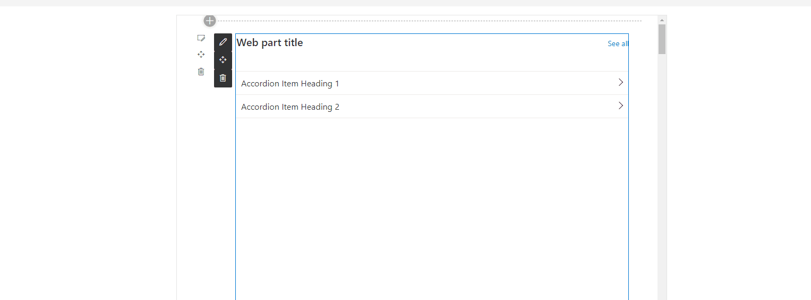

# Accessible Accordion

This control allows you to render an accordion control. It is an implementation based on React Accessible Accordion Control, that was customized to be more "Fluent".

Here is an example of the control in action:



## How to use this control in your solutions

- Check that you installed the `@pnp/spfx-controls-react` dependency. Check out the [getting started](../#getting-started) page for more information about installing the dependency.
- In your component file, import the `Accordion` control as follows:

```TypeScript
import {
    Accordion,
    AccordionItem,
    AccordionItemHeading,
    AccordionItemButton,
    AccordionItemPanel,
}  from "@pnp/spfx-controls-react/lib/AccessibleAccordion";

```

- Use the `Accordion` control in your code as follows:

```TypeScript
        <Accordion>
            <AccordionItem>
                <AccordionItemHeading>
                    <AccordionItemButton>
                        What harsh truths do you prefer to ignore?
                    </AccordionItemButton>
                </AccordionItemHeading>
                <AccordionItemPanel>
                    <p>
                        Exercitation in fugiat est ut ad ea cupidatat ut in
                        cupidatat occaecat ut occaecat consequat est minim minim
                        esse tempor laborum consequat esse adipisicing eu
                        reprehenderit enim.
                    </p>
                </AccordionItemPanel>
            </AccordionItem>
            <AccordionItem>
                <AccordionItemHeading>
                    <AccordionItemButton>
                        Is free will real or just an illusion?
                    </AccordionItemButton>
                </AccordionItemHeading>
                <AccordionItemPanel>
                    <p>
                        In ad velit in ex nostrud dolore cupidatat consectetur
                        ea in ut nostrud velit in irure cillum tempor laboris
                        sed adipisicing eu esse duis nulla non.
                    </p>
                </AccordionItemPanel>
            </AccordionItem>
        </Accordion> 
}
```

## Implementation

The `Accordion` control can be configured with the following properties:

### Accordion

| Property | Type | Required | Description | Default |
| ---- | ---- | ---- | ---- | ---- |
| allowMultipleExpanded | boolean | no | Don't auto-collapse items when expanding other items. | `false` |
| allowZeroExpanded | boolean | no | Allow the only remaining expanded item to be collapsed. | `false` |
| preExpanded | string[] | no | Accepts an array of strings and any `AccordionItem` whose `uuid` prop matches any one of these strings will be expanded on mount. | `[]` |
| className | string | no | Class(es) to apply to element. | "accordion" |
| onChange | (string[]) => void | no | Callback which is invoked when items are expanded or collapsed. Gets passed `uuid`s of the currently expanded `AccordionItem`s. | |
| theme | IPartialTheme \| ITheme | no | Set Fluent UI Theme. If not set or set to null or not defined, the theme passed through context will be used, or the default theme of the page will be loaded. | |

### AccordionItem

| Property | Type | Required | Description | Default |
| ---- | ---- | ---- | ---- | ---- |
| className | string | no | Class(es) to apply to element. | "accordion__item" |
| uuid | string \| number | no | Recommended for use with `onChange`. Will be auto-generated if not provided. | |
| dangerouslySetExpanded | boolean | no | Enables external control of the expansion. **Warning: This may impact accessibility negatively, use at your own risk** | |

### AccordionItemHeading

| Property | Type | Required | Description | Default |
| ---- | ---- | ---- | ---- | ---- |
| className | string | no | Class(es) to apply to the 'heading' element. | "accordion__heading" |
| aria-level | number | no | Semantics to apply to the 'heading' element. A value of `1` would make your heading element hierarchically equivalent to an `<h1>` tag, and likewise a value of `6` would make it equivalent to an `<h6>` tag. | `3` |

### AccordionItemButton

| Property  | Type   | Required | Description                                 | Default             |
| --------- | ------ | -------- | ------------------------------------------- | ------------------- |
| className | string | no       | Class(es) to apply to the 'button' element. | "accordion__button" |

### AccordionItemPanel

| Property  | Type   | Required | Description                    | Default            |
| --------- | ------ | -------- | ------------------------------ | ------------------ |
| className | string | no       | Class(es) to apply to element. | "accordion__panel" |

### AccordionItemState

| Property | Type                                                    | Required | Description      | Default |
| -------- | ------------------------------------------------------- | -------- | ---------------- | ------- |
| children | ({ expanded: boolean, disabled: boolean }): JSX.Element | yes      | item's children. |         |

## Helpers

### resetNextUuid

```typescript
resetNextUuid : () => void
```

Resets the internal counter for Accordion items' identifiers (including `id`
attributes). For use in test suites and isomorphic frameworks.


