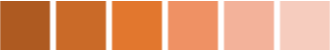
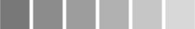
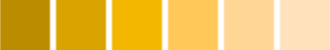

# ChartControl control

This control makes it easy to integrate [Chart.js](https://www.chartjs.org) charts into your web parts. It offers most of the functionality available with Chart.js.

The control automatically renders responsive charts, uses the environment's theme colors, and renders a hidden table for users with impaired vision.

Here is an example of the control in action:


## How to use this control in your solutions

- Check that you installed the `@pnp/spfx-controls-react` dependency. Check out the [getting started](../../#getting-started) page for more information about installing the dependency.
- Import the following module to your component:

```TypeScript
import { ChartControl, ChartType } from '@pnp/spfx-controls-react/lib/ChartControl';
```

- Use the `ChartControl` control in your code as follows:

```TypeScript
<ChartControl 
  type={ChartType.Bar}
  data={{
    labels: ['January', 'February', 'March', 'April', 'May', 'June', 'July'],
    datasets: [{
      label: 'My First dataset',
      data: [65, 59, 80, 81, 56, 55, 40]
    }]
  }} />
```

### Compatibility with Chart.js

The majority of Chart.js its options like `data`, `options`, `type`, and `plugins` will work the same way as is -- except that you use TypeScript syntax.

To find sample code that you can use, visit the [Chart.Js documentation](https://www.chartjs.org/docs/latest/).

For example, to reproduce following Javascript code sample from [Chart.js](https://www.chartjs.org):

```Html
<canvas id="myChart" width="400" height="400"></canvas>
<script>
var ctx = document.getElementById("myChart").getContext('2d');
var myChart = new Chart(ctx, {
  type: 'bar',
  data: {
    labels: ["Red", "Blue", "Yellow", "Green", "Purple", "Orange"],
    datasets: [{
      label: '# of Votes',
      data: [12, 19, 3, 5, 2, 3],
      backgroundColor: [
        'rgba(255, 99, 132, 0.2)',
        'rgba(54, 162, 235, 0.2)',
        'rgba(255, 206, 86, 0.2)',
        'rgba(75, 192, 192, 0.2)',
        'rgba(153, 102, 255, 0.2)',
        'rgba(255, 159, 64, 0.2)'
      ],
      borderColor: [
        'rgba(255,99,132,1)',
        'rgba(54, 162, 235, 1)',
        'rgba(255, 206, 86, 1)',
        'rgba(75, 192, 192, 1)',
        'rgba(153, 102, 255, 1)',
        'rgba(255, 159, 64, 1)'
      ],
      borderWidth: 1
    }]
  },
  options: {
    scales: {
      yAxes: [{
        ticks: {
            beginAtZero:true
        }
      }]
    }
  }
});
</script>
```

You would use the following Typescript code:

```TypeScript
<ChartControl 
  type={ChartType.Bar}
  data={{
    labels: ["Red", "Blue", "Yellow", "Green", "Purple", "Orange"],
    datasets: [{
        label: '# of Votes',
        data: [12, 19, 3, 5, 2, 3],
        backgroundColor: [
            'rgba(255, 99, 132, 0.2)',
            'rgba(54, 162, 235, 0.2)',
            'rgba(255, 206, 86, 0.2)',
            'rgba(75, 192, 192, 0.2)',
            'rgba(153, 102, 255, 0.2)',
            'rgba(255, 159, 64, 0.2)'
        ],
        borderColor: [
            'rgba(255,99,132,1)',
            'rgba(54, 162, 235, 1)',
            'rgba(255, 206, 86, 1)',
            'rgba(75, 192, 192, 1)',
            'rgba(153, 102, 255, 1)',
            'rgba(255, 159, 64, 1)'
        ],
        borderWidth: 1
    }]
  }}
  options={{
    scales: {
        yAxes: [{
          ticks: {
              beginAtZero:true
          }
      }]
    }
  }}
/>
```

The code above will produce the following chart:


### Specifying Data

The `data` property typically consist of:

- `labels`: (Optional) An array of strings providing the data labels (e.g.: `['January', 'February', 'March', 'April', 'May', 'June', 'July']`)
- `datasets`: At least one dataset, which contains:
    - `label`: (Optional) A label for the data (e.g.: `'My First Dataset'`)
    - `data`: An array of numbers (e.g.: `[65, 59, 80, 81, 56, 55, 40]`)

See [below](#charttype) for more information on what types of data are required for each type of chart.

### Specifying Data Promises

The ChartControl makes it easy to retrieve data asynchronously with the `datapromise` property.

To use `datapromise`, add a function to your web part that returns a `Promise<Chart.ChartData>` as follows:

```TypeScript
 private _loadAsyncData(): Promise<Chart.ChartData> {
    return new Promise<Chart.ChartData>((resolve, reject) => {
      // Call your own service -- this example returns an array of numbers
      // but you could call
      const dataProvider: IChartDataProvider = new MockChartDataProvider();
      dataProvider.getNumberArray().then((numbers: number[]) => {
        // format your response to ChartData
        const data: Chart.ChartData =
        {
          labels: ['January', 'February', 'March', 'April', 'May', 'June', 'July']
          datasets: [
            {
              label: 'My First dataset',
              data: numbers
            }
          ]
        };

        // resolve the promise
        resolve(data);
      });
    });
  }
```

Then, instead of passing a `data` property, pass your function to the  `datapromise` property, as follows:

```TypeScript
<ChartControl
  type='bar'
  datapromise={this._loadAsyncData()}
  />
```

If you want, you provide a template to display until the `datapromise` is resolved, as follows:

```TypeScript
<ChartControl
  type='bar'
  datapromise={this._loadAsyncData()}
  loadingtemplate={() => <div>Please wait...</div>}
/>
```


You can provide full React controls within the `loadingtemplate`. For example, to use the Office UI Fabric `Spinner` control, you would use the following code:

```TypeScript
import { Spinner, SpinnerSize } from 'office-ui-fabric-react/lib/Spinner';
...
<ChartControl
  type='bar'
  datapromise={this._loadAsyncData()}
  loadingtemplate={() => <Spinner size={SpinnerSize.large} label="Loading..."  />}
/>
```


You can also provide another template to display when the `datapromise` is rejected, as follows:

```TypeScript
<ChartControl
  type='bar'
  datapromise={this._loadAsyncData()}
    loadingtemplate={() => <Spinner size={SpinnerSize.large} label="Loading..."  />}
  rejectedtemplate={(error: string) => <div>Something went wrong: {error}</div>}
/>
```


### Theme Color Support

By default, the ChartControl will attempt to use the environment theme colors and fonts for elements such as the chart background color, grid lines, titles, labels, legends, and tooltips. This includes support for dark themes and high contrast themes.

If you wish, you can disable the use of themes by setting the `useTheme` property to `false`. Doing so will use the standard Chart.js colors and fonts.

### Office Color Palettes

You can also simplify the majority of code samples by omitting the `color` properties; the ChartControl will automatically reproduce the color palette that you would get if you used Office to create the chart.

```TypeScript
<ChartControl type={ChartType.Bar}
  data={{
    labels: ["Red", "Blue", "Yellow", "Green", "Purple", "Orange"],
    datasets: [{
        label: '# of Votes',
        data: [12, 19, 3, 5, 2, 3]
    }]
  }}
  options={{
    scales: {
      yAxes: [{
        ticks: {
          beginAtZero:true
        }
      }]
    }
  }}
/>
```


You can also set the `palette` property to choose one of the Office color palettes. For example, Specifying `ChartPalette.OfficeMonochromatic1` will produce the following chart:


### Responsiveness

The ChartControl will automatically expand to fit its container. If you wish to control the size of the chart, set its parent container size, or use the `className` property to pass your own CSS class and override the dimensions within that class.

### Accessibility

As long as you provide labels for all your data elements, the ChartControl will render a hidden table. Users who are visually impaired and use a screen reader will hear a description of the data in the chart.

You can improve the accessible table by adding an `alternateText`, a `caption` and a `summary`. If you do not provide a `caption`, the control will attempt to use the chart's title.

For example:

```TypeScript
<ChartControl type={ChartType.Bar}
              accessible={{
                alternateText: 'Text alternative for this canvas graphic is in the data table below.',
                summary: 'This is the text alternative for the canvas graphic.',
                caption: 'Votes for favorite pets'
              }}
              data={{
                    labels: ["Dog", "Cat", "Hamster", "Gerbil", "Hedgehog", "Platypus"],
                    datasets: [{
                        label: '# of Votes',
                        data: [12, 19, 3, 5, 2, 3]
                    }]
                }}
                options={{
                    scales: {
                        yAxes: [{
                            ticks: {
                                beginAtZero:true
                            }
                        }]
                    }
                }} />
```

## Implementation

### ChartControl Properties

The ChartControl can be configured with the following properties:

| Property | Type | Required | Description |
| ---- | ---- | ---- | ---- |
| accessibility | [IChartAccessibility](#ichartaccessibility) | no | Optional property to specify the accessibility options. |
| className | string | no | Optional property to specify a custom class that allows you to change the chart's styles. |
| data | ChartData | no | The data you wish to display. |
| datapromise | Promise<Chart.ChartData> | no | The promise to load data asynchronously. Use with `loadingtemplate` and `rejectedtemplate` |
| loadingtemplate | JSX.Element <br /> () => JSX.Element | no | The HTML to display while waiting to resolve the `datapromise` |
| options | ChartOptions | no | Optional property to set the chart's additional options. |
| palette | [ChartPalette](#chartpalette) | no | Optional property to set the desired Office color palette |
| plugins | object[] | no | Optional property to set an array of objects implementing the IChartPlugin interface |
| rejectedtemplate | JSX.Element <br /> () => JSX.Element | no | The HTML to display if the `datapromise` promise returns an error.
| useTheme | boolean | no | Optional property to set whether the ChartControl should attempt to use theme colors. Setting it to false will use the standard Chart.js colors and fonts. |
| type | [ChartType](#charttype) or string | yes | The type of chart you wish to render. You can also use the string equivalent. |
| onClick | (event?: MouseEvent, activeElements?: Array<{}>) => void | no | Optional callback method that get called when a user clicks on the chart |
| onHover | (chart: Chart, event: MouseEvent, activeElements: Array<{}>) => void | no | Optional callback method that get called when a user hovers the chart |
| onResize | (chart: Chart, newSize: ChartSize) => void | no | Optional callback method that get called when the window containing the ChartControl resizes |

You can call the following methods to interact with the chart after it has been initialized:

| Method | Type | Description |
| ---- | ---- | ---- |
| clear |  void | Will clear the chart canvas. Used extensively internally between animation frames, but you might find it useful. |
| getCanvas | () => HTMLCanvasElement | Return the canvass element that contains the chart |
| getChart | () => Chart | Returns the Chart.js instance |
| getDatasetAtEvent | (e: MouseEvent) => Array<{}> | Looks for the element under the event point, then returns all elements from that dataset.   This is used internally for 'dataset' mode highlighting |
| getElementAtEvent | (e: MouseEvent) => {} | Calling getElementAtEvent(event) passing an argument of an event will return the single element at the event position. For example, you can use with `onClick` event handlers. |
| getElementsAtEvent | (e: MouseEvent) => Array<{}> | Looks for the element under the event point, then returns all elements at the same data index. This is used internally for 'label' mode highlighting. Calling `getElementsAtEvent(event)` passing an argument of an event will return the point elements that are at that the same position of that event. |
| renderChart | (config: {}) => void | Triggers a redraw of all chart elements.  Note, this does not update elements for new data. Use .update() in that case. |
| stop | void | Use this to stop any current animation loop.   This will pause the chart during any current animation frame. |
| toBase64Image | () => string | Returns a base 64 encoded string of the chart in it's current state. |
| update | (config?: number \| boolean \| string) => void | Triggers an update of the chart. This can be safely called after updating the data object. This will update all scales, legends, and then re-render the chart. |

### ChartType

Defines the type of chart that will be rendered. For more information what data structure is required for each type of chart, review the Chart.js documentation ( links below ).

| Name                                                     | Chart.js Equivalent                                                                       | Description          |
| -------------------------------------------------------- | ----------------------------------------------------------------------------------------- | -------------------- |
| [Bar](./charts/BarChart.md)                              | [bar](https://www.chartjs.org/docs/latest/charts/bar.html)                                | Vertical bar chart   |
| [Bubble](./charts/BubbleChart.md)                        | [bubble](https://www.chartjs.org/docs/latest/charts/bubble.html)                          | Bubble chart         |
| [Doughnut](./charts/DoughnutChart.md)                    | [doughnut](https://www.chartjs.org/docs/latest/charts/doughnut.html)                      | Doughnut chart       |
| [HorizontalBar](./charts/BarChart.md#horizontalbarchart) | [horizontalBar](https://www.chartjs.org/docs/latest/charts/bar.html#horizontal-bar-chart) | Horizontal bar chart |
| [Line](./charts/LineChart.md)                            | [line](https://www.chartjs.org/docs/latest/charts/line.html)                              | Line chart           |
| [Pie](./charts/PieChart.md)                              | [pie](https://www.chartjs.org/docs/latest/charts/doughnut.html)                           | Pie chart            |
| [PolarArea](./charts/PolarAreaChart.md)                  | [polarArea](https://www.chartjs.org/docs/latest/charts/polar.html)                        | Polar area chart     |
| [Radar](./charts/RadarChart.md)                          | [radar](https://www.chartjs.org/docs/latest/charts/radar.html)                            | Radar chart          |
| [Scatter](./charts/ScatterChart.md)                      | [scatter](https://www.chartjs.org/docs/latest/charts/scatter.html)                        | Scatter graph        |

### IChartAccessibility

The `IChartAccessibility` interface implements the following properties:

| Property | Type | Required | Description |
| ---- | ---- | ---- | ---- |
| alternateText | string | no | Optional property to provide an accessible alternate text for the chart. We recommend that you use this property with `summary` |
| className| string | no | Optional property to specify a custom CSS class for the accessible table. |
| caption| string | no | Optional property to provide a caption for the accessible table. |
| enable | boolean | no | Optional property to turn on or off the rendering of the accessible table. |
| summary | string | no | Optional property to specify the chart's summary. We recommend that you use this property with `alternateText` |
| onRenderTable | () => JSX.Element | no | Options callback method that allows you to override the accessible table. |

### ChartPalette

Defines one of the possible Office color palette to use in a chart. The color palettes are the same that you find within Office.

| Name                  | Office Name               | Description                                              | Example                                                |
| --------------------- | ------------------------- | -------------------------------------------------------- | ------------------------------------------------------ |
| OfficeColorful1       | Office Colorful Palette 1 | Blue, Orange, Grey, Gold, Blue, Green                    |     |
| OfficeColorful2       | Office Colorful Palette 2 | Blue, Grey, Blue, Dark Blue, Dark Grey, Dark Blue        |     |
| OfficeColorful3       | Office Colorful Palette 3 | Orange, Gold, Green, Brown, Dark Yellow, Dark Green      |     |
| OfficeColorful4       | Office Colorful Palette 4 | Green, Blue, Gold, Dark Green, Dark Blue, Dark Yellow    |     |
| OfficeMonochromatic1  | Monochromatic Palette 1   | Blue gradient, dark to light                             |    |
| OfficeMonochromatic2  | Monochromatic Palette 2   | Orange gradient, dark to light                           |    |
| OfficeMonochromatic3  | Monochromatic Palette 3   | Grey gradient, dark to light                             |    |
| OfficeMonochromatic4  | Monochromatic Palette 4   | Gold gradient, dark to light                             |    |
| OfficeMonochromatic5  | Monochromatic Palette 5   | Blue gradient, dark to light                             |    |
| OfficeMonochromatic6  | Monochromatic Palette 6   | Green gradient, dark to light                            |    |
| OfficeMonochromatic7  | Monochromatic Palette 7   | Dark Grey, Light Grey, Grey, Dark Grey, Light Grey, Grey |    |
| OfficeMonochromatic8  | Monochromatic Palette 8   | Blue gradient, light to dark                             |    |
| OfficeMonochromatic9  | Monochromatic Palette 9   | Orange gradient, light to dark                           |    |
| OfficeMonochromatic10 | Monochromatic Palette 10  | Grey gradient, light to dark                             |  |
| OfficeMonochromatic11 | Monochromatic Palette 11  | Gold gradient, light to dark                             |  |
| OfficeMonochromatic12 | Monochromatic Palette 12  | Blue gradient, light to dark                             |  |
| OfficeMonochromatic13 | Monochromatic Palette 13  | Green gradient, light to dark                            |  |

### IChartPlugin

The easiest way to customize a chart is to use the [plugin functionality](https://www.chartjs.org/docs/latest/notes/extensions.html) provided by [Chart.js](https://www.chartjs.org/). In order to use a plugin, simply pass an array of objects that implement the `IChartPlugin` interface to the `plugins` property of the ChartControl.

If a hook is listed as cancellable, you can return `false` to cancel the event.

| Property | Type | Required | Description |
| ---- | ---- | ---- | ---- |
| afterDatasetsDraw    | (chartInstance: Chart, easing: string, options?: {}) => void | no | Called after the datasets are drawn but after scales are drawn.  |
| afterDatasetUpdate   | (chartInstance: Chart, options?: {}) => void | no | Called after a dataset was updated.   |
| afterDraw            | (chartInstance: Chart, easing: string, options?: {}) => void | no | Called after an animation frame was drawn.   |
| afterEvent           | (chartInstance: Chart, event: Event, options?: {}) => void | no | Called after an event occurs on the chart.   |
| afterInit | (chartInstance: Chart, options?: {}) => void | no | Called after a chart initializes |
| afterLayout          | (chartInstance: Chart, options?: {}) => void | no | Called after the chart layout was rendered.   |
| afterRender          | (chartInstance: Chart, options?: {}) => void | no | Called after a render.    |
| afterTooltipDraw     | (chartInstance: Chart, tooltipData?: {}, options?: {}) => void | no | Called after drawing the `tooltip`. Note that this hook will not be called if the tooltip drawing has been previously cancelled.   |
| afterUpdate | (chartInstance: Chart, options?: {}) => void | no | Called after a chart updates |
| beforeDatasetsDraw | (chartInstance: Chart, easing: string, options?: {}) => void | no | Called before the datasets are drawn but after scales are drawn. Cancellable.    |
| beforeDatasetUpdate| (chartInstance: Chart, options?: {}) => void | no | Called before a dataset is updated. Cancellable.   |
| beforeDraw         | (chartInstance: Chart, easing: string, options?: {}) => void | no | Called before an animation frame is drawn.  |
| beforeEvent        | (chartInstance: Chart, event: Event, options?: {}) => void | no | Called when an event occurs on the chart. Cancellable.   |
| beforeInit | (chartInstance: Chart, options?: {}) => void | no | Called before a chart initializes |
| beforeLayout         | (chartInstance: Chart, options?: {}) => void | no | Called before rendering the chart's layout. Cancellable.   |
| beforeRender       | (chartInstance: Chart, options?: {}) => void | no | Called at the start of a render. It is only called once, even if the animation will run for a number of frames. Use beforeDraw or afterDraw to do something on each animation frame. Cancellable.    |
| beforeTooltipDraw  | (chartInstance: Chart, tooltipData?: {}, options?: {}) => void | no | Called before drawing the `tooltip`. Cancellable. If it returns `false`,  tooltip drawing is cancelled until another `render` is triggered.   |
| beforeUpdate | (chartInstance: Chart, options?: {}) => void | no | Called before updating the chart. Cancellable. |
| destroy | (chartInstance: Chart) => void | no | Called when a chart is destroyed.  |
| resize | (chartInstance: Chart, newChartSize: Chart.ChartSize, options?: {}) => void | no | Called when a chart resizes. Cancellable. |


