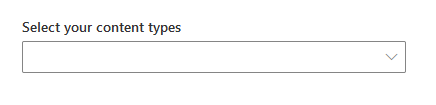
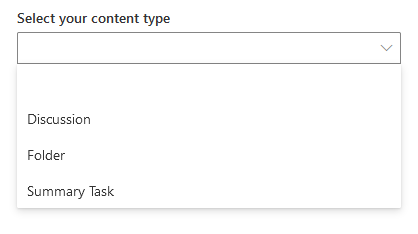
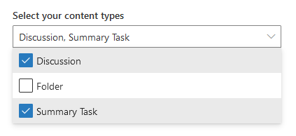

# ContentTypePicker control

This control allows you to select one or multiple available site content types or list content types.

Here is an example of the control:



`ContentTypePicker` single selection mode:



`ContentTypePicker` multi selection mode:



## How to use this control in your solutions

- Check that you installed the `@pnp/spfx-controls-react` dependency. Check out the [getting started](../../#getting-started) page for more information about installing the dependency.
- Import the control into your component:

```TypeScript
import { ContentTypePicker } from "@pnp/spfx-controls-react/lib/ContentTypePicker";
```

- Use the `ContentTypePicker` control in your code as follows:

```TypeScript
<ContentTypePicker
  context={this.props.context}
  group="Content Feedback"
  includeHidden={false}
  includeReadOnly={false}
  label="Select your content type"
  multiSelect={false}
  orderBy={ContentTypesOrderBy.Name}
  listId="00000000-0000-0000-0000-000000000000"
  onSelectionChanged={this.onContentTypePickerChanged}
  showBlankOption={true}
/>
```

- The `onSelectionChanged` change event returns the content type(s) and can be implemented as follows:

```TypeScript
private onContentTypePickerChanged (contentTypes: ISPContentType | ISPContentType[]) {
  console.log("Content types:", contentTypes);
}
```

## Implementation

The `ContentTypePicker` control can be configured with the following properties:

| Property | Type | Required | Description |
| --- | --- | --- | --- |
| context | BaseComponentContext | yes | The context object of the SPFx loaded webpart or customizer. |
| listId | string | no | The ID of the list or library you wish to select content type(s) from. When not specified, picker will be populated with site content types.|
| className | string | no | If provided, additional class name to provide on the dropdown element. |
| disabled | boolean | no | Whether or not the control is disabled. |
| includeHidden | boolean | no | Whether or not to include hidden content types. Default is true. |
| includeReadOnly | boolean | no | Whether or not to include read-only content types. Default is true. |
| group | string | no | Only show content types of a certain group. |
| filter | string | no | Filter content types from OData query (takes the upper hand of `hidden`, `readOnly` and `group` Filters). |
| orderBy | ContentTypesOrderBy | no | How to order the content types. |
| selectedContentTypes | string \| string[] | no | IDs of the selected item(s). If you provide this, you must maintain selection state by observing `onSelectionChanged` events and passing a new value in when changed. |
| multiSelect | boolean | no | Indicates if multi-choice selections is allowed. Default is false. |
| label | string | no | The label to display. |
| placeholder | string | no | Input placeholder text. Displayed until option is selected. |
| onSelectionChanged | (newValue: ISPContentType \| ISPContentType[]): void | no | Callback issued when the selected option changes. |
| filterItems | (contentTypes: ISPContentType[]): ISPContentType[] | no | This function is invoked after the filtering has been done. This allows you to add additional custom filtering. |
| webAbsoluteUrl | string | no | Absolute Web Url of target site (user requires permissions). |
| showBlankOption | boolean | no | Whether or not to show a blank option. Default is false. Works only when `multiSelect` is false. |

Enum `ContentTypesOrderBy`

| Value |
| ---- |
| Name |
| Id |


