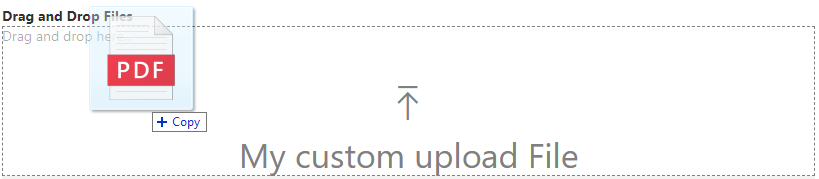

# DragDropFiles

This control allows to drag and drop files in pre defined areas.

## How to use this control in your solutions

- Check that you installed the `@pnp/spfx-controls-react` dependency. Check out the [getting started](../../#getting-started) page for more information about installing the dependency.
- Import the following modules to your component:

```TypeScript
import { DragDropFiles } from "@pnp/spfx-controls-react/lib/DragDropFiles";
```

- Use the DragDropFiles control in your code as follows:

```jsx
<DragDropFiles 
          dropEffect="copy" 
          enable={true}  
          onDrop={this._getDropFiles}
          iconName="Upload"
          labelMessage= "My custom upload File"
          >
  {/* Specify the components to load where Drag and drop area should work */}
</DragDropFiles>
```

### Content with drag and drop applied

```jsx
 <DragDropFiles 
          dropEffect="copy" 
          enable={true}  
          onDrop={this._getDropFiles}
          iconName="Upload"
          labelMessage= "My custom upload File"
          >
          Drag and drop here...

          </DragDropFiles>
```



### ListView with drag and drop applied


### FilePicker with drag and drop applied


- With the `onDrop` handler you can define a method that returns files and files inside folders that where drag and drop by user.

**PS: New property "fullPath" was included in file object to allow identify dropped files based on Folders, this allow users to create associated folder path.**

```typescript
private _getDropFiles = (files) => {
    for (var i = 0; i < files.length; i++) {
      console.log("Filename: " + files[i].name);
      console.log("Path: " + files[i].fullPath);
    }
  }
```

## Implementation

The `DragDropFiles` can be configured with the following properties:

| Property     | Type    | Required | Description                                                                                                    |
| ------------ | ------- | -------- | -------------------------------------------------------------------------------------------------------------- |
| dropEffect   | string  | no       | Visual feedback given to user during a drag and drop operation (copy,move,link,none). Default value is `copy`. |
| enable       | boolean | no       | Option allow control to be enable or disable. Default value is `true`                                          |
| labelMessage | string  | no       | Message displayed in drag drop preview.                                                                        |
| onDrop       | any     | no       | Method that returns all Files[] from drag and drop file area.                                                  |
| iconName     | string  | no       | Icon Name from Office UI Fabric Icons.                                                                         |


