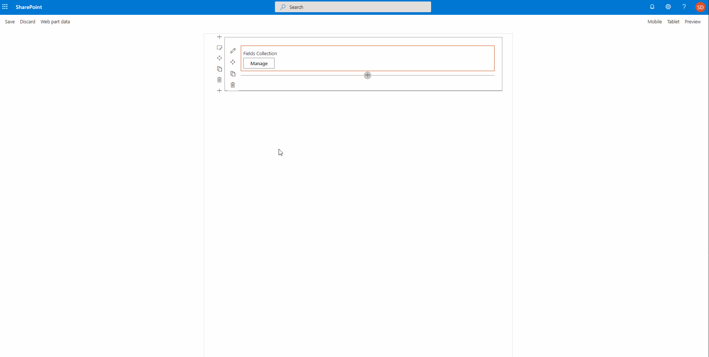

# FieldCollectionData control

This control gives you the ability to insert a list / collection data which can be used in your web part / application customizer. For example: you want to specify multiple locations for showing a weather information.

The control allows you to specify multiple data types like: string, number, boolean, or dropdown. It also provides the possibility to render custom field.

**FieldCollectionData**



The type of data you get returned depends on the fields you defined. For the example above, the data looks like this:

```json
[
  { 
    "Field1": "String value", "Field2": "123", "Field3": "https://pnp.github.io/", "Field4": true
  }
]
```

## How to use this control in your solutions

1. Check that you installed the `@pnp/spfx-controls-react` dependency. Check out The [getting started](../../#getting-started) page for more information about installing the dependency.
2. Import the following modules to your component:

```TypeScript
import { FieldCollectionData, CustomCollectionFieldType } from '@pnp/spfx-controls-react/lib/FieldCollectionData';
```

3. Add the control to the render method:


```TypeScript
<FieldCollectionData 
  key={"FieldCollectionData"} 
  label={"Fields Collection"} 
  manageBtnLabel={"Manage"} onChanged={(value) => { console.log(value); }}
  panelHeader={"Manage values"}

  executeFiltering={(searchFilter: string, item: any) => {
    return item["Field2"] === +searchFilter;
  }}
  itemsPerPage={3}
  fields={[
    {id: "Field1", title:"String field", type: CustomCollectionFieldType.string, required: true},
    {id: "Field2", title:"Number field", type: CustomCollectionFieldType.number},
    {id: "Field3", title:"URL field", type: CustomCollectionFieldType.url},
    {id: "Field4", title:"Boolean field", type: CustomCollectionFieldType.boolean}
  ]}
  value={[
    { 
      "Field1": "String value", "Field2": "123", "Field3": "https://pnp.github.io/", "Field4": true
    }
  ]}
/>
```

### Sample of custom field rendering

Here is an example of how you can render your own controls in the `FieldCollectionData` control:

```TypeScript
{
  id: "customFieldId",
  title: "Custom Field",
  type: CustomCollectionFieldType.custom,
  onCustomRender: (field, value, onUpdate, item, itemId, onError) => {
    return (
      React.createElement("div", null,
        React.createElement("input", { key: itemId, value: value, onChange: (event: React.FormEvent<HTMLInputElement>) => {
          if (event.currentTarget.value === "error") {
            onError(field.id, "Value shouldn't be equal to error");
          } else {
            onError(field.id, "");
          }
          onUpdate(field.id, event.currentTarget.value);
        }}), " 🎉"
      )
    );
  }
}
```

## Implementation

The `FieldCollectionData` control can be configured with the following properties:

| Property | Type | Required | Description | Default Value |
| ---- | ---- | ---- | ---- | ---- |
| key | string | yes | An unique key that indicates the identity of this control. | |
| label | string | no | Property field label displayed on top. | |
| panelHeader | string | yes | Label to be used as the header in the panel. | |
| panelDescription | string | no | Property that allows you to specify a description in the collection panel. | |
| manageBtnLabel | string | yes | Label of the button to open the panel. | |
| saveBtnLabel | string | no | Label of the save button. | |
| saveAndAddBtnLabel | string | yes | Label of the save and add button. | |
| cancelBtnLabel | string | yes | Label of the cancel button. | |
| fields | ICustomCollectionField[] | yes | The fields to be used for the list of collection data. | |
| value | any[] | yes | The collection data value. | |
| enableSorting | boolean | no | Specify if you want to be able to sort the items in the collection. | false |
| disabled | boolean | no | Specify if the control is disabled. | false |
| disableItemCreation | boolean | no | Allows you to specify if user can create new items. | false |
| disableItemDeletion | boolean | no | Allows you to specify if users can delete already inserted items. | false |
| panelClassName | string | no | Allows you to specify a custom CSS class name for the collection data panel. | |
| tableClassName | string | no | Allows you to specify a custom CSS class name for the collection data table inside the panel. | |
| itemsPerPage | number | no | Allows you to specify the amount of items displayed per page. Paging control is added automatically. | |
| executeFiltering | (searchFilter: string, item: any) => boolean | no | Allows you to show Search Box and specify own filtering logic. | |
| panelProps | IPanelProps | no | Allows you to pass in props of the panel such as type and customWidth to control the underlying panel. | |
| context | BaseComponentContext | no | Needed if **peoplepicker** field type is used | |
| usePanel | boolean | no | Specify if you want the control to opened in a panel or directly on the page (only useful within webpart) | true | 
| noDataMessage | string | no | Specify the message when no items are added to the collection ||

Interface `ICustomCollectionField`

| Property | Type | Required | Description |
| ---- | ---- | ---- | ---- |
| id | string | yes | ID of the field. |
| title | string | yes | Title of the field. This will be used for the label in the table. |
| type | CustomCollectionFieldType | yes | Specifies the type of field to render. |
| disableEdit | boolean | no | Allows you to specify if a field is disabled for editing. |
| required | boolean | no | Specify if the field is required. |
| options | [IDropdownOption[]](https://developer.microsoft.com/en-us/fabric#/components/dropdown) [IComboboxOption[]](https://developer.microsoft.com/en-us/fluentui#/controls/web/combobox) | no | Dropdown options. Only necessary when dropdown or combobox type is used. |
| onRenderOption | IRenderFunction<ISelectableOption> | no | Dropdown custom options render method. Only for the **dropdown** field type. |
| placeholder | string | no | Placehoder text which will be used for the input field. If not provided the input title will be used. |
| defaultValue | any | no | Specify a default value for the input field. |
| deferredValidationTime | number | no | Field will start to validate after users stop typing for `deferredValidationTime` milliseconds. Default: 200ms. |
| onGetErrorMessage | (value: any, index: number, crntItem: any): string \| Promise<string> | no | The method is used to get the validation error message and determine whether the input value is valid or not. It provides you the current row index and the item you are currently editing. |
| onCustomRender | (field: ICustomCollectionField, value: any, onUpdate: (fieldId: string, value: any) => void, item: any, itemUniqueId: string, onCustomFieldValidation: (fieldId: string, errorMessage: string) => void) => JSX.Element | no | This property is only required if you are using the `custom` field type and it can be used to specify the custom rendering of your control in the collection data. |
| multiSelect | boolean| no | Specifies multiple options can be selected (**combobox**) or mutliple users can be selected (**peoplepicker**) |
| allowFreeform | boolean | no | Specifies that own options can be entered. Only for **combobox** field type |
| minimumUsers| number | no | Specifies the minimum number of users to be entered for **peoplepicker** field type |
| minimumUsersMessage| string | no | Specifies the message to be displayed if minimumUsers are not entered for **peoplepicker** field type |
| maximumUsers | number | no | Specifies the maximum number of users to be entered for **peoplepicker** field type |

Enum `CustomCollectionFieldType`

| Type | Description |
| ---- | ---- |
| string | Text field |
| number | Number field |
| boolean | Checkbox |
| dropdown | Dropdown field. You will have to specify the `options` property when using this field type |
| combobox | Combobox field. You wil have to specify the `options` property, optional specify `allowFreeform` and `multiSelect` |
| fabricIcon | Name of the [Office UI Fabric icon](https://developer.microsoft.com/en-us/fabric#/styles/icons) |
| url | URL field |
| peoplepicker | Peoplepicker control |
| custom | This gives you control over the whole field rendering. Be sure to provide the `onCustomRender` method to render your control in the collection data. |


