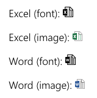

# FileTypeIcon control

This control returns the file type icon based on a specified file path or application.



## How to use this control in your solutions

- Check that you installed the `@pnp/spfx-controls-react` dependency. Check out the [getting started](../../#getting-started) page for more information about installing the dependency.
- Import the following modules to your component:

```TypeScript
import { FileTypeIcon, ApplicationType, IconType, ImageSize } from "@pnp/spfx-controls-react/lib/FileTypeIcon";
```

- Use the `FileTypeIcon` control in your code as follows:

```TypeScript
/* Showing the icons font */
<FileTypeIcon type={IconType.font} application={ApplicationType.Word} />
<FileTypeIcon type={IconType.font} application={ApplicationType.Excel} />
<FileTypeIcon type={IconType.font} path="https://contoso.sharepoint.com/documents/filename.docx" />
<FileTypeIcon type={IconType.font} path="https://contoso.sharepoint.com/documents/filename.xslx" />

/* Showing the icon image */
<FileTypeIcon type={IconType.image} application={ApplicationType.Word} />
<FileTypeIcon type={IconType.image} path="https://contoso.sharepoint.com/documents/filename.docx" />

/* Icon image allows three different sizes */
<FileTypeIcon type={IconType.image} size={ImageSize.small} application={ApplicationType.Excel} />
<FileTypeIcon type={IconType.image} size={ImageSize.medium} application={ApplicationType.Excel} />
<FileTypeIcon type={IconType.image} size={ImageSize.large} application={ApplicationType.Excel} />
```

## Implementation

The FileTypeIcon component can be configured with the following properties:

| Property | Type | Required | Description |
| ---- | ---- | ---- | ---- |
| application | ApplicationType | no | Type of the application for which you want to show the icon. Use the **ApplicationType** enum to get the list of available applications. |
| path | string | no | Path to the document. If this is provided, the control will use the file extension to display the corresponding icon. |
| size | ImageSize | no | This is a property that only needs to be used when the type is set to image. It allows you to specify the image size. small (16px), normal (20px), medium (48px) and large (96px) are possible. Use the **ImageSize** enum to get the list of available images sizes. |
| type | IconType | yes | This property specifies is you want to use the icon font or image. Use the **IconType** enum to get the list of available icon types. |
| onClick | React.MouseEvent&lt;HTMLElement&gt; | no | Event triggered when the icon is clicked. |
| onDoubleClick | React.MouseEvent&lt;HTMLElement&gt; | no | Event triggered when the icon is double clicked. |
| onMouseEnter | React.MouseEvent&lt;HTMLElement&gt; | no | Event triggered when the mouse cursor enters the icon (without event bubbling). |
| onMouseLeave | React.MouseEvent&lt;HTMLElement&gt; | no | Event triggered when the mouse cursor leaves the icon. |
| onMouseOver | React.MouseEvent&lt;HTMLElement&gt; | no | Event triggered when the mouse cursor enters the icon (with event bubbling). |
| onMouseUp | React.MouseEvent&lt;HTMLElement&gt; | no | Event triggered when the mouse button is released after clicked on the icon. |


