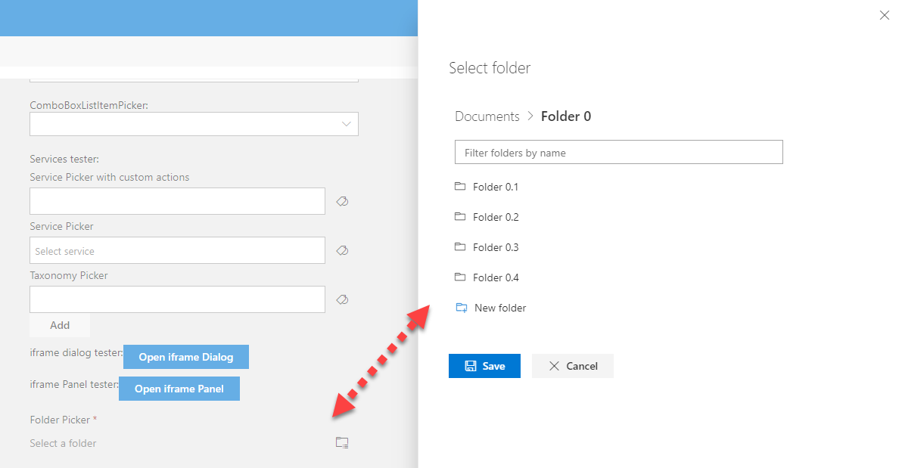
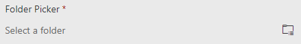
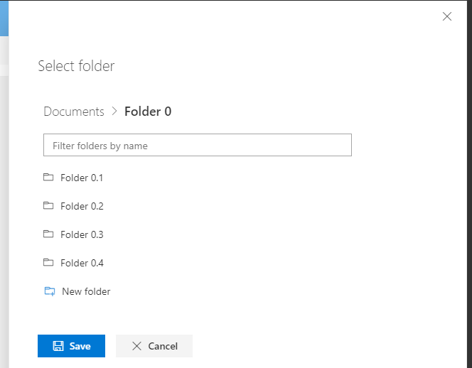
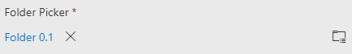

# FolderPicker control

This control allows you to explore and select a folder.
It also allows the user to create a new folder at the current level being explored.

Here is an example of the control:



`FolderPicker` no selection:



`FolderPicker` selection:



`FolderPicker` selected:



## How to use this control in your solutions

- Check that you installed the `@pnp/spfx-controls-react` dependency. Check out the [getting started](../../#getting-started) page for more information about installing the dependency.
- Import the control into your component:

```TypeScript
import { FolderPicker, IFolder } from "@pnp/spfx-controls-react/lib/FolderPicker";
```

- Use the `FolderPicker` control in your code as follows:

```TypeScript
<FolderPicker context={this.props.context}
                label='Folder Picker'
                required={true}
                rootFolder={{
                  Name: 'Documents',
                  ServerRelativeUrl: `/sites/TestSite/Shared Documents`
                }}                
                onSelect={this._onFolderSelect}
                canCreateFolders={true} />
```

- To use the `FolderExplorer` control to fetch folders from different site collection in your code as follows:

```TypeScript
<FolderExplorer context={this.props.context}
                rootFolder={{
                  Name: 'Documents',
                  ServerRelativeUrl: `/sites/TestSite2/Shared Documents`
                }}
                onSelect={this._onFolderSelect}
                canCreateFolders={true} 
                siteAbsoluteUrl="https://xxxx.sharepoint.com/sites/TestSite2"/>
```

- The `onSelect` change event returns the selected folder and can be implemented as follows:

```TypeScript
private _onFolderSelect = (folder: IFolder): void => {
  console.log('selected folder', folder);
}
```

- If you want to pick a folder outside the current site collection (not the one targeted by the SPFx context), you have to specify which site collection owns the folder. You can do this by setting the `siteAbsoluteUrl` property to the URL of the site collection that owns the folder.

```TypeScript
<FolderPicker context={this.props.context}
                label='Folder Picker'
                rootFolder={{
                  Name: 'Documents',
                  ServerRelativeUrl: '/sites/anotherSite/Shared Documents'
                }}
                siteAbsoluteUrl="https://contoso.sharepoint.com/sites/anotherSite"             
                onSelect={this._onFolderSelect} />
```

## Implementation

The `FolderPicker` control can be configured with the following properties:

| Property | Type | Required | Description |
| ---- | ---- | ---- | ---- |
| context | BaseComponentContext | yes | The context object of the SPFx loaded webpart or customizer. |
| label | string | yes | The label for the control. |
| rootFolder | IFolder | yes | The lowest level folder that can be explored. This can be the root folder of a library. |
| siteAbsoluteUrl | string | no | The absolute url of the target site. Only required if rootFolder does not belongs to the current site |
| defaultFolder | IFolder | no | The default folder to be selected or explored. |
| required | boolean | no | Is selection required. |
| disabled | boolean | no | Is the control disabled. |
| canCreateFolders | boolean | no | Allow current user to create folders on the target location. If enabled, you need to ensure that the user has the required permissions. |
| onSelect | (folder: IFolder): void | no | Callback function called after a folder is selected. |


