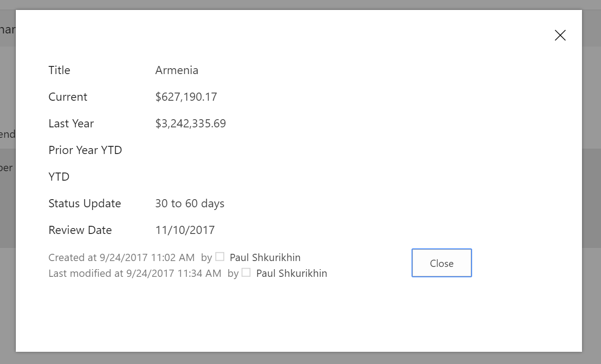

# IFrameDialog control

This control renders a Dialog with an iframe as content.

Here is an example of the control in action:



## How to use this control in your solutions

- Check that you installed the `@pnp/spfx-controls-react` dependency. Check out the [getting started](../../#getting-started) page for more information about installing the dependency.
- Import the following modules to your component:

```TypeScript
import { IFrameDialog } from "@pnp/spfx-controls-react/lib/IFrameDialog";
```

- Use the `IFrameDialog` control in your code as follows (`this._onIframeLoaded` and `this._onDialogDismiss` are methods that should be implemented if you want to execute some actions when the iframe content is loaded and dialog should be closed respectively):

```TypeScript
<IFrameDialog 
    url={this.state.lookupDispFormUrl}
    iframeOnLoad={this._onIframeLoaded.bind(this)}
    hidden={this.state.hideDialog}
    onDismiss={this._onDialogDismiss.bind(this)}
    modalProps={{
        isBlocking: true,
        containerClassName: styles.dialogContainer
    }}
    dialogContentProps={{
        type: DialogType.close,
        showCloseButton: true
    }}
    width={'570px'}
    height={'315px'}/>
```

## Implementation

The IFrameDialog component can be configured with the following properties:

| Property | Type | Required | Description |
| ---- | ---- | ---- | ---- |
| dialogContentProps | IDialogContentProps | no | Props to be passed through to Dialog Content. |
| hidden | boolean | no | Whether the dialog is hidden. |
| modalProps | IModalProps | no | Props to be passed through to Modal. |
| onDismiss | (ev?: React.MouseEvent<HTMLButtonElement>) => any | no | A callback function for when the Dialog is dismissed from the close button or light dismiss. Can also be specified separately in content and modal. |
| url | string | yes | iframe Url |
| iframeOnload | iframeOnLoad?: (iframe: any) => {} | no | iframe's onload event handler |
| width | string | yes | iframe's width |
| heigth | string | yes | iframe's height |
| allowFullScreen | boolean | no | Specifies if iframe content can be displayed in a full screen |
| allowTransparency | boolean | no | Specifies if transparency is allowed in iframe |
| marginHeight | number | no | Specifies the top and bottom margins of the content of an iframe |
| marginWidth | number | no | Specifies the left and right margins of the content of an iframe |
| name | string | no | Specifies the name of an iframe |
| sandbox | string | no | Enables an extra set of restrictions for the content in an iframe |
| scrolling | string | no | Specifies whether or not to display scrollbars in an iframe |
| seamless | string | no | When present, it specifies that the iframe should look like it is a part of the containing document (no borders or scrollbars) |


