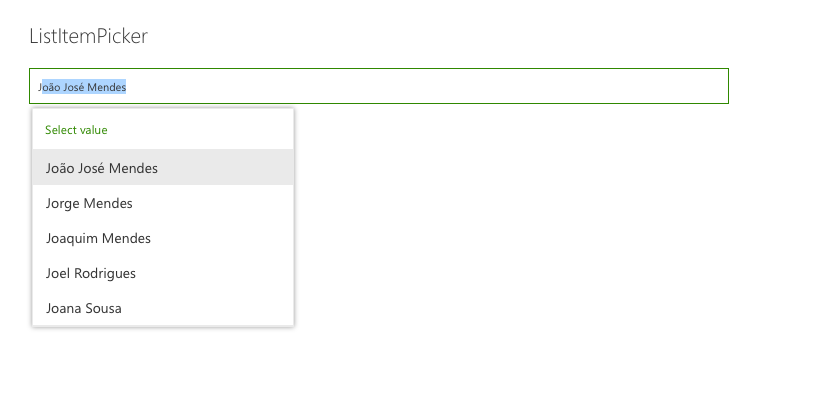
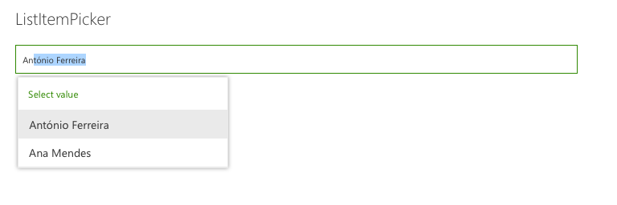

# ListItemPicker control

This control allows you to select one or more items from a list. The List can be filtered to allow select items from a subset of items The item selection is based from a column value. The control will suggest items based on the inserted value.

Here is an example of the control:






## How to use this control in your solutions

- Check that you installed the `@pnp/spfx-controls-react` dependency. Check out the [getting started](../../#getting-started) page for more information about installing the dependency.
- Import the control into your component:

```TypeScript
import { ListItemPicker } from '@pnp/spfx-controls-react/lib/ListItemPicker';
```

- Use the `ListItemPicker` control in your code as follows:

```TypeScript
<ListItemPicker listId='da8daf15-d84f-4ab1-9800-7568f82fed3f'
                columnInternalName='Title'
                keyColumnInternalName='Id'
                filter="Title eq 'SPFx'"
                orderBy={"Id desc"}
                itemLimit={2}
                onSelectedItem={this.onSelectedItem}
                context={this.props.context} />
```

- The `onSelectedItem` change event returns the list items selected and can be implemented as follows:

```TypeScript
private onSelectedItem(data: { key: string; name: string }[]) {
  for (const item of data) {
    console.log(`Item value: ${item.key}`);
    console.log(`Item text: ${item.name}`);
  }
}
```

## Implementation

The `ListItemPicker` control can be configured with the following properties:

| Property                 | Type                   | Required | Description                                                                                                  |
| ------------------------ | ---------------------- | -------- | ------------------------------------------------------------------------------------------------------------ |
| columnInternalName       | string                 | yes      | InternalName of column to search and get values.                                                             |
| keyColumnInternalName    | string                 | no       | InternalName of column to use as the key for the selection. Must be a column with unique values. Default: Id |
| context                  | BaseComponentContext   | yes      | SPFx web part or extension context                                                                           |
| listId                   | string                 | yes      | Guid or title of the list.                                                                                   |
| itemLimit                | number                 | yes      | Number of items which can be selected                                                                        |
| onSelectedItem           | (items: any[]) => void | yes      | Callback function which returns the selected items.                                                          |
| className                | string                 | no       | ClassName for the picker.                                                                                    |
| webUrl                   | string                 | no       | URL of the site. By default it uses the current site URL.                                                    |
| defaultSelectedItems     | any[]                  | no       | Initial items that have already been selected and should appear in the people picker.                        |
| suggestionsHeaderText    | string                 | no       | The text that should appear at the top of the suggestion box.                                                |
| noResultsFoundText       | string                 | no       | The text that should appear when no results are returned.                                                    |
| disabled                 | boolean                | no       | Specifies if the control is disabled or not.                                                                 |
| filter                   | string                 | no       | condition to filter list Item, same as $filter OData parameter                                               |
| orderBy                  | string                 | no       | condition to order by list Item, same as $orderby OData parameter                                            |
| placeholder              | string                 | no       | Short text hint to display in empty picker                                                                   |
| substringSearch          | boolean                | no       | Specifies if substring search should be used                                                                 |
| label                    | string                 | no       | Specifies the text describing the ListItemPicker.                                                            |
| enableDefaultSuggestions | boolean                | no       | Enable default suggestions. All options are displayed by default when clicking on the control.               |
| itemsQueryCountLimit     | number                 | no       | Number of items to display in a lookup field                                                                 |


