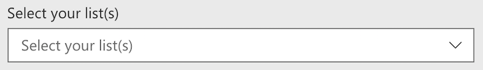
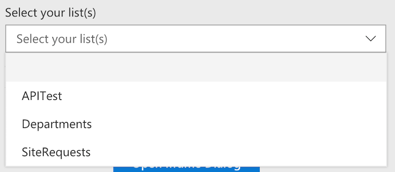
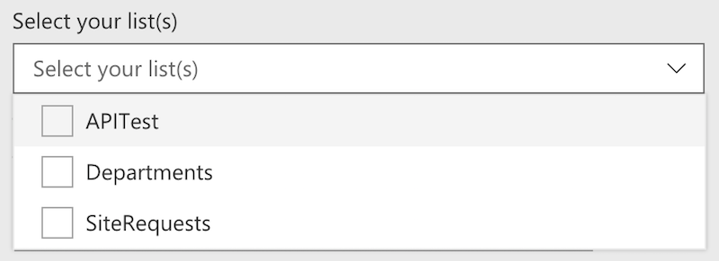

# ListPicker control

This control allows you to select one or multiple available lists/libraries of the current site.

Here is an example of the control:



`ListPicker` single selection mode:



`ListPicker` multi-selection mode



## How to use this control in your solutions

- Check that you installed the `@pnp/spfx-controls-react` dependency. Check out the [getting started](../../#getting-started) page for more information about installing the dependency.
- Import the control into your component:

```TypeScript
import { ListPicker } from "@pnp/spfx-controls-react/lib/ListPicker";
```

- Use the `ListPicker` control in your code as follows:

```TypeScript
<ListPicker context={this.props.context}
            label="Select your list(s)"
            placeHolder="Select your list(s)"
            baseTemplate={100}
            contentTypeId="0x0101"
            includeHidden={false}
            multiSelect={false}
            onSelectionChanged={this.onListPickerChange} />
```

- The `onSelectionChanged` change event returns the list(s) and can be implemented as follows:

```TypeScript
private onListPickerChange (lists: string | string[]) {
  console.log("Lists:", lists);
}
```

## Implementation

The `ListPicker` control can be configured with the following properties:

| Property | Type | Required | Description |
| ---- | ---- | ---- | ---- |
| context | BaseComponentContext | yes | The context object of the SPFx loaded webpart or customizer. |
| className | string | no | If provided, additional class name to provide on the dropdown element. |
| disabled | boolean | no | Whether or not the control is disabled. |
| baseTemplate | number \| number[] | no | The SharePoint BaseTemplate ID to filter the list options by. |
| filter | string | no | Filter list from OData query (takes precedence over `includeHidden` and `baseTemplate` filters). |
| includeHidden | boolean | no | Whether or not to include hidden lists. Default is `true`. |
| orderBy | LibsOrderBy | no | How to order the lists retrieved from SharePoint. |
| selectedList | string OR string[] | no | Keys(list Ids) of the selected item(s). If you provide this, you must maintain selection state by observing onSelectionChanged events and passing a new value in when changed. |
| multiSelect | boolean | no | Optional mode indicates if multi-choice selections is allowed. Default to `false`. |
| label | string | no | Label to use for the control. |
| placeHolder | string | no | Placeholder label to show in the dropdown. **Deprecated. Use `placeholder` instead.** |
| placeholder | string | no | Placeholder label to show in the dropdown. |
| onSelectionChanged | (newValue: string OR string[]): void | no | Callback function when the selected option changes. |
| webAbsoluteUrl | string | no | Absolute Web Url of target site (user requires permissions) |
| contentTypeId | string | no | The Id if a content type which must be present in a list in order for the list to appear in the picker.|
| refreshToggle | boolean | no | If present can be used to force the control to refresh the list of lists by toggling its value|

Enum `LibsOrderBy`

| Value |
| ---- |
| Id |
| Title |


