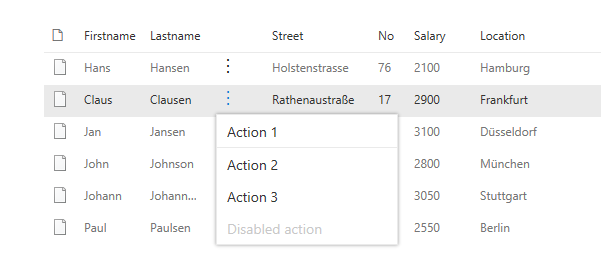

# ListView: Add a contextual menu

## The ContextualMenu component

In order to create a contextual menu for your list view, you first need to create a new component which will use a combination of an [IconButton](https://developer.microsoft.com/en-us/fabric#/components/button#Variants) and [ContextualMenu](https://developer.microsoft.com/en-us/fabric#/components/contextualmenu) controls from the Office UI Fabric React.

Here is some sample code:

```TypeScript
import * as React from 'react';
import { Layer, IconButton, IButtonProps } from 'office-ui-fabric-react';
import { ContextualMenuItemType } from 'office-ui-fabric-react/lib/ContextualMenu';
// The following are project specific components
import { IECBProps } from './IECBProps';
import styles from './ECB.module.scss';
import { IListitem } from '../../model/IListitem';

export class ECB extends React.Component<IECBProps, {}> {

  public constructor(props: IECBProps) {        
    super(props);

    this.state = {
      panelOpen: false
    };
  }

  public render() {      
    return (
      <div className={styles.ecb}>
        <IconButton id='ContextualMenuButton1'
                    className={styles.ecbbutton}
                    text=''
                    width='30'
                    split={false}
                    iconProps={ { iconName: 'MoreVertical' } }
                    menuIconProps={ { iconName: '' } }
                    menuProps={{
                      shouldFocusOnMount: true,
                      items: [
                        {
                          key: 'action1',
                          name: 'Action 1',
                          onClick: this.handleClick.bind(this, this.props.item.Firstname + ' Action 1')
                        },
                        {
                          key: 'divider_1',
                          itemType: ContextualMenuItemType.Divider
                        },
                        {
                          key: 'action2',
                          name: 'Action 2',
                          onClick: this.handleClick.bind(this, this.props.item.Firstname + ' Action 2')
                        },
                        {
                          key: 'action3',
                          name: 'Action 3',
                          onClick: this.handleClick.bind(this, this.props.item.Lastname + ' Action  3')
                        },
                        {
                          key: 'disabled',
                          name: 'Disabled action',
                          disabled: true,
                          onClick: () => console.error('Disabled action should not be clickable.')
                        }
                      ]
                    }} />
      </div>
    );
  }

  private handleClick(source:string, event) {
    alert(`${source} clicked`);
  }
}
```

## The ListView column

Once the ECB component is created, you can add the contextual menu to the `ListView` control. In order to do this, you have to insert another `Viewfield` in code at the position of our choice. For instance after the `Lastname`:

```TypeScript
{
  name: "",
  sorting: false,
  maxWidth: 40,
  render: (rowitem: IListitem) => {
    const element:React.ReactElement<IECBProps> = React.createElement(
      ECB, 
      {
        item: rowitem
      }
    );
    return element;
  }      
}
```

Inside the render method of the `IViewField`, the ECB component gets created and the current item will be used as a reference for the clicked row.

## The result

The result will look like the following:



Once you click on an action, you will see the alert:


