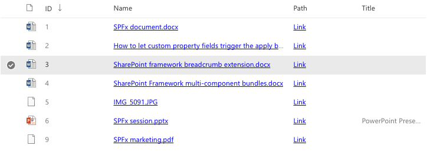
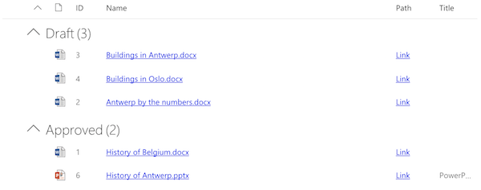
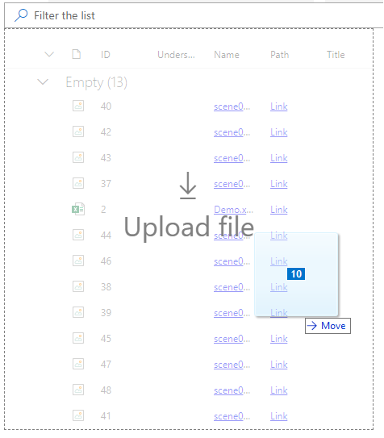

# ListView control

This control renders a list view for the given set of items.



- List view control with grouping applied:



- List view control with drag and drop applied:



## How to use this control in your solutions

- Check that you installed the `@pnp/spfx-controls-react` dependency. Check out the [getting started](../../#getting-started) page for more information about installing the dependency.
- Import the following modules to your component:

```TypeScript
import { ListView, IViewField, SelectionMode, GroupOrder, IGrouping } from "@pnp/spfx-controls-react/lib/ListView";
```

- Use the `ListView` control in your code as follows:

```TypeScript
<ListView
  items={items}
  viewFields={viewFields}
  iconFieldName="FileRef"
  compact={true}
  selectionMode={SelectionMode.multiple}
  selection={this._getSelection}
  showFilter={true}
  defaultFilter="John"
  filterPlaceHolder="Search..."
  groupByFields={groupByFields}
  dragDropFiles={true}
  onDrop={this._getDropFiles}
  stickyHeader={true}
  className={styles.listWrapper}
  listClassName={styles.list} />
```

- The control provides full text filtering through all the columns. If you want to execute filtering on the specified columns, you can use syntax : `<ColumnName>`:`<FilterValue>`. Use `':'` as a separator between column name and value. Control support both `'fieldName'` and `'name'` properties of IColumn interface.

- With the `selection` property you can define a method that which gets called when the user selects one or more items in the list view:

```typescript
private _getSelection(items: any[]) {
  console.log('Selected items:', items);
}
```

- With the `groupByFields` property you can define an array of field objects which will be used for grouping.

**Important**: the same order of the fields defines how grouping will be applied. In the snippet the `ListView` control will first group by the `Extension` and after that by the `Author` field.

```TypeScript
const groupByFields: IGrouping[] = [
  {
    name: "Extension", 
    order: GroupOrder.ascending 
  }, {
    name: "Author", 
    order: GroupOrder.descending
  }
];
```

!!! note "Extend ListView with a ContextualMenu"
    To extend the `ListView` control with a [ContextualMenu](https://developer.microsoft.com/en-us/fabric#/components/contextualmenu) refer to [ListView.ContextualMenu](./ListView.ContextualMenu.md).

- With the `onDrop` handler you can define a method that returns files that where drag and drop by user in the list view:

```typescript
private _getDropFiles = (files) => {
    for (var i = 0; i < files.length; i++) {
      console.log(files[i].name);
    }
  }
```

## Implementation

The ListView control can be configured with the following properties:

| Property | Type | Required | Description |
| ---- | ---- | ---- | ---- |
| iconFieldName | string | no | Specify the items' property name that defines the file URL path which will be used to show the file icon. This automatically creates a column and renders the file icon. |
| items | any[] | no | Items to render in the list view. |
| viewFields | IViewField[] | no | The fields you want to render in the list view. Check the `IViewField` implementation to see which properties you can define. |
| compact | boolean | no | Boolean value to indicate if the control should render in compact mode. By default this is set to `false`. |
| selectionMode | SelectionMode | no | Specify if the items in the list view can be selected and how. Options are: none, single, multi. |
| selection | function | no | Selection event that passes the selected item(s) from the list view. |
| groupByFields | IGrouping[] | no | Defines the field on which you want to group the items in the list view. |
| defaultSelection | number[] | no | The index of the items to be select by default |
| filterPlaceHolder | string | no | Specify the placeholder for the filter text box. Default 'Search' |
| showFilter | boolean | no | Specify if the filter text box should be rendered. |
| defaultFilter | string | no | Specify the initial filter to be applied to the list. |
| dragDropFiles | boolean | no | Specify the drag and drop files area option. Default false. |
| onDrop | file | no | Event handler returns files from drag and drop. |
| stickyHeader | boolean | no | Specifies if the header of the `ListView`, including search box, is sticky |
| onRenderRow | (props: IDetailsRowProps) => JSX.Element \| null | no | Callback to override the default row rendering. |
| sortItems | (items: any[], columnName: string, descending: boolean) =&gt; any[] | no | Custom sorting function to handle sorting by column |
| className | string | no | Class name to apply additional styles on list view wrapper |
| listClassName | string | no | Class name to apply additional styles on list view |

The `IViewField` has the following implementation:

| Property         | Type     | Required | Description                                                                                 |
| ---------------- | -------- | -------- | ------------------------------------------------------------------------------------------- |
| name             | string   | yes      | Name of the field.                                                                          |
| displayName      | string   | no       | Name that will be used as the column title. If not defined, the name property will be used. |
| linkPropertyName | string   | no       | Specify the field name that needs to be used to render a link for the current field.        |
| sorting          | boolean  | no       | Specify if you want to enable sorting for the current field.                                |
| minWidth         | number   | no       | Specify the minimum width of the column.                                                    |
| maxWidth         | number   | no       | Specify the maximum width of the column.                                                    |
| isResizable      | boolean  | no       | Determines if the column can be resized.                                                    |
| render           | function | no       | Override how the field has to get rendered.                                                 |

The `IGrouping` has the following implementation:

| Property | Type       | Required | Description                                |
| -------- | ---------- | -------- | ------------------------------------------ |
| name     | string     | yes      | Name of the field                          |
| order    | GroupOrder | yes      | Specify how the group needs to be ordered. |

enum `GroupOrder`

| Value      | Description                          |
| ---------- | ------------------------------------ |
| ascending  | Order the group in ascending order.  |
| descending | Order the group in descending order. |


