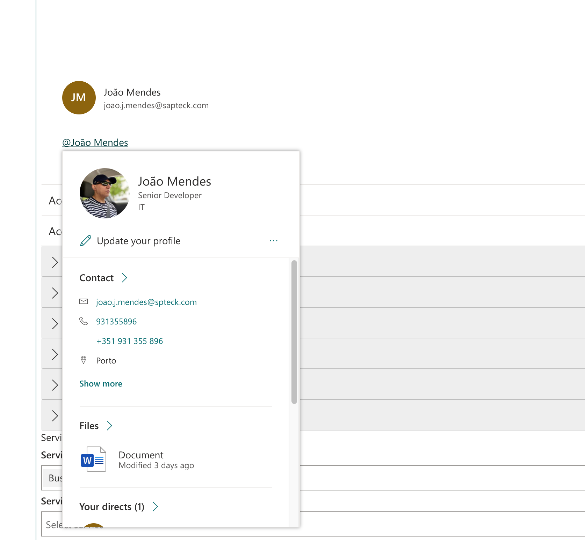

# LivePersona control

This control allows you to use LivePersona Card available on SharePoint Online.

!!! attention
    The `LivePersona` Card uses an internal SharePoint Component and it can be changed in the future. Use at your own risk and be conscious that its behavior can be changed.

## Example

Here is an example of the control:



## How to use this control in your solutions

- Check that you installed the `@pnp/spfx-controls-react` dependency. Check out the [getting started](../../#getting-started) page for more information about installing the dependency.
- Import the control into your component:

```TypeScript
import { LivePersona } from "@pnp/spfx-controls-react/lib/LivePersona";
```

- Use the `LivePersona` control in your code as follows:

```TypeScript
<LivePersona upn="joao.j.mendes@spteck.com"
  template={
    <>
      <Persona text="João Mendes" secondaryText="joao.j.mendes@sapteck.com" coinSize={48} />
    </>
  }
 serviceScope={this.context.serviceScope}
/>
```

## Implementation

The `LivePersona` control can be configured with the following properties:

| Property     | Type                  | Required | Description                                                                |
| ------------ | --------------------- | -------- | -------------------------------------------------------------------------- |
| serviceScope | ServiceScope          | yes      | The SPFx ServiceScope object loaded from context of web part or extension. |
| upn          | string                | yes      | User UPN.                                                                  |
| disableHover | boolean               | no       | If info should not appear on hover.                                        |
| template     | string \| JSX.Element | yes      | The content to wrap with persona info.                                     |
