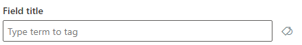
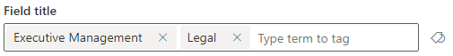
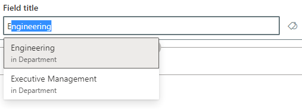

# Modern Taxonomy Picker

This control allows you to select one or more Terms from a TermSet via its TermSet ID. You can also configure the control to select the child terms from a specific term in the TermSet by setting the anchorTermId. This is the modern version of the taxonomy picker that uses the REST API and makes use of some load on demand features which makes it well suited for large term sets.

!!! note "Disclaimer"
    Since this control is meant to look as and work in the same way as the out-of-the-box control it lacks some of the features from the legacy ```TaxonomyPicker``` control. If you need some of those features please continue using the legacy version.

- Empty term picker:



- Selecting terms:


- Selected terms in picker:



- Term picker: Auto Complete:



## How to use this control in your solutions

- Check that you installed the `@pnp/spfx-controls-react` dependency. Check out the [getting started](../../#getting-started) page for more information about installing the dependency.
- Import the following modules to your component:

```TypeScript
import { ModernTaxonomyPicker } from "@pnp/spfx-controls-react/lib/ModernTaxonomyPicker";
```

- Use the `ModernTaxonomyPicker` control in your code as follows:

```TypeScript
<ModernTaxonomyPicker allowMultipleSelections={true}
  termSetId="f233d4b7-68fb-41ef-8b58-2af0bafc0d38"
  panelTitle="Select Term"
  label="Taxonomy Picker"
  context={this.props.context}
  onChange={this.onTaxPickerChange}
/>
```

- With the `onChange` property you can capture the event of when the terms in the picker has changed:

```typescript
private onTaxPickerChange(terms : ITermInfo[]) {
  console.log("Terms", terms);
}
```

## Advanced example

Custom rendering of a More actions button that displays a context menu for each term in the term set and the term set itself and with different options for the terms and the term set. This could for example be used to add terms to an open term set. It also shows how to set the initialsValues property when just knowing the name and the id of the term.

```TypeScript
const termSetId = "36d21c3f-b83b-4acc-a223-4df6fa8e946d";
const [clickedActionTerm, setClickedActionTerm] = React.useState<ITermInfo>();

private addTermSwitch = async (index: number, term: ITermInfo, updateTaxonomyTreeViewCallback: any, isParent: boolean) => {
    if (isParent) {
      this.addTerm(index, term, updateTaxonomyTreeViewCallback);
    } else {
      this.addChildTerm(index, term, updateTaxonomyTreeViewCallback);
    }
  }

  //Below methods are using graphClient to create terms
  private addTerm = async (index: number, term: ITermInfo, updateTaxonomyTreeViewCallback: any) => {
    try {
      if (termSetId) {
        this.props.context?.msGraphClientFactory?.getClient("3").then((client) => {
          client
            .api(`/sites/${this.props.context?.pageContext.site.id}/termStore/sets/${termSetId}/terms/${term.id}`)
            .post({
              labels: [
                {
                  languageTag: "en-US",
                  name: "TestTerm",
                  isDefault: true,
                },
              ],
            })
            .then((response) => {
              const { "@odata.context": _, ...filteredResponse } = response;
              filteredResponse.isAvailableForTagging = [
                {
                    "setId": termSetId,
                    "isAvailable": true
                }
            ];
              // Pass the filtered response to updateTaxonomyTreeViewCallback
              updateTaxonomyTreeViewCallback([filteredResponse] as ITermInfo[], [term] as ITermInfo[], null, null);
            })
            .catch((error) => {
              console.error("Error adding child term", error);
            });
        });
      } else {
        console.error("termSetId is undefined");
      }
    } catch (error) {
      console.error("Error adding child term", error);
    }
  }

  private addChildTerm = async (index: number, term: ITermInfo, updateTaxonomyTreeViewCallback: any) => {
    try {
      if (termSetId) {
        this.props.context?.msGraphClientFactory?.getClient("3").then((client) => {
          client
            .api(`/sites/${this.props.context?.pageContext.site.id}/termStore/sets/${termSetId}/terms/${term.id}/children`)
            .post({
              labels: [
                {
                  languageTag: "en-US",
                  name: "TestChild",
                  isDefault: true,
                },
              ],
            })
            .then((response) => {
              // Exclude @odata.context from the response
              const { "@odata.context": _, ...filteredResponse } = response;
              filteredResponse.isAvailableForTagging = [
                {
                    "setId": termSetId,
                    "isAvailable": true
                }
            ];
              // Pass the filtered response to updateTaxonomyTreeViewCallback
              updateTaxonomyTreeViewCallback([filteredResponse] as ITermInfo[], [term] as ITermInfo[], null, null);
            })
            .catch((error) => {
              console.error("Error adding child term", error);
            });
        });
      } else {
        console.error("termSetId is undefined");
      }
    } catch (error) {
      console.error("Error adding child term", error);
    }
  }
    

  private deleteTerm = (_: number, term: ITermInfo,updateTaxonomyTreeViewCallback: any) => {
    if (termSetId) {
      this.props.context?.msGraphClientFactory?.getClient("3").then((client) => {
        client
          .api(`/sites/${this.props.context?.pageContext.site.id}/termStore/sets/${termSetId}/terms/${term.id}`)
          .delete()
          .then(() => {
            console.log("Term deleted");
            updateTaxonomyTreeViewCallback(null,null,[term] as ITermInfo[]);
          })
          .catch((error) => {
            console.error("Error deleting term", error);
          });
      });
    } else {
      console.error("termSetId is undefined");
    }
  }

  //Another example in how to create term
  const addChildTerm = (parentTermId, updateTaxonomyTreeViewCallback): void => {
  spPost(sp.termStore.sets.getById(termSetId).terms.getById(parentTermId).children, {
    body: JSON.stringify({
      "labels": [
        {
          "languageTag": "en-US",
          "name": "Test",
          "isDefault": true
        }
      ]
    }),
  })
  .then(addedTerm => {
    return sp.termStore.sets.getById(termSetId).terms.getById(addedTerm.id).expand("parent")();
  })
  .then(term => {
    updateTaxonomyTreeViewCallback([term], null, null);
  });
} 

//Usage
<ModernTaxonomyPicker
    allowMultipleSelections={true}
    termSetId={'8ed8c9ea-7052-4c1d-a4d7-b9c10bffea6f'}
    panelTitle='Select Term'
    label={'Modern Taxonomy Picker'}
    context={this.props.context}
    required={false}
    disabled={false}
    onRenderActionButton={(
      termStoreInfo: any, 
      termSetInfo: any, 
      termInfo: ITermInfo,
      updateTaxonomyTreeViewCallback?: (newTermItems?: ITermInfo[], parentTerm?:ITermInfo[], updatedTermItems?: ITermInfo[], deletedTermItems?: ITermInfo[]) => void
    ): JSX.Element => {
    const menuIcon: IIconProps = { iconName: 'MoreVertical', 'aria-label': 'Add or delete terms', style: { fontSize: 'medium' } };
    if (termInfo) {
      const menuProps: IContextualMenuProps = {
        items: [
          {
            key: 'addTerm',
            text: 'Add Term',
            iconProps: { iconName: 'Tag' },
            onClick: () => { (async () => await this.addTermSwitch(0, termInfo, updateTaxonomyTreeViewCallback, false))(); }
          },
          {
            key: 'deleteTerm',
            text: 'Delete term',
            iconProps: { iconName: 'Untag' },
            onClick: () => this.deleteTerm(0,termInfo, updateTaxonomyTreeViewCallback)
          },
        ],
      };
      return (
        <>
          <IconButton
          menuProps={menuProps}
          menuIconProps={menuIcon}
          style={{opacity: 1}}
          onMenuClick={(_: React.MouseEvent<HTMLElement, MouseEvent> | React.KeyboardEvent<HTMLElement>, __?: IButtonProps) => {
            console.log('IconButton clicked');
            this.setClickedActionTerm(termInfo);
          }}
        />
        </>
      );
    }
    else {
      const menuProps: IContextualMenuProps = {
        items: [
          {
            key: 'addTerm',
            text: 'Add term',
            iconProps: { iconName: 'Tag' },
            onClick: () => { (async () => await this.addTermSwitch(0, termInfo, updateTaxonomyTreeViewCallback, true))(); }
          },
        ],
      };
      return (
        <IconButton
          menuProps={menuProps}
          menuIconProps={menuIcon}
          style={{opacity: 1}}
        />
      );
    }
  }}
/>
```

## Implementation

The ModernTaxonomyPicker control can be configured with the following properties:

| Property | Type | Required | Description |
| ---- | ---- | ---- | ---- |
| panelTitle | string | yes | TermSet Picker Panel title. |
| label | string | yes | Text displayed above the Taxonomy Picker. |
| disabled | boolean | no | Specify if the control should be disabled. Default value is false. |
| context | BaseComponentContext | yes | Context of the current web part or extension. |
| initialValues | ITermInfo[] | no | Defines the terms selected by default. This will only set the initial values and cannot be used to use the control in a controlled way. ITermInfo comes from PnP/PnPjs and can be imported with <br/>```import { ITermInfo } from '@pnp/sp/taxonomy';``` |
| allowMultipleSelections | boolean | no | Defines if the user can select only one or multiple terms. Default value is false. |
| termSetId | string | yes | The Id of the TermSet that you would like the Taxonomy Picker to select terms from. |
| onChange | function | no |  Captures the event of when the terms in the picker has changed. |
| anchorTermId | string | no | Set the id of a child term in the TermSet to be able to select terms from that level and below. |
| placeHolder | string | no | Short text hint to display in picker. |
| required | boolean | no | Specifies if to display an asterisk near the label. Default value is false. |
| customPanelWidth | number | no | Custom panel width in pixels. |
| termPickerProps | IModernTermPickerProps | no | Custom properties for the term picker (More info: [IBasePickerProps interface](https://developer.microsoft.com/en-us/fluentui#/controls/web/pickers#IBasePickerProps)).  |
| themeVariant | IReadonlyTheme | no | The current loaded SharePoint theme/section background (More info: [Supporting section backgrounds](https://docs.microsoft.com/sharepoint/dev/spfx/web-parts/guidance/supporting-section-backgrounds)). |
| isLightDismiss | boolean | no | Whether the panel can be light dismissed. |
| isBlocking | boolean | no | Whether the panel uses a modal overlay or not. |
| onRenderActionButton | function | no | Optional custom renderer for adding e.g. a button with additional actions to the terms in the tree view. See advanced example section |
| isPathRendered | boolean | no | Whether the terms will be rendered with the term label or the full path up to the root. |
| allowSelectingChildren | boolean | no | Whether child terms can be selected. Default value is true. |

## Standalone TaxonomyTree control

You can also use the `TaxonomyTree` control separately to just render a stand-alone tree-view of a term set with action buttons.

- Use the `TaxonomyTree` control in your code as follows:  
  Initialize the taxonomy service and state, load basic info from term store and display the `TaxonomyTree` component.

```TypeScript
import * as React from "react";
import { Guid } from "@microsoft/sp-core-library";
import { WebPartContext } from "@microsoft/sp-webpart-base";
import { sp } from "@pnp/sp";
import { ITermInfo, ITermSetInfo, ITermStoreInfo } from "@pnp/sp/taxonomy";
import { SPTaxonomyService, TaxonomyTree } from "@pnp/spfx-controls-react";

export interface ITestTaxonomyTreeReactHooksProps {
  context: WebPartContext;
  termSetId: string;
  onRenderActionButton?: (termStoreInfo: ITermStoreInfo, termSetInfo: ITermSetInfo, termInfo: ITermInfo, updateTaxonomyTreeViewCallback?: (newTermItems?: ITermInfo[], updatedTermItems?: ITermInfo[], deletedTermItems?: ITermInfo[]) => void) => JSX.Element;
}

export function TestTaxonomyTreeReactHooks(
	props: ITestTaxonomyTreeReactHooksProps
): React.ReactElement<ITestTaxonomyTreeReactHooksProps> {
  const taxonomyService = new SPTaxonomyService(props.context);
  const [terms, setTerms] = React.useState<ITermInfo[]>([]);
  const [currentTermStoreInfo, setCurrentTermStoreInfo] = React.useState<ITermStoreInfo>();
  const [currentTermSetInfo, setCurrentTermSetInfo] = React.useState<ITermSetInfo>();
  const [currentLanguageTag, setCurrentLanguageTag] = React.useState<string>("");
  
  React.useEffect(() => {
    sp.setup(props.context);
    taxonomyService.getTermStoreInfo()
      .then((termStoreInfo) => {
        setCurrentTermStoreInfo(termStoreInfo);
        setCurrentLanguageTag(props.context.pageContext.cultureInfo.currentUICultureName !== '' ?
          props.context.pageContext.cultureInfo.currentUICultureName :
          currentTermStoreInfo.defaultLanguageTag);
      });
    taxonomyService.getTermSetInfo(Guid.parse(props.termSetId))
      .then((termSetInfo) => {
        setCurrentTermSetInfo(termSetInfo);
      });
  }, []);
  
  return (
    currentTermStoreInfo && currentTermSetInfo && currentLanguageTag && (
      <TaxonomyTree
        languageTag={currentLanguageTag}
        onLoadMoreData={taxonomyService.getTerms}
        pageSize={50}
        setTerms={setTerms}
        termSetInfo={currentTermSetInfo}
        termStoreInfo={currentTermStoreInfo}
        terms={terms}
        onRenderActionButton={props.onRenderActionButton}
        hideDeprecatedTerms={false}
        showIcons={true}
      />
    ) || null
  );
}
```


