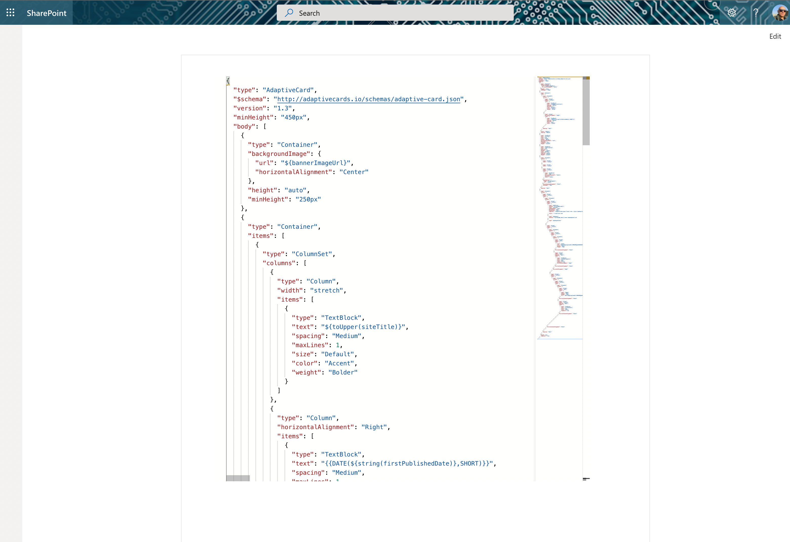
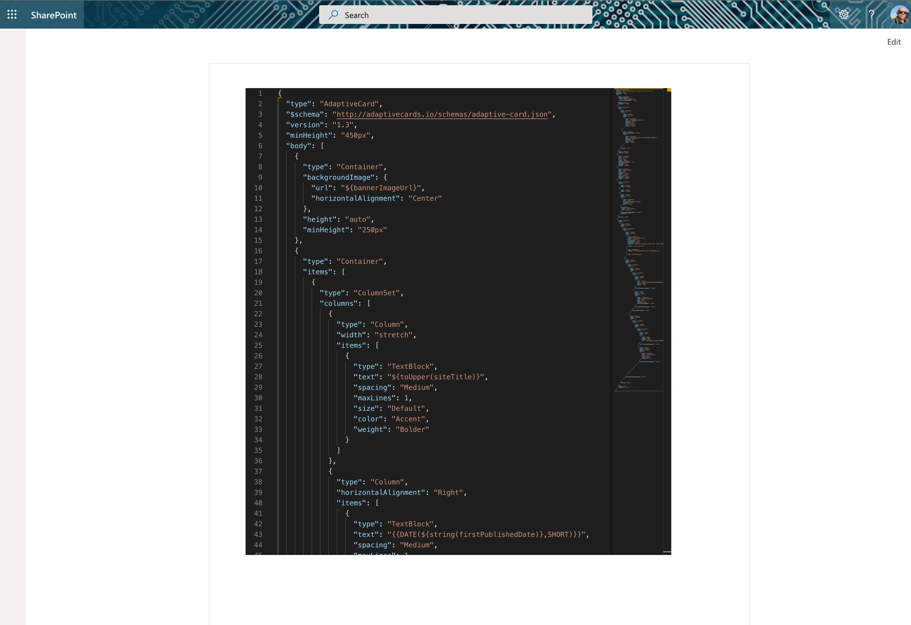

# Monaco Editor control

This control is an implementation of the Monaco Editor. The Monaco Editor is the code editor that powers [VS Code](https://github.com/microsoft/vscode).

Here is an example of the control:



`MonacoEditor` dark theme:



## How to use this control in your solutions

- Check that you installed the `@pnp/spfx-controls-react` dependency. Check out the [getting started](../../#getting-started) page for more information about installing the dependency.
- Import the control into your component:

```TypeScript
import { MonacoEditor } from "@pnp/spfx-controls-react/lib/MonacoEditor";
```

- Use the `MonacoEditor` control in your code as follows:

```TypeScript
 <MonacoEditor value={defaultValue}
               showMiniMap={true}
               onValueChange={onValueChange}
               language={"javascript"}/>
```

- The `onValueChange` change event returns the updated code and array with messages of errors on validation and can be implemented as follows:

> This validation is only available for JSON language

Your `onValueChange` handler would follow a similar format to this:

```TypeScript
const onValueChange = (newValue: string, validationErrors: string[]): void => { console.log(newValue); };
```

Or, if using React Hooks:

```TypeScript
const onValueChange = React.useCallback((newValue: string, validationErrors: string[]): void => {console.log(newValue);} , []);
```

## Implementation

The `MonacoEditor` control can be configured with the following properties:

| Property | Type | Required | Description |
| ---- | ---- | ---- | ---- |
| value | string   | yes | default content for editor |
| theme | string | no | theme used by editor, two themes are supported 'vs'  and 'vs-dark', default 'vs' |
| readOnly | boolean | no | indicate if editor is in read-only mode |
| showLineNumbers | boolean | no | editor show line number or not, default : yes|
| onValueChange |(newValue:string, validationErrors:string[]) => void | no | function to get code changes, return an array with validation error in case of language is 'JSON' |
| language |string | yes | editor code language, please see <https://microsoft.github.io/monaco-editor/index.html> for supported languages|
| jsonDiagnosticsOptions |monaco.languages.json.DiagnosticsOptions | no | define options to JSON validation, please see  <https://microsoft.github.io/monaco-editor/index.html> for more details |
| javascriptDiagnosticsOptions | monaco.languages.typescript.DiagnosticsOptions | no | define options to javascript or typescript validation, please see  <https://microsoft.github.io/monaco-editor/index.html> for more details |
