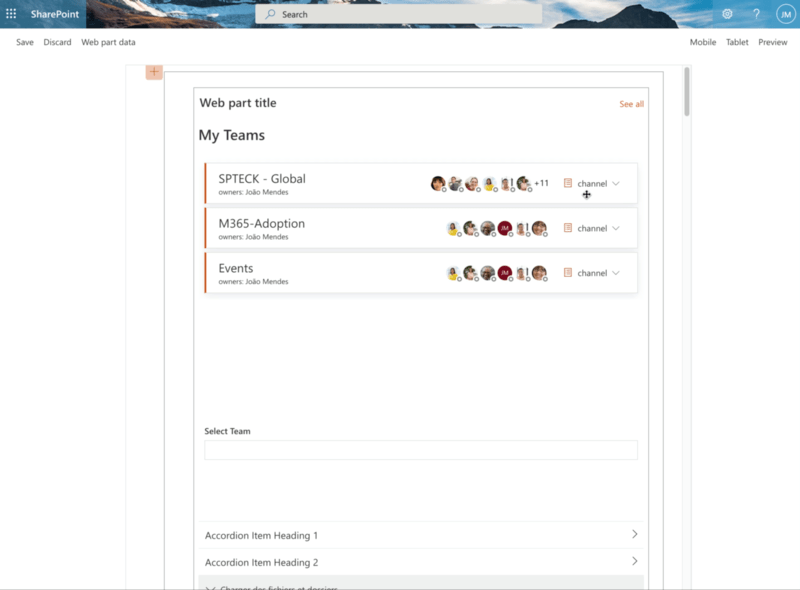
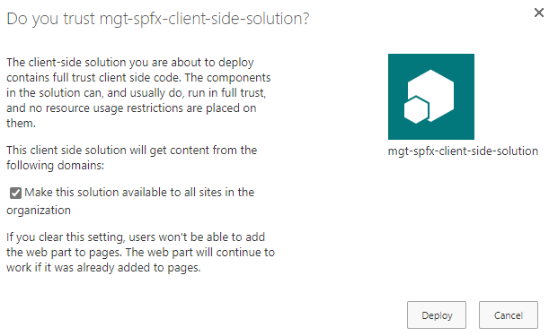

# MyTeams control

This control show all Teams the user has access (joined),and for each Team the user can see the channels has permissions and quick open the channel or if callback is specified can return the Team Id and Channel Id for use in App.

The user can quick see the members and owner of the group.
This control uses the [People](https://docs.microsoft.com/graph/toolkit/components/people) component from [mgt-toolkit](https://docs.microsoft.com/graph/toolkit/overview) that can be configured to show Person Card on hover. Please refer to required dependencies section to install the [mgt-spfx](https://docs.microsoft.com/graph/toolkit/get-started/mgt-spfx) library in your tenant.

Here is an example of the control:




## Required dependencies

In order to resolve an issue using controls from [mgt-toolkit](https://docs.microsoft.com/graph/toolkit/overview) within SharePoint Framework solutions, the mgt team created an SPFx library that should be deployed to your tenant. For the MyTeams control to work, we had no other option but to add a dependency on the mgt-spfx library. More information about mgt-spfx is available [here](https://docs.microsoft.com/graph/toolkit/get-started/mgt-spfx)

Simply download the `mgt-spfx-2.2.0.sppkg` file from the link below and deploy to the SharePoint app catalog, making the solution available to all sites in the tenant.

[mgt-spfx direct download link](https://github.com/microsoftgraph/microsoft-graph-toolkit/releases/download/v2.2.0/mgt-spfx-2.2.0.sppkg)



## How to use this control in your solutions

- Check that you installed the `@pnp/spfx-controls-react` dependency. Check out the [getting started](../../#getting-started) page for more information about installing the dependency.
- Import the control into your component:

```TypeScript
import { MyTeams } from "@pnp/spfx-controls-react/lib/MyTeams";
```

- Use the `MyTeams` control in your code as follows:

```TypeScript
<MyTeams
  title="My Teams"
  webPartContext={context}
  themeVariant={themeVariant} />
```

```TypeScript
<MyTeams
  title="My Teams"
  webPartContext={context}
  themeVariant={themeVariant}
  enablePersonCardInteraction={true}
  onSelectedChannel={onSelectedChannel} />
```

- The `onSelectedChannel` callback returns the teamId and ChannelId and can be implemented as follows:

```TypeScript
const onSelectedChannel = (teamsId: string, channelId: string) => {
  console.log("TeamsId", teamsId);
  console.log("ChannelId", channelId);
};
```

## Implementation

The `MyTeams` control can be configured with the following properties:

| Property                    | Type                                      | Required | Description                                   |
| --------------------------- | ----------------------------------------- | -------- | --------------------------------------------- |
| webPartContext              | WebPartContext                            | yes      | The context object of the SPFx loaded webpart |
| title                       | string                                    | no       | Title of WebPart                              |
| themeVariant                | IReadonlyTheme                            | no       | themeVariant                                  |
| enablePersonCardInteraction | boolean                                   | no       | Show Person Card on hover                     |
| onSelectedChannel           | (teamId:string,channelId:string) => void; | no       | callBack with TeamId and ChannelId Selected   |

## MSGraph Permissions required

This control requires at least the following scopes:

- `Channel.ReadBasic.All`
- `Team.ReadBasic.All`
- `TeamMember.Read.All`
- All scopes used by [mgt-people](https://docs.microsoft.com/graph/toolkit/components/people) and [mgt-person](https://docs.microsoft.com//graph/toolkit/components/person-card) components
