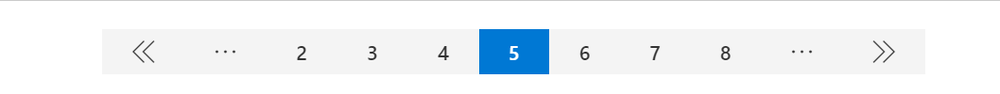

# Pagination Control

This control renders a Pagination component which can be used to show limited information of data. For example, you can set up your search result for the first 10 and then when clicking on a new page make a new request for other 10 elements.

- Pagination on the page:



## How to use this control in your solutions

- Check that you installed the `@pnp/spfx-controls-react` dependency. Check out the [getting started](../../#getting-started) page for more information about installing the dependency.
- Import the following modules to your component:

```typescript
import { Pagination } from "@pnp/spfx-controls-react/lib/pagination";
```

- Use the `Pagination` control in your code as follows:

```typescript
<Pagination
  currentPage={3}
  totalPages={13} 
  onChange={(page) => this._getPage(page)}
  limiter={3} // Optional - default value 3
  hideFirstPageJump // Optional
  hideLastPageJump // Optional
  limiterIcon={"Emoji12"} // Optional
/>
```

- With the `onChange` property you can get the selected Page in the Pagination component:

```typescript
private _getPage(page: number){
  console.log('Page:', page);
}
```

## Implementation

The Pagination control can be configured with the following properties:

| Property          | Type    | Required | Description                                               | Default |
| ----------------- | ------- | -------- | --------------------------------------------------------- | ------- |
| currentPage       | number  | yes      | The page initial selected                                 |         |
| totalPages        | number  | yes      | The total of page that you want to show on control        |         |
| onChange          | string  | yes      | When the page number change send the page number selected |         |
| limiter           | string  | no       | The number of pages showing before the icon               | 3       |
| hideFirstPageJump | boolean | no       | Hide the quick jump to the first page                     | false   |
| hideLastPageJump  | boolean | no       | Hide the quick jump to the last page                      | false   |
| limiterIcon       | string  | no       | Limiter icon form Fluent IU                               | More    |


