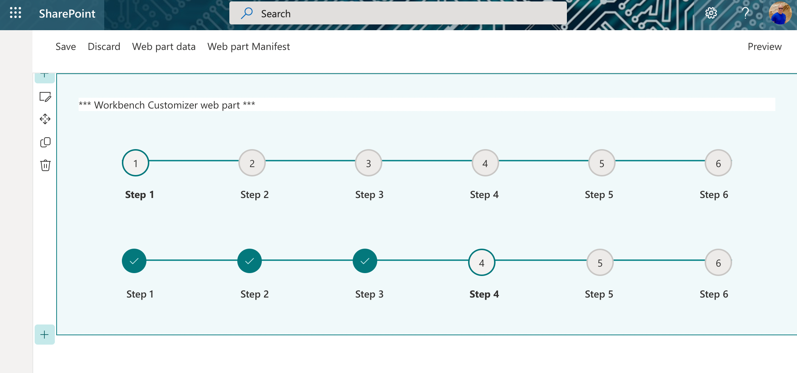

# Progress Steps Indicator

This control shows a progress of steps.

Here is an example of the control in action:



## How to use this control in your solutions

- Check that you installed the `@pnp/spfx-controls-react` dependency. Check out the [getting started](../../#getting-started) page for more information about installing the dependency.
- In your component file, import the `ProgressStepsIndicator` control as follows:

```TypeScript
import { ProgressStepsIndicator } from '"@pnp/spfx-controls-react/lib/ProgressStepsIndicator';

const progressSteps: IStep[] = [
  { id: 0, title: "Step 1", description: "Step 1 Description" },
  { id: 1, title: "Step 2", description: "Step 2 Description" },
  { id: 3, title: "Step 3", description: "Step 3 Description" },
  { id: 4, title: "Step 4", description: "Step 4 Description" },
  { id: 5, title: "Step 5", description: "Step 5 Description" },
  { id: 6, title: "Step 6", description: "Step 6 Description" },
];
```

- Use the `ProgressStepsIndicator` control in your code as follows:

```TypeScript
{
     <ProgressStepsIndicator steps={progressSteps} currentStep={0} themeVariant={props.themeVariant} />
}
```

## Implementation

The `ProgressStepsIndicator` control can be configured with the following properties:

| Property     | Type           | Required  | Description           | Default      |
| ------------ | -------------- | --------- | --------------------- | ------------ |
| steps        | ISteps[]       | yes       | Progress Steps       |              |
| currentStep  | number         | yes       | index of current step | default is 0 |
| themeVariant | IReadonlyTheme | undefined | no                    | Theme        |

The `IStep Interface` definition:

```TypeScript
Interface IStep {
  id?:number;
  title:string;
  description:string;
}
```


