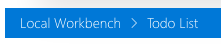
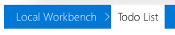

# SiteBreadcrumb control

This control returns a breadcrumb based on the current location.




## How to use this control in your solutions

- Check that you installed the `@pnp/spfx-controls-react` dependency. Check out the [getting started](../../#getting-started) page for more information about installing the dependency.
- Import the following modules to your component:

```TypeScript
import { SiteBreadcrumb } from "@pnp/spfx-controls-react/lib/SiteBreadcrumb";
```

- Use the `SiteBreadcrumb` control in your code as follows:

```TypeScript
<SiteBreadcrumb context={this.props.context} />
```

## Implementation

The SiteBreadcrumb control can be configured with the following properties:

| Property | Type                 | Required | Description                                                            |
| -------- | -------------------- | -------- | ---------------------------------------------------------------------- |
| context  | BaseComponentContext | yes      | Pass the context of your web part or application customizer extension. |


