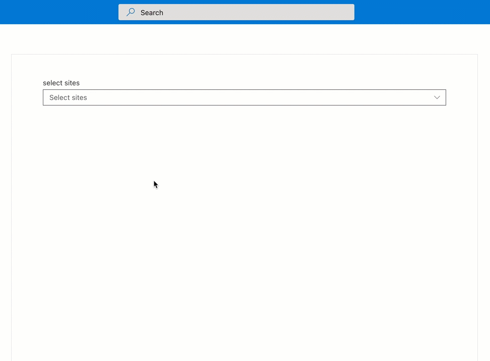

# SitePicker control

This control allows you to select one or multiple available sites, site collections or hub sites.

Here is an example of the control.

`SitePicker` single selection mode:


`SitePicker` multi-selection mode



## How to use this control in your solutions

- Check that you installed the `@pnp/spfx-controls-react` dependency. Check out the [getting started](../../#getting-started) page for more information about installing the dependency.
- Import the control into your component:

```TypeScript
import { SitePicker } from "@pnp/spfx-controls-react/lib/SitePicker";
```

- Use the `SitePicker` control in your code as follows:

```TypeScript
<SitePicker
  context={this.props.context}
  label={'Select sites'}
  mode={'site'}
  allowSearch={true}
  multiSelect={false}
  onChange={(sites) => { console.log(sites); }}
  placeholder={'Select sites'}
  searchPlaceholder={'Filter sites'} />
```

- The `onChange` change event returns the selected site(s).

## Implementation

The `SitePicker` control can be configured with the following properties:

| Property | Type | Required | Description |
| ---- | ---- | ---- | ---- |
| allowSearch | boolean | no | Specifies if search box is displayed for the component. Default: `true`. |
| context | BaseComponentContext | yes | The context object of the SPFx loaded webpart or customizer. |
| deferredSearchTime | number | no | The list will be filtered after users stop typing for `deferredSearchTime` milliseconds. Default: 200. |
| className | string | no | If provided, additional class name to provide on the dropdown element. |
| disabled | boolean | no | Whether or not the control is disabled. |
| initialSites | ISite[] | no | Initial data to load in the 'Selected sites' area (optional). |
| isDesc | boolean | no | Specifies if the list is sorted in descending order. Default: `false`. |
| label | string | no | Label to use for the control. |
| limitToCurrentSiteCollection | boolean | no | Specifies if the options should be limited by the current site collections. Taken into consideration if selectionMode is set to `web`. |
| mode | `associatedsites` \| `site` \| `web` \| `hub` | no | Defines what entities are available for selection: site collections, sites, hub sites and sites inside hub. Default: `web`. |
| multiSelect | boolean | no | Optional mode indicates if multi-choice selections is allowed. Default: `true`. |
| onChange | `(selectedSites: ISite[]) => void` | yes | Selection change handler. |
| orderBy | `title` \| `url` | no | Specifies if the list is sorted by title or url. Default: `title`. |
| placeholder | string | no | Placeholder label to show in the dropdown. |
| searchPlaceholder | string | no | Search input placeholder text. Displayed until search text is entered. |
| trimDuplicates | boolean | no | Specifies if the duplicates should be trimmed. false by default. Applicable if mode is set to site or web. |
| additionalQuery | string | no | If provided will be added to the search query as AND part. Applicable if mode is set to site or web. |

Interface `ISite`

| Property  | Type   | Required | Description                                                                       |
| --------- | ------ | -------- | --------------------------------------------------------------------------------- |
| id        | string | no       | ID of the site collection.                                                        |
| title     | string | no       | Title of the site.                                                                |
| url       | string | no       | URL of the site.                                                                  |
| webId     | string | no       | ID of the site. **Note: the value is not populated if the `mode` is set to `hub`. |
| hubSiteId | string | no       | ID of the hub site.                                                               |


