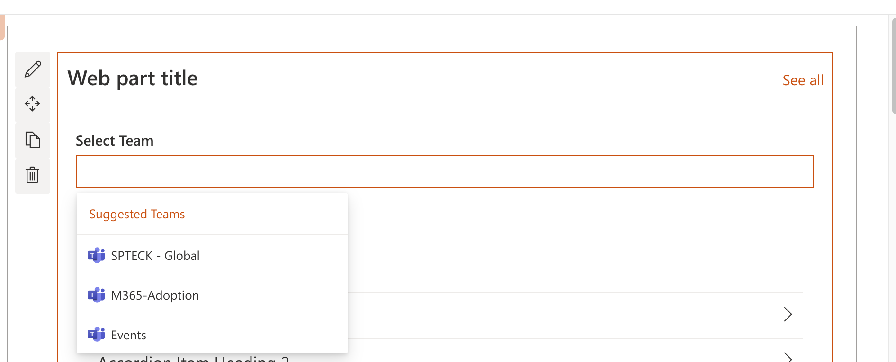

# TeamPicker control

This control allows you to select one or multiple Teams based on user's permissions.

Here is an example of the control:


`SelectTeamPicker` single selection mode:



## How to use this control in your solutions

- Check that you installed the `@pnp/spfx-controls-react` dependency. Check out the [getting started](../../#getting-started) page for more information about installing the dependency.
- Import the control into your component:

```TypeScript
import { SelectTeamPicker } from "@pnp/spfx-controls-react/lib/TeamPicker";
```

- Use the `SelectTeamPicker` control in your code as follows:

```TypeScript
<TeamPicker label="Select Team"
            selectedTeams={selectedTeams}
            appcontext={webpartContext}
            itemLimit={1}
            onSelectedTeams={_onSelectedTeams}/>
```

- The `_onSelectedTeams` change event returns the team(s) and can be implemented as follows:

```TypeScript
const _onSelectedTeams ((tagList: ITag[]) => {
    console.log(tagList);
}
```

## Implementation

The `TeamPicker` control can be configured with the following properties:

| Property         | Type                               | Required | Description                                                  |
| ---------------- | ---------------------------------- | -------- | ------------------------------------------------------------ |
| appcontext       | WebPartContext \| ExtensionContext | yes      | The context object of the SPFx loaded webpart or customizer. |
| selectedTeams    | ITag[]                             | yes      | Array with Selected Teams                                    |
| itemLimit        | number                             | no       | number of allowed selected items                             |
| label            | string                             | no       | Label of Picker                                              |
| styles           | IBasePickerStyles                  | no       | Customer Styles of Picker                                    |
| onSelectedTeams: | (tagsList:ITag[]) => void;         | yes      | callBack with teams Selected                                 |

## MSGraph Permissions required

This control requires at least the following scopes:

- `Channel.ReadBasic.All`
- `Team.ReadBasic.All`
