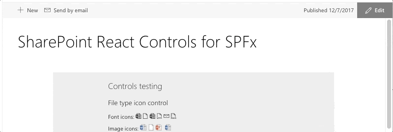
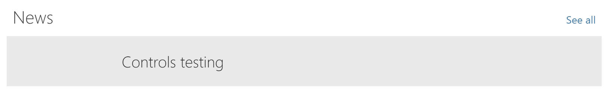

# WebPartTitle control

This control renders a web part title that is changeable when the page is in edit mode.

Here is an example of the control in action:



## How to use this control in your solutions

- Check that you installed the `@pnp/spfx-controls-react` dependency. Check out the [getting started](../../#getting-started) page for more information about installing the dependency.
- In the root web part file, the one that extends from the `BaseClientSideWebPart` class. Pass the following properties to your web part main component:

```TypeScript
const element: React.ReactElement<IControlsTestProps> = React.createElement(
  ControlsTest,
  {
    title: this.properties.title,
    displayMode: this.displayMode,
    updateProperty: (value: string) => {
      this.properties.title = value;
    }
  }
);
```

- Add the `title`, `displayMode`, and `updateProperty` properties to the properties interface of your component:

```TypeScript
import { DisplayMode } from '@microsoft/sp-core-library';

export interface IControlsTestProps {
  title: string;
  displayMode: DisplayMode;
  updateProperty: (value: string) => void;
}
```

- In your component file, import the `WebPartTitle` control as follows:

```TypeScript
import { WebPartTitle } from "@pnp/spfx-controls-react/lib/WebPartTitle";
```

- Use the `WebPartTitle` control in your code as follows:

```TypeScript
<WebPartTitle displayMode={this.props.displayMode}
              title={this.props.title}
              updateProperty={this.props.updateProperty} />
```

## Adding a "see all" link

Since version `1.13.0` the WebPartTitle control has the ability to show a "see all" link by using the `moreLink` property. The property gives you the flexibility to render the link or component you want to show next to the web part title.

You can do this as like in the following example code:

```TypeScript
<WebPartTitle displayMode={this.props.displayMode}
              title={this.props.title}
              updateProperty={this.props.updateProperty}
              moreLink={
                <Link href="https://pnp.github.io/sp-dev-fx-controls-react/">See all</Link>
              } />
```

If you wish, you may pass a callback function instead, as per the following example code:

```TypeScript
<WebPartTitle displayMode={this.props.displayMode}
              title={this.props.title}
              updateProperty={this.props.updateProperty}
              moreLink={
                ()=> {
                  return (<Link href="https://pnp.github.io/sp-dev-fx-controls-react/">See all</Link>);
                }
              } />
```

The resulting web part title will look like the following:



## Implementation

The WebPartTitle control can be configured with the following properties:

| Property | Type | Required | Description |
| ---- | ---- | ---- | ---- |
| displayMode | DisplayMode | yes | This tells the control in which page mode it is rendering. |
| title | string | yes | The title value for the web part. |
| updateProperty | Function | yes | Function that you can pass to update the title in the root web part. |
| className | string | no | Optional property to specify a custom class that allows you to change the web part title style. |
| placeholder | string | no | Optional property to specify a custom placeholder to display when the title is editable. |
| themeVariant | IReadonlyTheme | no | The current loaded SharePoint theme/section background (More info: [Supporting section backgrounds](https://docs.microsoft.com/sharepoint/dev/spfx/web-parts/guidance/supporting-section-backgrounds)). |
| moreLink | Function \| JSX.Element | no | Optional property to render a _See all_ link in the web part title. |


