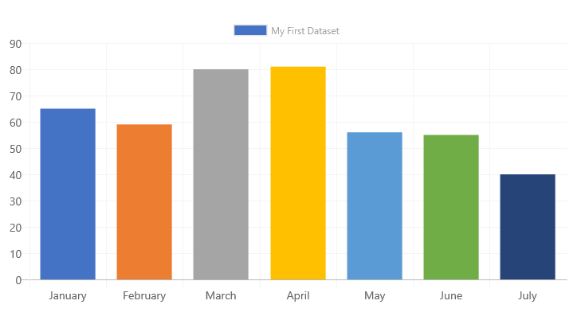
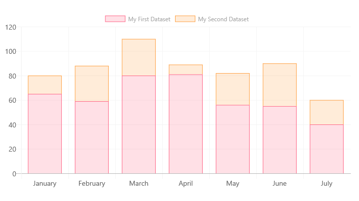
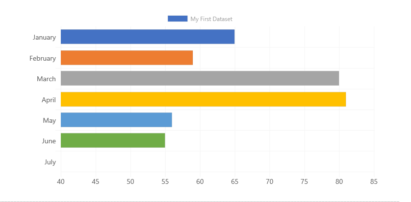
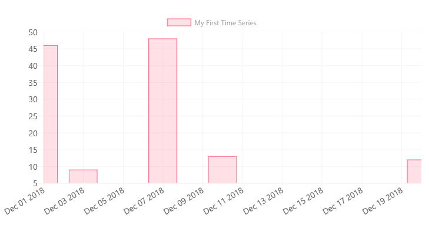

# ChartControl - Bar Chart

Bar charts represent data values as vertical bars.


## Example Usage

To create a bar chart, add the ChartControl import:

```TypeScript
import { ChartControl, ChartType } from '@pnp/spfx-controls-react/lib/ChartControl';
```

Then render the ChartControl:

```TypeScript
 <ChartControl
    type={ChartType.Bar}
    data={data}
    options={options}
  />
```

For example, to render the chart above, use the following code:

```TypeScript
// set the data
const data: Chart.ChartData = {
    labels:
      [
        'January', 'February', 'March', 'April', 'May', 'June', 'July'
      ],
    datasets:
      [{
        label: 'My First Dataset',
        data:
          [
            65, 59, 80, 81, 56, 55, 40
          ],
        backgroundColor:
          [
            'rgba(255, 99, 132, 0.2)',
            'rgba(255, 159, 64, 0.2)',
            'rgba(255, 205, 86, 0.2)',
            'rgba(75, 192, 192, 0.2)',
            'rgba(54, 162, 235, 0.2)',
            'rgba(153, 102, 255, 0.2)',
            'rgba(201, 203, 207, 0.2)'
          ],
        borderColor:
          [
            'rgb(255, 99, 132)',
            'rgb(255, 159, 64)',
            'rgb(255, 205, 86)',
            'rgb(75, 192, 192)',
            'rgb(54, 162, 235)',
            'rgb(153, 102, 255)',
            'rgb(201, 203, 207)'
          ],
        borderWidth: 1
      }]
  };

// set the options
const options: Chart.ChartOptions = {
  scales:
  {
    yAxes:
      [
        {
          ticks:
          {
            beginAtZero: true
          }
        }
      ]
  }
};

return (
  <ChartControl
    type={ChartType.Bar}
    data={data}
    options={options}
  />);
```

You can omit the `backgroundColor`, `borderColor`, and `borderWidth` values from the code above to render a chart using the default Office palette:

```TypeScript
// set the data
const data: Chart.ChartData = {
    labels:
      [
        'January', 'February', 'March', 'April', 'May', 'June', 'July'
      ],
    datasets:
      [{
        label: 'My First Dataset',
        data:
          [
            65, 59, 80, 81, 56, 55, 40
          ]
      }]
  };

// set the options
const options: Chart.ChartOptions = {
  scales:
  {
    yAxes:
      [
        {
          ticks:
          {
            beginAtZero: true
          }
        }
      ]
  }
};

return (
  <ChartControl
    type={ChartType.Bar}
    data={data}
    options={options}
  />);
```

Which will produce the following chart:



As with all charts, the `backgroundColor` and `borderColor` values can be one of the following:

* Array of colors (`string[]`): each data element in the dataset will be assigned a different color in the same order as they are listed in the array. If there are more data elements than colors, the remaining data elements will have a grey color.
* A single color (`string`): every data element in the dataset will use the same color.

## Variations

### Stacked Bar Chart



If your bar chart has multiple datasets, you can render it as a stacked bar chart by changing the settings on the X and Y axes to enable stacking, as follows:

```TypeScript
const options: Chart.ChartOptions = {
  scales: {
      xAxes: [{
          stacked: true
      }],
      yAxes: [{
          stacked: true
      }]
  }
};
```

In order to render each dataset with a different color, make sure to specify the `backgroundColor` and `borderColor` settings for each dataset:

```TypeScript
const data: Chart.ChartData = {
      labels:
        [
          'January',
          'February',
          'March',
          'April',
          'May',
          'June',
          'July'
        ],
      datasets:
        [
          {
            label: 'My First Dataset',
            data:
              [
                65,
                59,
                80,
                81,
                56,
                55,
                40
              ],
            fill: false,
            backgroundColor: 'rgba(255, 99, 132, 0.2)', // same color for all data elements
            borderColor: 'rgb(255, 99, 132)', // same color for all data elements
            borderWidth: 1
          },
          {
            label: 'My Second Dataset',
            data:
              [
                15,
                29,
                30,
                8,
                26,
                35,
                20
              ],
            fill: false,
            backgroundColor: 'rgba(255, 159, 64, 0.2)', // same color for all data elements
            borderColor: 'rgb(255, 159, 64)', // same color for all data elements
            borderWidth: 1
          }
        ]
    };
```

### Horizontal Bar Chart



To render a horizontal bar, use the following code:

```TypeScript
<ChartControl
    type={ChartType.HorizontalBar}
    data={data}
    options={options}
  />
```

Using the same options as above. Note that horizontal bar charts can also be stacked using the same approach as above.

## Dataset Properties

Bar charts allow each dataset to have different configuration properties.

Some properties can be provided as arrays. When arrays are provided, the settings in the array will be applied to each data element in the same order (e.g.: first value applies to first element, second value to second element, etc.)

For example, the following code will apply the value `'red:'` to every element in the dataset.

```TypeScript
const data: Chart.ChartData = {
      datasets:
        [
          {
            label: 'My First Dataset',
            data:
              [
                10,
                20,
                30,
              ],
            backgroundColor: 'red'
          }
    };
```

Whereas the following code will set `10` to `backgroundColor` `'red'`, `20` to `'green'`, and `30` to `'blue'`.

```TypeScript
const data: Chart.ChartData = {
      datasets:
        [
          {
            label: 'My First Dataset',
            data:
              [
                10,
                20,
                30,
              ],
            backgroundColor: ['red', 'green', 'blue']
          }
    };
```

| Name                  | Type                                              | Description |
| ----                  | ----                                              | ---- |
| label                 | string                                            | Dataset label. Appears in the legend and tooltips. |
| xAxisID               | string                                            | The axis ID for the X axis. If not specified, the dataset will be rendered on the first available X axis. If an ID is specified, the dataset will be rendered on that axis |
| yAxisID               | string                                            | The axis ID for the Y axis. If not specified, the dataset will be rendered on the first available Y axis. If an ID is specified, the dataset will be rendered on that axis |
| backgroundColor       | Color OR Color[]                                  | The bar fill color.  |
| borderColor           | Color OR Color[]                                  | The bar border color.  |
| borderWidth           | number OR number[]                                | The bar's border width. Measured in pixels. |
| borderSkipped         | `'bottom'`<br/>`'left'`<br/>`'top'`<br/>`'right'` | Specifies which border should be hidden when rendering bars. This option is useful when custom-rendering charts. |
| data | number[] <br/>{ t: Date, y: number}| The chart's data. Required. |
| hoverBackgroundColor  | Color OR Color[]                                  | The bar's fill color when a mouse hovers over it |
| hoverBorderColor      | Color OR Color[]                                  | The bar's border color when a mouse hovers over it.  |
| hoverBorderWidth      | number OR number[]                                | The bar's border width when a mouse hovers over it.  |

## Data Structure

### number[]

The `data` property of each dataset item consists of an array of numbers. Each point in the array corresponds to the matching label on the x axis:

```TypeScript
data: [20, 10, 33, 47]
```

The chart elements will be rendered in the same order as found in the array.

### Time Scales

You can also provide dates and times instead of labels for each data element. Time scales should be provided as `t` (as in `ticks`) and `y` coordinates:

```TypeScript
data: [
  { "t": new Date('December 1 2018'), "y": 46 },
  { "t": new Date('December 3 2018'), "y": 9 },
  { "t": new Date('December 7 2018'), "y": 48 },
  { "t": new Date('December 10 2018'), "y": 13 },
  { "t": new Date('December 20 2018'), "y": 12 },
 ]
```

Or, if you prefer using [moment.js](http://momentjs.com/):

```TypeScript

data: [
  { "t": moment('December 1 2018').valueOf(), "y": 46 },
  { "t": moment('December 3 2018').valueOf(), "y": 9 },
  { "t": moment('December 7 2018').valueOf(), "y": 48 },
  { "t": moment('December 10 2018').valueOf(), "y": 13 },
  { "t": moment('December 20 2018').valueOf(), "y": 12 },
]
```

(add the following to your imports:)

```TypeScript
import * as moment from 'moment';
```

To render horizontal axis as a time series, use the following options:

```TypeScript
options={{
    scales: {
      xAxes: [{
        type: 'time',
        time: {
          displayFormats: {
            // choose the scale that applies to your data,
            // or pass all the scales
            'millisecond': 'MMM DD YYYY', // use your own date format
            'second': 'MMM DD YYYY',
            'minute': 'MMM DD YYYY',
            'hour': 'MMM DD YYYY',
            'day': 'MMM DD YYYY',
            'week': 'MMM DD YYYY',
            'month': 'MMM DD YYYY',
            'quarter': 'MMM DD YYYY',
            'year': 'MMM DD YYYY',
          }
        }
      }]
    }
  }}
```

Which will produce the following chart:



> **NOTE:** As with regular data elements, you should pass the time scale array in the order that you want them to appear. Otherwise, you will get disappointing results.

## Configuration

The following configuration options are specific to bar charts:

| Name                      | Type              | Default | Description |
| ----                      | ----              | ----    | ---- |
| barPercentage             | number            | 0.9     | How much of the category should each bar occupy, in percent. Value should be between 0 and 1. |
| categoryPercentage        | number            | 0.8     | How much each category should occupy, in percent. Value should be between 0 and 1. |
| barThickness              | number OR `"flex"`  |         | Sets the thickness of each bar. If the default value is used, the bars will be equally sized to match the smallest interval.<br/>If `number` value is provided, the bar width will be set in pixels and `barPercentage` and `categoryPercentage` will be ignored.<br/> If `"flex"` is used, the widths are calculated automatically based on the previous and following samples so that they take the full available widths without overlap |
| maxBarThickness           | number            |         | Sets the maximum width of every bar.  |
| gridLines.offsetGridLines | boolean           | true    | `true`, bars will fall between the grid lines; grid lines will shift to the left by  half a tick interval.<br/>If `false`, grid line will align with the middle of the bars.  |

## For More Information

For more information on what options are available with Bar charts, refer to the [Bar Chart documentation](https://www.chartjs.org/docs/latest/charts/bar.html) on [Chart.js](https://www.chartjs.org).


