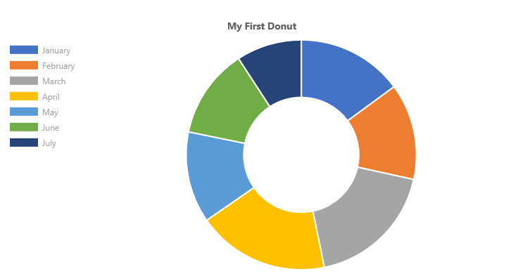

# ChartControl - Doughnut Chart

Doughnut charts are divided into segments, each of which shows the proportional value of the data.



## Example Usage

To create a donut chart, add the ChartControl import:

```TypeScript
import { ChartControl, ChartType } from '@pnp/spfx-controls-react/lib/ChartControl';
```

Then render the ChartControl:

```TypeScript
 <ChartControl
    type={ChartType.Doughnut}
    data={data}
    options={options}
  />
```

For example, to render the chart above, use the following code:

```TypeScript
// set the data
const data: Chart.ChartData = {
    labels:
      [
        'January', 'February', 'March', 'April', 'May', 'June', 'July'
      ],
    datasets: [
      {
        label: 'My First Dataset',
        data:
          [
            65, 59, 80, 81, 56, 55, 40
          ]
      }
    ]
  };

// set the options
const options: Chart.ChartOptions = {
    legend: {
      display: true,
      position: "left"
    },
    title: {
      display: true,
      text: "My First Donut"
    }
  };

return (
  <ChartControl
    type={ChartType.Doughnut}
    data={data}
    options={options}
  />);
```

## Dataset Properties

Doughnut charts allow each dataset to have different configuration properties.

Properties are provided as arrays. Settings in the array will be applied to each data element in the same order (e.g.: first value applies to first element, second value to second element, etc.)

| Name                  | Type                                              | Description |
| ----                  | ----                                              | ---- |
| backgroundColor       | Color[]                                  | The segment's fill color.  |
| borderColor           | Color[]                                  | The segment's border color.  |
| borderWidth           | number[]                                | The segment's border width. Measured in pixels. |
| data | number[] | The chart's data. Required. |
| hoverBackgroundColor  | Color[]                                  | The segment's fill color when a mouse hovers over it |
| hoverBorderColor      | Color[]                                  | The segment's border color when a mouse hovers over it.  |
| hoverBorderWidth      | number[]                                | The segment's border width when a mouse hovers over it.  |

## Data Structure

The `data` property of each dataset item consists of an array of numbers. Each point in the array corresponds to the matching label on the x axis:

```TypeScript
data: [20, 10, 33, 47]
```

## Configuration

The following configuration options are specific to doughnut charts:

| Name | Type | Default | Description |
| ---- | ---- | ---- | ---- |
| cutoutPercentage | number | 50 | The percentage of the chart that is cut out of the middle. |
| rotation | number | -0.5 * Math.PI | The angle at which the doughtnut segments start |
| circumference | number | 2 * Math.PI | The total circumference of the donut chart. |
| animation.animateRotate | boolean | true | `true` will animate the chart while rotating it.  |
| animation.animateScale | boolean | false | `true` will animate the chart while scaling it.  |

## For More Information

For more information on what options are available with Doughnut charts, refer to the [Doughnut and Pie documentation](https://www.chartjs.org/docs/latest/charts/doughnut.html) on [Chart.js](https://www.chartjs.org).


