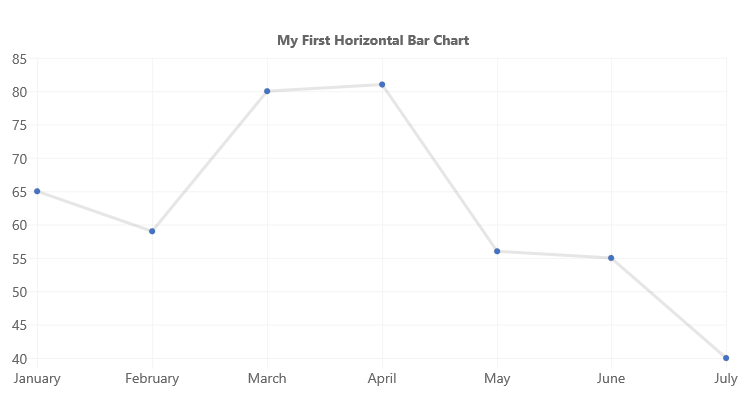
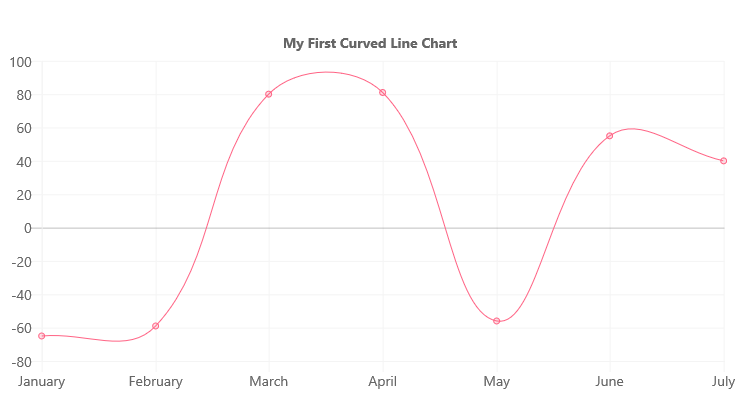
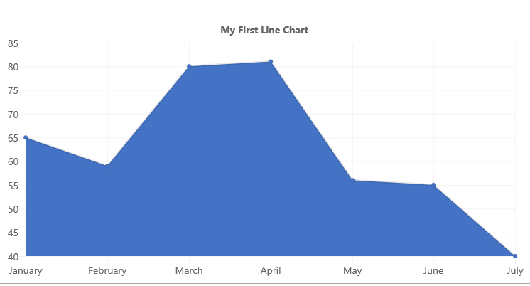
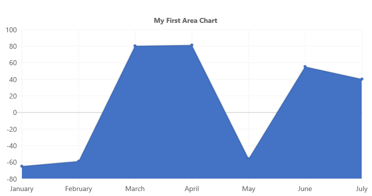
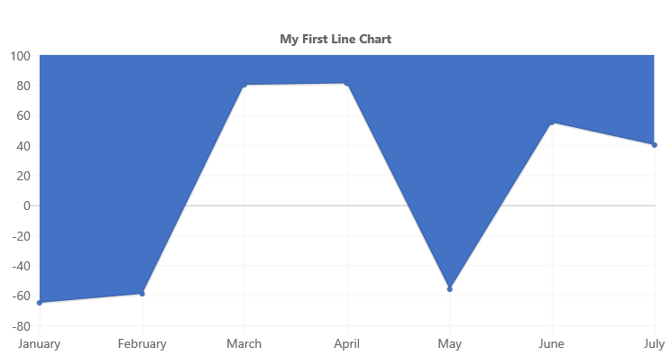
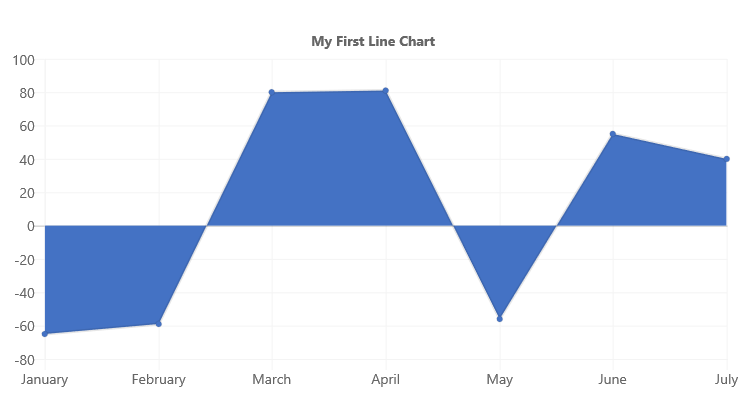
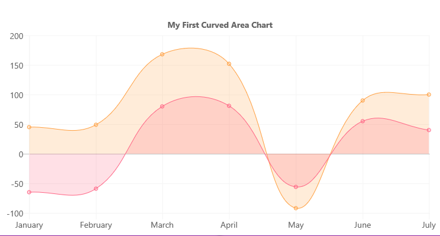

# ChartControl - Line Chart

Line charts represent data values as plotted points on a line.



## Example Usage

To create a line chart, add the ChartControl import:

```TypeScript
import { ChartControl } from "@pnp/spfx-controls-react/lib/ChartControl";
```

Then render the ChartControl:

```TypeScript
<ChartControl
    type='line'
    data={data}
    options={options}
  />
```

Alternatively, you can use the following import:

```TypeScript
import { ChartControl, ChartType } from '@pnp/spfx-controls-react/lib/ChartControl';
```

Followed by:

```TypeScript
 <ChartControl
    type={ChartType.Line}
    data={data}
    options={options}
  />
```

For example, to render the chart above, use the following code:

```TypeScript
// set the data
const data: Chart.ChartData = {
  labels:
    [
      'January', 'February', 'March', 'April', 'May', 'June', 'July'
    ],
  datasets: [
    {
      label: 'My First Dataset',
      fill: false,
      lineTension: 0,
      data:
        [
          65, 59, 80, 81, 56, 55, 40
        ]
    }
  ]
};

// set the options
const options: Chart.ChartOptions = {
  legend: {
    display: false,
  },
  title: {
    display: true,
    text: "My First Line Chart"
  }
};

return (
  <ChartControl
    type={ChartType.Line}
    data={data}
    options={options}
  />);
```

## Variations

### Curved lines



You can render curved lines instead of straight lines by removing the `lineTension` setting from each dataset, or by setting it to a value other than `0`.

For example, to render the above chart, use the following code:

```TypeScript
// set the data
const data: Chart.ChartData = {
  labels:
    [
      'January', 'February', 'March', 'April', 'May', 'June', 'July'
    ],
  datasets: [
    {
        label: 'My First Dataset',
        fill: false,
        //lineTension: 0, -- removed
        data:
          [
            -65, -59, 80, 81, -56, 55, 40
          ],
        backgroundColor: "rgba(255, 99, 132, 0.2)",
        borderColor: "rgb(255, 99, 132)",
        borderWidth: 1
      },
  ]
};

// set the options
const options: Chart.ChartOptions = {
  legend: {
    display: false,
  },
  title: {
    display: true,
    text: "My First Curved Line Chart"
  }
};

return (
  <ChartControl
    type={ChartType.Line}
    data={data}
    options={options}
  />);
```

### Area Chart



To render an area chart, change the `fill` setting of the dataset to `true`.

```TypeScript
// set the data
const data: Chart.ChartData = {
  labels:
    [
      'January', 'February', 'March', 'April', 'May', 'June', 'July'
    ],
  datasets: [
    {
      label: 'My First Dataset',
      fill: true,
      lineTension: 0,
      data:
        [
          65, 59, 80, 81, 56, 55, 40
        ]
    }
  ]
};

// set the options
const options: Chart.ChartOptions = {
  legend: {
    display: false,
  },
  title: {
    display: true,
    text: "My First Area Chart"
  }
};

return (
  <ChartControl
    type={ChartType.Line}
    data={data}
    options={options}
  />);
```

If your chart has negative and positive values, you can control where the filled area by setting the `fill` setting to one of the following value:

| `fill` Value | Description | Sample |
| ----        | ----    | ---- |
| `'start'`   | Fill from the bottom of the chart  |  |
| `'end'`     | Fill from the top of the chart  |  |
| `'origin'`  | Fill from the 'zero' line Same as `true`  |   |

For example, the code below will set the `fill` value to `start`:

```TypeScript
// set the data
const data: Chart.ChartData = {
  labels:
    [
      'January', 'February', 'March', 'April', 'May', 'June', 'July'
    ],
  datasets: [
    {
      label: 'My First Dataset',
      fill: 'start',
      lineTension: 0,
      data:
        [
          -65, -59, 80, 81, -56, 55, 40
        ]
    }
  ]
};

// set the options
const options: Chart.ChartOptions = {
  legend: {
    display: false,
  },
  title: {
    display: true,
    text: "My First Area Chart"
  }
};

return (
  <ChartControl
    type={ChartType.Line}
    data={data}
    options={options}
  />);
```

Which renders the following chart:


### Stacked Area Chart


If your bar chart has multiple datasets, you can render it as a stacked area chart by changing the settings on the Y axis to enable stacking, as follows:

```TypeScript
const options: Chart.ChartOptions = {
  scales: {
      yAxes: [{
          stacked: true
      }]
  }
};
```

In order to render each dataset with a different color, make sure to specify the `backgroundColor` and `borderColor` settings for each dataset.

For example, to render the above chart, use the following code:

```TypeScript
const data: Chart.ChartData = {
  labels:
    [
      'January', 'February', 'March', 'April', 'May', 'June', 'July'
    ],
  datasets: [
    {
      label: 'My First Dataset',
      fill: true,
      lineTension: 0,
      data:
        [
          -65, -59, 80, 81, -56, 55, 40
        ],
      backgroundColor: "rgba(255, 99, 132, 0.2)",
      borderColor: "rgb(255, 99, 132)",
      borderWidth: 1
    },
    {
      label: 'My Second Dataset',
      fill: true,
      lineTension: 0,
      data:
        [
          45, 49, 88, 71, -36, 35, 60
        ],
      backgroundColor: 'rgba(255, 159, 64, 0.2)',
      borderColor: 'rgb(255, 159, 64)',
      borderWidth: 1
    }

  ]
};

const options: Chart.ChartOptions =  {
  legend: {
    display: false,
  },
  title: {
    display: true,
    text: "My First Stacked Area Chart"
  },
  scales: {
    yAxes: [{
      stacked: true
    }]
  }
};

return (
  <ChartControl
    type={ChartType.Line}
    data={data}
    options={options}
  />);
```

As with lines, you can set the `lineTension` value to render curved lines instead of straight lines:



In addition to the `fill` values listed above, you can specify how each dataset fill:

| `fill` Value Type | Description | Sample Values |
| ----        | ----    | ---- |
| number   | Fill to dataset by its absolute index  | `1`, `2`, `3`, ... |
| string     | Fill to dataset by its relative index  | `'-3'`, `'-2'`, `'-1'`, `'+1'`, `'+2'`, `'+3'`, ... |

For example, if you use declare your datasets with the following fill values:

```TypeScript
const data: Chart.ChartData = {
      labels:
        [
          'January', 'February', 'March', 'April', 'May', 'June', 'July'
        ],
      datasets: [
        {
          label: 'My First Dataset',
          fill: "start",
          lineTension: 0,
          data:
            [
              -65, -59, 80, 81, -56, 55, 40
            ],
          backgroundColor: "rgba(255, 99, 132, 0.2)",
          borderColor: "rgb(255, 99, 132)",
          borderWidth: 1
        },
        {
          label: 'My Second Dataset',
          fill: '-1',
          lineTension: 0,
          data:
            [
              45, 49, 88, 71, -36, 35, 60
            ],
          backgroundColor: 'rgba(255, 159, 64, 0.2)',
          borderColor: 'rgb(255, 159, 64)',
          borderWidth: 1
        }

      ]
    };
```

Will cause the first dataset to fill from the bottom of the chart, while the second dataset will fill to the previous dataset (by it's relative index of `-1`)


## Dataset Properties

Line charts allow each dataset to have different configuration properties.

Some properties can be provided as arrays. When arrays are provided, the settings in the array will be applied to each data element in the same order (e.g.: first value applies to first element, second value to second element, etc.)

| Name                  | Type                                              | Description |
| ----                  | ----                                              | ---- |
| label                 | string                                            | Dataset label. Appears in the legend and tooltips. |
| xAxisID               | string                                            | The axis ID for the X axis. If not specified, the dataset will be rendered on the first available X axis. If an ID is specified, the dataset will be rendered on that axis |
| yAxisID               | string                                            | The axis ID for the Y axis. If not specified, the dataset will be rendered on the first available Y axis. If an ID is specified, the dataset will be rendered on that axis |
| backgroundColor       | Color OR Color[]                                  | The fill color under the line.  |
| borderColor           | Color OR Color[]                                  | The color of the line.  |
| borderWidth           | number OR number[]                                | The width of the line. Measured in pixels. |
| borderDash            | number[]                                          | The length and spacing of dashes. Consist of an array of numbers that specify distances to alternately draw a line and a gap. If array length is odd, elements of the array will be repeated. If an empty array is provided, lines will be solid. |
| borderDashOffset      | number                                            | The distance to offset dashes. |
| borderCapStyle        | `'butt'`<br/>`'round'`<br/>`'square'`             | Specifies the end of the lines. Default is `'butt`'. |
| borderJoinStyle       | `'bevel'`<br/>`'round'`<br/>`'miter'`             | Determines the shape used to join two line segments where they meet. Default is `'miter'`. |
| cubicInterpolationMode  | `'default'`<br/>`'monotone'`                    | Determines which algorithm is used to interpolate a smooth curve between data points. |
| data | number[] <br/> Point[] | The chart's data. Required. |
| fill      | `false`<br/>number<br/>string<br/>`'start'`<br/>`'end'`<br/>`'origin'` | Controls how the dataset's area is filled.  |
| lineTension      | number                                | Tension of the Bézier curve line. `0` renders straight lines. Ignored if `cubicInterpolationMode` is set to `monotone`.  |
| pointBackgroundColor  | Color OR Color[]                                  | The point's fill color. |
| pointBorderColor      | Color OR Color[]                                  | The point's border color.  |
| pointBorderWidth      | number OR number[]                                | The point's border width.  |
| pointRadius  | number OR number[]                                  | The point's fill color. |
| pointStyle      | `'circle'` <br/>`'cross'`<br/>`'crossRot'`<br/>`'dash'`<br/>`'line'`<br/>`'rect'`<br/>`'rectRounded'`<br/>`'rectRot'`<br/>`'star'`<br/>`'triangle'`<br/>HTMLImageElement<br/>HTMLCanvasElement<br/>HTMLImageElement[]<br/>HTMLCanvasElement[]  | Style of point. |
| pointRotation      | number OR number[]                                | The point's rotation, in degrees.  |
| pointHitRadius      | number OR number[]                                | The point's border width.  |
| pointHoverBackgroundColor  | Color OR Color[]                                  | The point's background color when a mouse hovers over it. |
| pointHoverBorderColor      | Color OR Color[]                                  | The point's border color when a mouse hovers over it.  |
| pointHoverBorderWidth      | number OR number[]                                | The point's border width when a mouse hovers over it.  |
| pointHoverRadius      | number OR number[]                                | The point's radius width when a mouse hovers over it.  |
| showLine      | boolean                                | The point's radius width when a mouse hovers over it.  |
| spanGaps      | boolean                                | The point's radius width when a mouse hovers over it.  |
| steppedLine      | boolean<br/>`'before'`<br/>`'after'`| Determines whether the line is shown as a stepped line. Any value but `false` overrides the `lineTension` setting.  |

## Data Structure

### number[]

The `data` property of each dataset item consists of an array of numbers. Each point in the array corresponds to the matching label on the x axis:

```TypeScript
data: [20, -10, 33, -47]
```

The chart elements will be rendered in the same order as found in the array.

### Point[]

You can also provide data elements with `x` and `y` coordinates:

```TypeScript
data: [{
    x: 10,
    y: 20
}, {
    x: 15,
    y: 10
}]

```

#### Point Configuration

Point elements can be configured to change their appearance using the following configuration options:

| Name              | Type    | Default             | Description |
| ----              | ----    | ----                | ---- |
| radius            | number  | 3                   | Point radius. |
| pointStyle        | `'circle'` <br/>`'cross'`<br/>`'crossRot'`<br/>`'dash'`<br/>`'line'`<br/>`'rect'`<br/>`'rectRounded'`<br/>`'rectRot'`<br/>`'star'`<br/>`'triangle'`  | `'circle'`          | Style of point. |
| rotation          | number  | 0                   | Rotation of the point, in degrees. |
| backgroundColor   | Color   | `'rgba(0,0,0,0.1)`  | Fill color.  |
| borderWidth       | number  | 1                   | Stroke width.  |
| borderColor       | Color   | `'rgba(0,0,0,0.1)`  | Stroke color. |
| hitRadius         | number  | 1                   | Extra radius added around the point to make it easier to detect mouse events. |
| hoverRadius       | number  | 4                   | Point radius, when mouse hovers over point. |
| hoverBorderWidth  | number  | 1                   | Stroke width, when mouse hovers over point.  |

## Configuration

The following configuration options are specific to line charts:

| Name                      | Type              | Default | Description |
| ----                      | ----              | ----    | ---- |
| showLines             | boolean            | true     | Indicates whether a line will be drawn between each data point. A value of `false` will not render lines. |
| spanGaps        | boolean            | false     | Indicates whether invalid number values (`NaN`) will cause a break in the line . A value of `false` will not span data gaps and cause a break in the line. |

## For More Information

For more information on what options are available with Line charts, refer to the [Line Chart documentation](https://www.chartjs.org/docs/latest/charts/line.html) on [Chart.js](https://www.chartjs.org).


