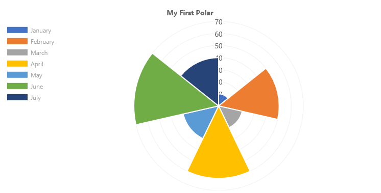

# ChartControl - Polar Chart

Polar charts are similar to pie charts, except that each segment has the same angle, and the radius of each segment differs depending on the value.



## Example Usage

To create a polar area chart, add the ChartControl import:

```TypeScript
import { ChartControl, ChartType } from '@pnp/spfx-controls-react/lib/ChartControl';
```

Then render the ChartControl:

```TypeScript
 <ChartControl
    type={ChartType.PolarArea}
    data={data}
    options={options}
  />
```

For example, to render the chart above, use the following code:

```TypeScript
// set the data
const data: Chart.ChartData = {
  labels:
    [
      'January', 'February', 'March', 'April', 'May', 'June', 'July'
    ],
  datasets: [
    {
      label: 'My First Dataset',
      data:
        [
          10, 50, 20, 60, 30, 70, 40
        ]
    }
  ]
};

// set the options
const options: Chart.ChartOptions = {
  legend: {
    display: true,
    position: "left"
  },
  title: {
    display: true,
    text: "My First Polar"
  }
};

return (
  <ChartControl
    type={ChartType.PolarArea}
    data={data}
    options={options}
  />);
```

## Dataset Properties

Polar area charts allow each dataset to have different configuration properties.

Properties are provided as arrays. The settings in the array will be applied to each data element in the same order (e.g.: first value applies to first element, second value to second element, etc.)

| Name                  | Type                                              | Description |
| ----                  | ----                                              | ---- |
| backgroundColor       | Color[]                                  | The segment's fill color.  |
| borderColor           | Color[]                                  | The segment's border color.  |
| borderWidth           | number[]                                | The segment's border width. Measured in pixels. |
| data | number[] | The chart's data. Required. |
| hoverBackgroundColor  | Color[]                                  | The segment's fill color when a mouse hovers over it |
| hoverBorderColor      | Color[]                                  | The segment's border color when a mouse hovers over it.  |
| hoverBorderWidth      | number[]                                | The segment's border width when a mouse hovers over it.  |

## Data Structure

The `data` property of each dataset item consists of an array of numbers. Each point in the array corresponds to the matching label on the x axis:

```TypeScript
data: [20, 10, 33, 47]
```

## Configuration

The following configuration options are specific to polar area charts:

| Name | Type | Default | Description |
| ---- | ---- | ---- | ---- |
| rotation | number | -0.5 * Math.PI | The angle at which the polar segments start |
| animation.animateRotate | boolean | true | `true` will animate the chart while rotating it.  |
| animation.animateScale | boolean | false | `true` will animate the chart while scaling it.  |

## For More Information

For more information on what options are available with Polar Area charts, refer to the [Polar Area documentation](https://www.chartjs.org/docs/latest/charts/polar.html) on [Chart.js](https://www.chartjs.org).


