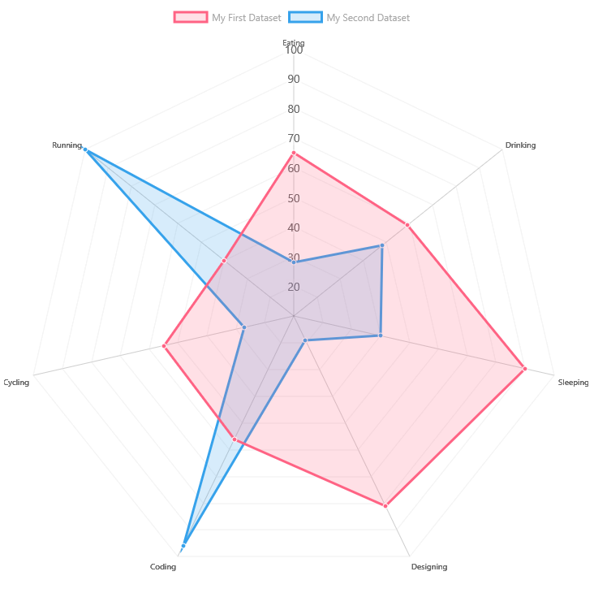

# ChartControl - Radar Chart

Radar charts are best used when comparing points of two or more datasets.



## Example Usage

To create a radar chart, add the ChartControl import:

```TypeScript
import { ChartControl, ChartType } from '@pnp/spfx-controls-react/lib/ChartControl';
```

Then render the ChartControl:

```TypeScript
 <ChartControl
    type={ChartType.Radar}
    data={data}
    options={options}
  />
```

For example, to render the chart above, use the following code:

```TypeScript
// set the data
const data: Chart.ChartData = {
  labels:
    ["Eating", "Drinking", "Sleeping", "Designing", "Coding", "Cycling", "Running"],
  datasets: [
    // It is better to use multiple datasets for radar charts
    {
      label: "My First Dataset",
      data: [65, 59, 90, 81, 56, 55, 40],
      fill: true,
      // semi-transparent colors are best
      backgroundColor: "rgba(255, 99, 132, 0.2)",
      borderColor: "rgb(255, 99, 132)",
      pointBackgroundColor: "rgb(255, 99, 132)",
      pointBorderColor: "#fff",
      pointHoverBackgroundColor: "#fff",
      pointHoverBorderColor: "rgb(255, 99, 132)"
    },
    {
      label: "My Second Dataset",
      data: [28, 48, 40, 19, 96, 27, 100],
      fill: true,
      backgroundColor: "rgba(54, 162, 235, 0.2)",
      borderColor: "rgb(54, 162, 235)",
      pointBackgroundColor: "rgb(54, 162, 235)",
      pointBorderColor: "#fff",
      pointHoverBackgroundColor: "#fff",
      pointHoverBorderColor: "rgb(54, 162, 235)"
    }]
};

// set the options
const options: Chart.ChartOptions = {
  // Using an aspect ratio of 1 will render a square chart area
  aspectRatio: 1,
  elements: {
    line: {
      tension: 0,
      borderWidth: 3
    }
  }
};

// render the chart
return (
  <ChartControl
    type={ChartType.Radar}
    data={data}
    options={options}
  />);
```

## Dataset Properties

Radar charts allow each dataset to have different configuration properties.

Some properties can be provided as arrays. When arrays are provided, the settings in the array will be applied to each data element in the same order (e.g.: first value applies to first element, second value to second element, etc.)

| Name                  | Type                                              | Description |
| ----                  | ----                                              | ---- |
| label                 | string                                            | Dataset label. Appears in the legend and tooltips. |
| backgroundColor       | Color OR Color[]                                  | The fill color under the line.  |
| borderColor           | Color OR Color[]                                  | The color of the line.  |
| borderWidth           | number OR number[]                                | The width of the line. Measured in pixels. |
| borderDash            | number[]                                          | The length and spacing of dashes. Consist of an array of numbers that specify distances to alternately draw a line and a gap. If array length is odd, elements of the array will be repeated. If an empty array is provided, lines will be solid. |
| borderDashOffset      | number                                            | The distance to offset dashes. |
| borderCapStyle        | `'butt'`<br/>`'round'`<br/>`'square'`             | Specifies the end of the lines. Default is `'butt`'. |
| borderJoinStyle       | `'bevel'`<br/>`'round'`<br/>`'miter'`             | Determines the shape used to join two line segments where they meet. Default is `'miter'`. |
| data | number[] | The chart's data. Required. |
| fill      | `false`<br/>number<br/>string<br/>`'start'`<br/>`'end'`<br/>`'origin'` | Controls how the dataset's area is filled.  |
| lineTension      | number                                | Ttension of the Bezier curve line. `0` renders straight lines. Ignored if `cubicInterpolationMode` is set to `monotone`.  |
| pointBackgroundColor  | Color OR Color[]                                  | The point's fill color. |
| pointBorderColor      | Color OR Color[]                                  | The point's border color.  |
| pointBorderWidth      | number OR number[]                                | The point's border width.  |
| pointRadius  | number OR number[]                                  | The point's fill color. |
| pointStyle      | `'circle'` <br/>`'cross'`<br/>`'crossRot'`<br/>`'dash'`<br/>`'line'`<br/>`'rect'`<br/>`'rectRounded'`<br/>`'rectRot'`<br/>`'star'`<br/>`'triangle'`<br/>HTMLImageElement<br/>HTMLCanvasElement<br/>HTMLImageElement[]<br/>HTMLCanvasElement[]  | Style of point. |
| pointRotation      | number OR number[]                                | The point's roation, in degrees.  |
| pointHitRadius      | number OR number[]                                | The point's border width.  |
| pointHoverBackgroundColor  | Color OR Color[]                                  | The point's background color when a mouse hovers over it. |
| pointHoverBorderColor      | Color OR Color[]                                  | The point's border color when a mouse hovers over it.  |
| pointHoverBorderWidth      | number OR number[]                                | The point's border width when a mouse hovers over it.  |
| pointHoverRadius      | number OR number[]                                | The point's radius width when a mouse hovers over it.  |

## Data Structure

The `data` property of each dataset item consists of an array of numbers. Each point in the array corresponds to the matching label on the x axis:

```TypeScript
data: [20, 10, 33, 47]
```

## For More Information

For more information on what options are available with Radar charts, refer to the [Radar documentation](https://www.chartjs.org/docs/latest/charts/radar.html) on [Chart.js](https://www.chartjs.org).


