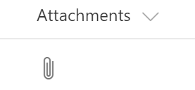

# FieldAttachmentsRenderer control

This control renders Clip icon based on the provided `count` property is defined and greater than 0.



**Note:** this control displays correctly starting with SharePoint Framework v1.4

## Covered Fields

- Attachments

## How to use this control in your solutions

- Check that you installed the `@pnp/spfx-controls-react` dependency. Check out the [getting started](../../#getting-started) page for more information about installing the dependency.
- Import the following modules to your component:

```TypeScript
import { FieldAttachmentsRenderer } from "@pnp/spfx-controls-react/lib/FieldAttachmentsRenderer";
```

- Use the `FieldAttachmentsRenderer` control in your code as follows:

```TypeScript
<FieldAttachmentsRenderer count={event.fieldValue} className={'some-class'} cssProps={{ background: '#f00' }} />
```

## Implementation

The FieldAttachmentsRenderer component can be configured with the following properties:

| Property  | Type                | Required | Description                                                                                |
| --------- | ------------------- | -------- | ------------------------------------------------------------------------------------------ |
| cssProps  | React.CSSProperties | no       | CSS styles to apply to the renderer.                                                       |
| className | ICssInput           | no       | CSS classes to apply to the renderer.                                                      |
| count     | number              | no       | Amount of attachments. The icon is displayed if the property is defined and greater than 0 |


