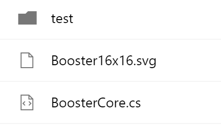

# FieldFileTypeRenderer control

This control renders document or folder icon based on file path. Office UI Fabric icons font is used to render the icons.

**Note:** this control displays correctly starting with SharePoint Framework v1.4



## Covered Fields

- Type (DocIcon)

## How to use this control in your solutions

- Check that you installed the `@pnp/spfx-controls-react` dependency. Check out the [getting started](../../#getting-started) page for more information about installing the dependency.
- Import the following modules to your component:

```TypeScript
import { FieldFileTypeRenderer } from "@pnp/spfx-controls-react/lib/FieldFileTypeRenderer";
```

- Use the `FieldFileTypeRenderer` control in your code as follows:

```TypeScript
<FieldFileTypeRenderer path={fileLeafRef} isFolder={false} className={'some-class'} cssProps={{ background: '#f00' }} />
```

## Implementation

The FieldFileTypeRenderer component can be configured with the following properties:

| Property  | Type                | Required | Description                                                |
| --------- | ------------------- | -------- | ---------------------------------------------------------- |
| cssProps  | React.CSSProperties | no       | CSS styles to apply to the renderer.                       |
| className | ICssInput           | no       | CSS classes to apply to the renderer.                      |
| path      | string              | yes      | document/file path                                         |
| isFolder  | boolean             | no       | true if the icon should be rendered for a folder, not file |


