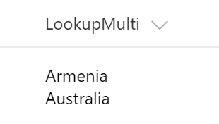
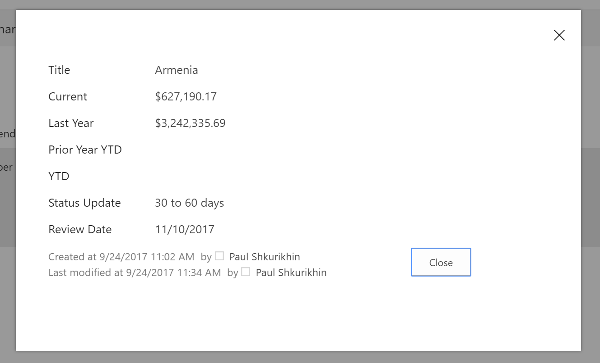

# FieldLookupRenderer control

This control renders lookup values. Each lookup item is clickable. Click on the lookup item leads to opening of referenced item's display form.

**Note:** this control displays correctly starting with SharePoint Framework v1.4




## Covered Fields

- Lookup (single, multi)

## How to use this control in your solutions

- Check that you installed the `@pnp/spfx-controls-react` dependency. Check out the [getting started](../../#getting-started) page for more information about installing the dependency.
- Import the following modules to your component:

```TypeScript
import { FieldLookupRenderer } from "@pnp/spfx-controls-react/lib/FieldLookupRenderer";
```

- Use the `FieldLookupRenderer` control in your code as follows:

```TypeScript
<FieldLookupRenderer lookups={event.fieldValue} fieldId={'<field-guid>'} context={this.context} className={'some-class'} cssProps={{ background: '#f00' }} />
```

## Implementation

The FieldLookupRenderer component can be configured with the following properties:

| Property | Type | Required | Description |
| ---- | ---- | ---- | ---- |
| cssProps | React.CSSProperties | no | CSS styles to apply to the renderer. |
| className | ICssInput | no | CSS classes to apply to the renderer. |
| lookups | ISPFieldLookupValue[] | yes | Lookup field values. |
| dispFormUrl | boolean | no | Url of Display form for the list that is referenced by the lookup. |
| onClick | (args: ILookupClickEventArgs) => {} | no | Custom event handler of lookup item click. If not set the dialog with Display Form will be shown. |
| fieldId | string | Field's id | |
| context | IContext | Customizer context. Must be provided if fieldId is set | |


