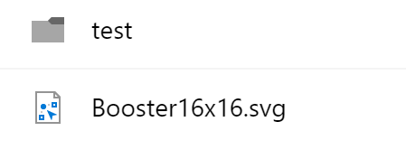

# FieldNameRenderer control

This control renders document's name as a link. The link provides either preview (if it is available) or direct download. Additionally, new documents are marked with "Glimmer" icon.

**Note:** The Name column in document libraries is marked as non-editable. See [this issue](https://github.com/sharepoint/sp-dev-docs/issues/1207) for details.
**Note** Glimmer icon displays correctly starting with SharePoint Framework v1.4



## Covered Fields

- Document Name (LinkFilename, LinkFilenameNomenu, FileLieafRef)

## How to use this control in your solutions

- Check that you installed the `@pnp/spfx-controls-react` dependency. Check out the [getting started](../../#getting-started) page for more information about installing the dependency.
- Import the following modules to your component:

```TypeScript
import { FieldNameRenderer } from "@pnp/spfx-controls-react/lib/FieldNameRenderer";
```

- Use the `FieldNameRenderer` control in your code as follows:

```TypeScript
<FieldNameRenderer text={'Technical Requirements'} isLink={true} isNew={false} filePath={'https://contoso.sharepoint.com/Documents/tech-requirements.pdf'} className={'some-class'} cssProps={{ background: '#f00' }} />
```

## Implementation

The FieldNameRenderer component can be configured with the following properties:

| Property | Type | Required | Description |
| ---- | ---- | ---- | ---- |
| cssProps | React.CSSProperties | no | CSS styles to apply to the renderer. |
| className | ICssInput | no | CSS classes to apply to the renderer. |
| text | string | no | Text to be rendered. |
| isLink | boolean | yes | True if the name should be rendered as a link. |
| isNew | boolean | no | True if the document is new. |
| filePath | string | no | Path to the document. |
| hasPreview | boolean | no | True if the document has preview and link href should be constructed to display the preview (instead of direct document's link). The flag works only if `onClick` property is NOT defined.  |
| onClick | (args: INameClickEventArgs) => {} | no | Custom handler for link click. If not set link click will lead to rendering document preview. Works if `isLink` is set to `true` |
| onDoubleClick | (args: INameClickEventArgs) => {} | no | Custom handler for link double click. If not set link If not set link will use OOTB behavior. Works if `isLink` is set to `true`  |


