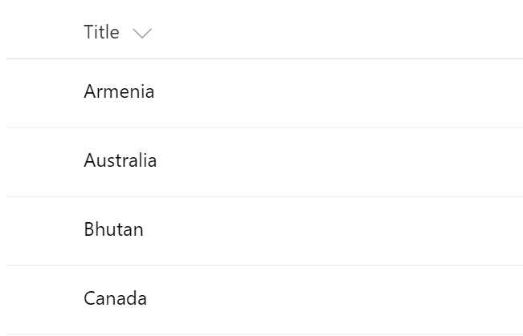

# FieldTitleRenderer control

This control renders title either as a simple text or as a link to the Display Form. Additional actions like Share and Context Menu are not implemented.



## Covered Fields

- List Item Title (Title, LinkTitle, LinkTitleNoMenu)

## How to use this control in your solutions

- Check that you installed the `@pnp/spfx-controls-react` dependency. Check out the [getting started](../../#getting-started) page for more information about installing the dependency.
- Import the following modules to your component:

```TypeScript
import { FieldTitleRenderer } from "@pnp/spfx-controls-react/lib/FieldTitleRenderer";
```

- Use the `FieldTitleRenderer` control in your code as follows:

```TypeScript
<FieldTitleRenderer text={'Technical Requirements'} isLink={true} className={'some-class'} cssProps={{ background: '#f00' }} />
```

## Implementation

The FieldTitleRenderer component can be configured with the following properties:

| Property  | Type                               | Required | Description                                                                               |
| --------- | ---------------------------------- | -------- | ----------------------------------------------------------------------------------------- |
| cssProps  | React.CSSProperties                | no       | CSS styles to apply to the renderer.                                                      |
| className | ICssInput                          | no       | CSS classes to apply to the renderer.                                                     |
| text      | string                             | no       | Text to be rendered.                                                                      |
| isLink    | boolean                            | yes      | True if the name should be rendered as a link.                                            |
| baseUrl   | string                             | no       | Web Url. Should be provided if `onClick` is not defined                                   |
| listId    | string                             | no       | List Id. Should be provided if `onClick` is not defined                                   |
| id        | number                             | no       | Item Id. Should be provided if `onClick` is not defined                                   |
| onClick   | (args: ITitleClickEventArgs) => {} | no       | Custom title click event handler. If not set Display form for the item will be displayed. |


