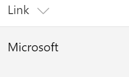
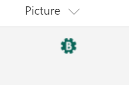

# FieldUrlRenderer control

This control renders Hyperlink or Picture field value as a link or image.




## Covered Fields

- Hyperlink or Image
- Url in Links List

## How to use this control in your solutions

- Check that you installed the `@pnp/spfx-controls-react` dependency. Check out the [getting started](../../#getting-started) page for more information about installing the dependency.
- Import the following modules to your component:

```TypeScript
import { FieldUrlRenderer } from "@pnp/spfx-controls-react/lib/FieldUrlRenderer";
```

- Use the `FieldUrlRenderer` control in your code as follows:

```TypeScript
// to show Url
<FieldUrlRenderer text={'microsoft'} url={'http://www.microsoft.com'} className={'some-class'} cssProps={{ background: '#f00' }} />

// to show Image
<FieldUrlRenderer url={'http://cdn.contoso.com/images/logo.png'} isImageUrl={true} className={'some-class'} cssProps={{ background: '#f00' }} />
```

## Implementation

The FieldUrlRenderer component can be configured with the following properties:

| Property   | Type                | Required | Description                                         |
| ---------- | ------------------- | -------- | --------------------------------------------------- |
| cssProps   | React.CSSProperties | no       | CSS styles to apply to the renderer.                |
| className  | ICssInput           | no       | CSS classes to apply to the renderer.               |
| text       | string              | no       | Text to be rendered.                                |
| url        | string              | yes      | Url.                                                |
| isImageUrl | boolean             | no       | True if the control should be rendered as an image. |


