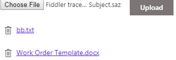

# Attachments control

This control allows us to work with lite item attachments.



## How to use this control in your solutions

- Check that you installed the `@pnp/spfx-controls-react` dependency. Check out the [getting started](../#getting-started) page for more information about installing the dependency.
- Import the following modules to your component:

```TypeScript
import { Attachments } from "@pnp/spfx-controls-react/lib/Attachments";
```

- Use the `FileTypeIcon` control in your code as follows:

```TypeScript
<Attachments
  itemId={itemId}
  listName={listName}
  showAsLinks={true}
/>
```

## Implementation

The FileTypeIcon component can be configured with the following properties:

| Property | Type | Required | Description | Default |
| ---- | ---- | ---- | ---- | ---- |
| listName | string | yes | The name of the list containing the item | _NA_ |
| itemId | string&#124;number | yes | The ID of the list item | _NA_ |
| showAsLinks | boolean | no | If true, show the attachments as links | false |


