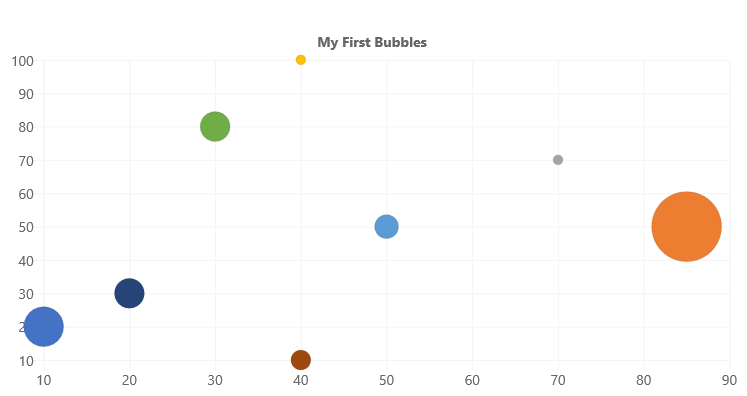

# ChartControl - Bubble Chart

Bubble chart show elements across three dimensions. Each bubble in the chart is located according to the first two dimensions. The size of each bubble represents the thid dimension.



## Example Usage

To create a bubble chart, add the ChartControl import:

```TypeScript
import { ChartControl } from "@pnp/spfx-controls-react/lib/ChartControl";
```

Then render the ChartControl:

```TypeScript
<ChartControl
    type='bubble'
    data={data}
    options={options}
  />
```

Alternatively, you can use the following import:

```TypeScript
import { ChartControl, ChartType } from '@pnp/spfx-controls-react/lib/ChartControl';
```

Followed by:

```TypeScript
 <ChartControl
    type={ChartType.Bubble}
    data={data}
    options={options}
  />
```

For example, to render the chart above, use the following code:

```TypeScript
// set the data
const data = {
  datasets: [
    {
      label: "Bubble",
      data:
        [
          { x: 10, y: 20, r: 20 },
          { x: 85, y: 50, r: 35 },
          { x: 70, y: 70, r: 5 },
          { x: 40, y: 100, r: 5 },
          { x: 50, y: 50, r: 12 },
          { x: 30, y: 80, r: 15 },
          { x: 20, y: 30, r: 15 },
          { x: 40, y: 10, r: 10 }
        ]
    }]
};

// set the options
const options = {
  legend: {
    display: false
  },
  title: {
    display: true,
    text: "My First Bubbles"
  }
};

return (
  <ChartControl
    type={ChartType.Bubble}
    data={data}
    options={options}
  />);
```


## Data Structure

The `data` property of each dataset item consists of an `x`, `y`, and `r` coordinate.

```TypeScript
{
    // X Value
    x: number,

    // Y Value
    y: number,

    // Bubble radius in pixels
    r: number
}
```

> **NOTE:** Unlike the `x` and `y`, the `r` value is measured in pixels and does not scale with the chart.

## For More Information

For more information on what options are available with Bubble charts, refer to the [Bubble Chart documentation](https://www.chartjs.org/docs/latest/charts/bubble.html) on [Chart.js](https://www.chartjs.org).
