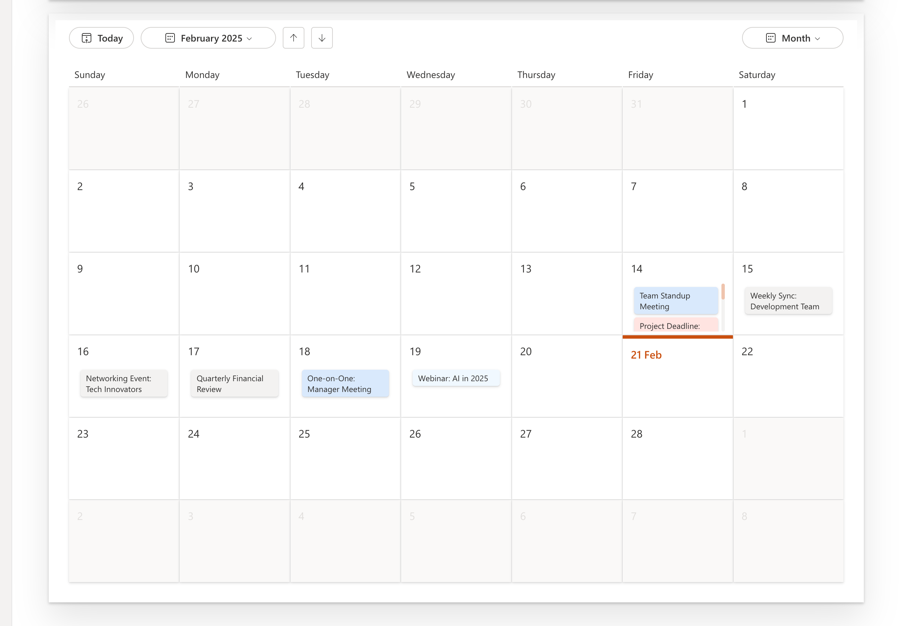
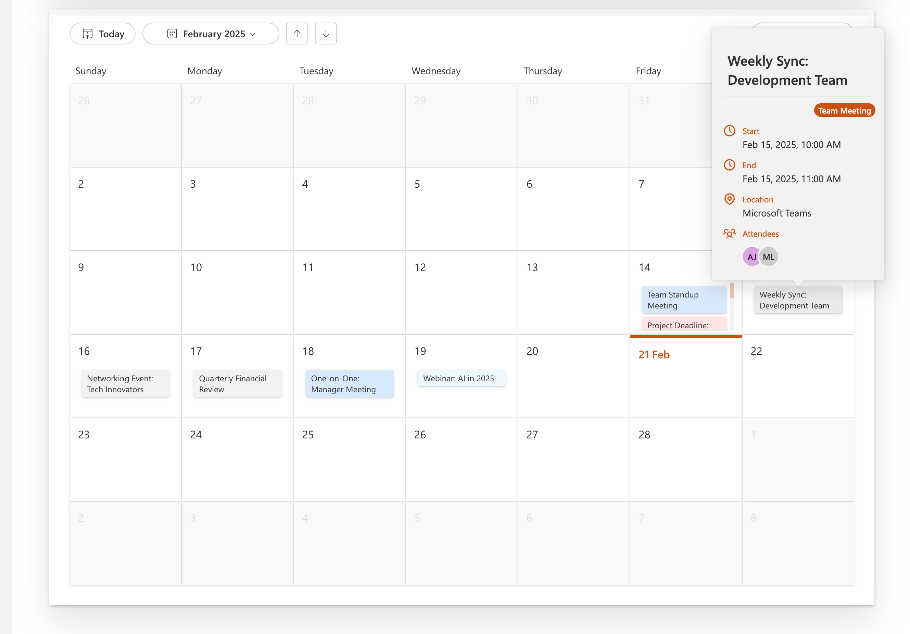
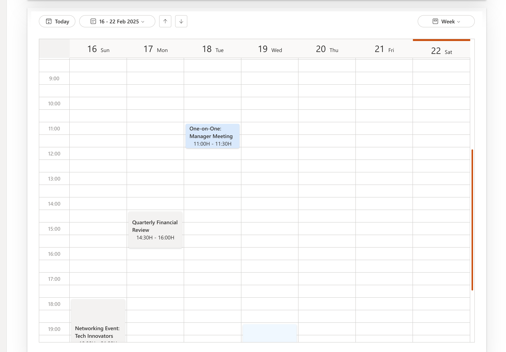
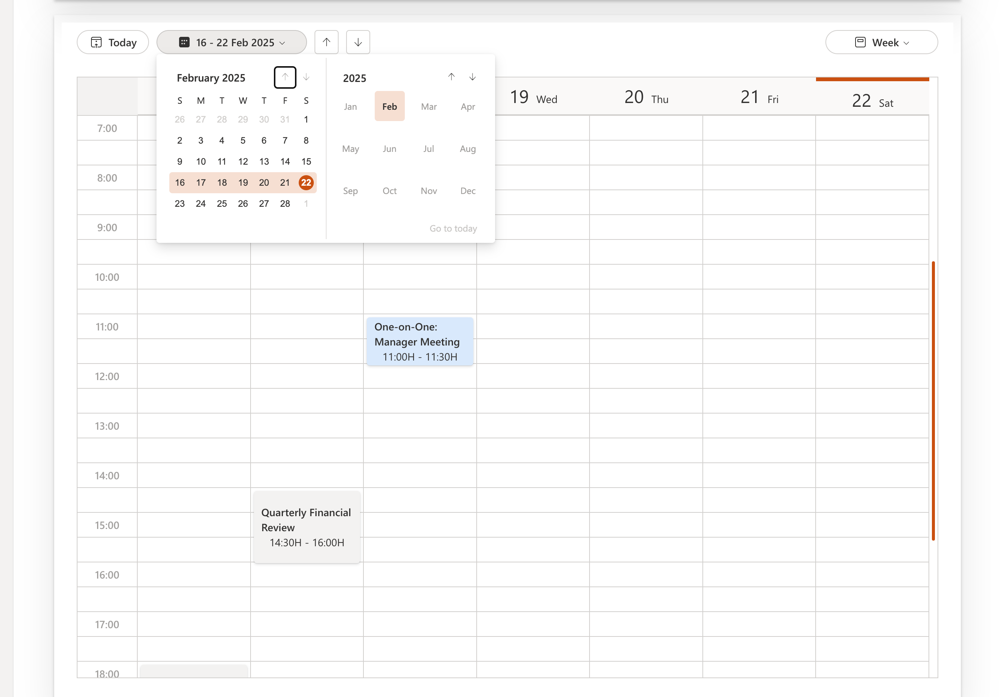

# Calendar

## Overview

The Calendar Control allows users to view and manage events in a calendar interface. It supports different event views, Month, Week and Day, and customizable rendering for month, week, and day views.

Here is an example of the control in action:








## Installation

- Check that you installed the `@pnp/spfx-controls-react` dependency. Check out the [getting started](../../#getting-started) page for more information about installing the dependency.
- Import the following modules to your component:

## Importing the Calendar Control

To use the Calendar Control in your React project, import it as follows:

```typescript
import { Calendar } from '@pnp/spfx-controls-react/lib/calendar';
import { IEvent } from '@pnp/spfx-controls-react/lib/calendar/IEvent';
```

## Calendar Props

The Calendar Control accepts the following props:

| Property       | Type                   | Required | Description                                                                    |
| -------------- | ---------------------- | -------- | ------------------------------------------------------------------------------ |
| events         | IEvent[]               | Yes      | List of events to display in the calendar.                                     |
| height         | string \| number       | No       | Height of the calendar.                                                        |
| theme          | Theme                  | No       | Theme to apply to the calendar.                                                |
| onMonthChange  | (date: Date) => void   | No       | Callback function triggered when the month changes.                            |
| onDayChange    | (date: Date) => void   | No       | Callback function triggered when the day changes.                              |
| onWeekChange   | (date: Date) => void   | No       | Callback function triggered when the week changes.                             |
| onNext         | (date: Date) => void   | No       | Callback function triggered when navigating to the next period.                |
| onPrev         | (date: Date) => void   | No       | Callback function triggered when navigating to the previous period.            |
| onViewChange   | (view: string) => void | No       | Callback function triggered when the view changes.                             |
| onDaySlotClick | (date: Date) => void   | No       | Callback function triggered when an event is clicked on day slot on Month view |

## Event Object (IEvent)

Events displayed in the calendar are represented using the `IEvent` interface:

### Event Properties

| Property            | Type                           | Required | Description                                                    |
| ------------------- | ------------------------------ | -------- | -------------------------------------------------------------- |
| id                  | string                         | Yes      | Unique identifier for the event.                               |
| title               | string                         | Yes      | The title of the event.                                        |
| start               | string (ISO format)            | Yes      | The start date and time of the event.                          |
| end                 | string (ISO format)            | Yes      | The end date and time of the event.                            |
| isFullDay           | boolean                        | No       | Indicates if the event lasts the whole day.                    |
| attendees           | IAttendee[]                    | No       | List of attendees for the event.                               |
| category            | string                         | No       | The category of the event (e.g., "Meeting", "Workshop").       |
| description         | string                         | No       | A brief description of the event.                              |
| location            | string                         | No       | The event's physical or virtual location.                      |
| importance          | string                         | No       | Importance level of the event (e.g., "High", "Normal", "Low"). |
| isOrganizer         | boolean                        | No       | Indicates if the user is the event organizer.                  |
| sensitivity         | string                         | No       | Privacy setting of the event (e.g., "Public", "Private").      |
| type                | string                         | No       | Type of event (e.g., "Appointment", "Meeting").                |
| isOnlineMeeting     | boolean                        | No       | Indicates if the event is an online meeting.                   |
| onRenderInMonthView | (event: IEvent) => JSX.Element | No       | Custom rendering function for month view.                      |
| onRenderInWeekView  | (event: IEvent) => JSX.Element | No       | Custom rendering function for week view.                       |
| onRenderInDayView   | (event: IEvent) => JSX.Element | No       | Custom rendering function for day view.                        |
| enableOnHover       | boolean                        | No       | Whether to enable hover effects on events.                     |
| imageUrl            | string                         | No       | URL for an event-related image.                                |
| webLink             | string                         | No       | URL to navigate to event details.                              |
| color               | string                         | No       | Custom color for the event.                                    |
| backgroundColor     | string                         | No       | Custom background color for the event.                         |

## Attendee Object (IAttendee)

The `IAttendee` interface represents an attendee of an event:

| Property | Type   | Required | Description                         |
| -------- | ------ | -------- | ----------------------------------- |
| id       | string | Yes      | Unique identifier for the attendee. |
| name     | string | Yes      | Name of the attendee.               |
| email    | string | No       | Email of the attendee.              |
| role     | string | No       | Role of the attendee in the event.  |
| imageUrl | string | No       | URL for the attendee's image.       |

## Usage Example

Here’s an example of how to integrate the Calendar Control in a React component:

```typescript
import React from 'react';
import { Calendar } from '@pnp/spfx-controls-react/lib/calendar';
import { IEvent } from '@pnp/spfx-controls-react/lib/calendar/IEvent';

const events: IEvent[] = [
  {
    id: '1',
    title: 'Weekly Sync: Development Team',
    start: '2025-02-15T10:00:00',
    end: '2025-02-15T11:00:00',
    location: 'Microsoft Teams',
    attendees: [{ name: 'AJ' }, { name: 'ML' }],
    category: 'Meeting',
    isOnlineMeeting: true,
  },
  {
    id: '2',
    title: 'Project Deadline',
    start: '2025-02-21T23:59:00',
    end: '2025-02-21T23:59:00',
    category: 'Deadline',
    importance: 'High',
  },
];

const MyCalendar = () => {
  return (
    <Calendar
      events={events}
      height={800}
      theme={theme}
      onViewChange={(view) => console.log(`View changed to: ${view}`)}
      onDayChange={(date) => console.log(`Day changed to: ${date}`)}
      onWeekChange={(date) => console.log(`Week changed to: ${date}`)}
      onMonthChange={(date) => console.log(`Month changed to: ${date}`)}
      onNext={(date) => console.log(`Navigated to next date: ${date}`)}
      onPrev={(date) => console.log(`Navigated to previous date: ${date}`)}
    />
  );
};

export default MyCalendar;
```

## Conclusion

The Calendar Control provides a flexible and interactive way to manage events. It supports multiple views, custom rendering options, and detailed event properties to enhance the user experience.


