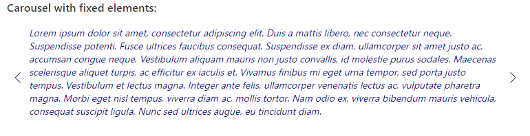

# Carousel control

A slideshow component for cycling through elements—images or slides of text—like a carousel.

Here is an example of the control in action:



## How to use this control in your solutions

- Check that you installed the `@pnp/spfx-controls-react` dependency. Check out the [getting started](../../#getting-started) page for more information about installing the dependency.
- Import the following modules to your component:

```TypeScript
import { Carousel } from "@pnp/spfx-controls-react/lib/Carousel";
```

- Use the `Carousel` control in your code as follows:

Carousel component with provided `JSX.Element[]` slides

```TypeScript
<Carousel
  buttonsLocation={CarouselButtonsLocation.top}
  buttonsDisplay={CarouselButtonsDisplay.block}

  contentContainerStyles={styles.carouselContent}
  containerButtonsStyles={styles.carouselButtonsContainer}

  isInfinite={true}

  element={this.carouselElements}
  onMoveNextClicked={(index: number) => { console.log(`Next button clicked: ${index}`); }}
  onMovePrevClicked={(index: number) => { console.log(`Prev button clicked: ${index}`); }}
/>
```

Carousel component with provided `triggerPageEvent`

```TypeScript
<Carousel
  buttonsLocation={CarouselButtonsLocation.bottom}
  buttonsDisplay={CarouselButtonsDisplay.buttonsOnly}

  contentContainerStyles={styles.carouselContent}
  containerButtonsStyles={styles.carouselButtonsContainer}

  canMoveNext={this.state.canMoveNext}
  canMovePrev={this.state.canMovePrev}
  triggerPageEvent={this.triggerNextElement}
  element={this.state.currentCarouselElement}
/>
```

Carousel component with provided `ICarouselImageProps[]` slides:

```TypeSCript
<Carousel
  buttonsLocation={CarouselButtonsLocation.center}
  buttonsDisplay={CarouselButtonsDisplay.buttonsOnly}
  contentContainerStyles={styles.carouselImageContent}
  isInfinite={true}
  indicatorShape={CarouselIndicatorShape.circle}
  pauseOnHover={true}

  element={[
    {
      imageSrc: 'https://images.unsplash.com/photo-1588614959060-4d144f28b207?ixlib=rb-1.2.1&ixid=eyJhcHBfaWQiOjEyMDd9&auto=format&fit=crop&w=3078&q=80',
      title: 'Colosseum',
      description: 'This is Colosseum',
      url: 'https://en.wikipedia.org/wiki/Colosseum',
      showDetailsOnHover: true,
      imageFit: ImageFit.cover
    },
    {
      imageSrc: 'https://images.unsplash.com/photo-1588614959060-4d144f28b207?ixlib=rb-1.2.1&ixid=eyJhcHBfaWQiOjEyMDd9&auto=format&fit=crop&w=3078&q=80',
      title: 'Colosseum',
      description: 'This is Colosseum',
      url: 'https://en.wikipedia.org/wiki/Colosseum',
      showDetailsOnHover: true,
      imageFit: ImageFit.cover
    },
    {
      imageSrc: 'https://images.unsplash.com/photo-1588614959060-4d144f28b207?ixlib=rb-1.2.1&ixid=eyJhcHBfaWQiOjEyMDd9&auto=format&fit=crop&w=3078&q=80',
      title: 'Colosseum',
      description: 'This is Colosseum',
      url: 'https://en.wikipedia.org/wiki/Colosseum',
      showDetailsOnHover: true,
      imageFit: ImageFit.cover
    }
  ]}
  onMoveNextClicked={(index: number) => { console.log(`Next button clicked: ${index}`); }}
  onMovePrevClicked={(index: number) => { console.log(`Prev button clicked: ${index}`); }}
/>
```

## Implementation

The Carousel component can be configured with the following properties:

| Property | Type | Required | Description |
| ---- | ---- | ---- | ---- |
| startIndex | number | no | Specifies the initial index of the element to be displayed. |
| isInfinite | boolean | no | Indicates if infinite scrolling is enabled. |
| canMoveNext | boolean | no | Property indicates if the next item button can be clicked. If not provided, status of the button is calculated based on the current index. <br />It is mandatory when triggerPageEvent is used. |
| canMovePrev | boolean | no | Property indicates if the previous item button can be clicked. If not provided, status of the button is calculated based on the current index. <br />It is mandatory when triggerPageEvent is used. |
| buttonsLocation | CarouselButtonsLocation | no | Specifies the location of the buttons inside the container. Default: center |
| buttonsDisplay | CarouselButtonsDisplay | no | Specifies the buttons container display mode. Default: block |
| containerStyles | ICssInput | no | Allows to specify own styles for carousel container. |
| loadingComponentContainerStyles | ICssInput | no | Allows to specify own styles for loading component. |
| contentContainerStyles | ICssInput | no | Allows to specify own styles for elements container. |
| containerButtonsStyles | ICssInput | no | Allows to specify own styles for buttons container. |
| prevButtonStyles | ICssInput | no | Allows to specify own styles for previous item button. |
| nextButtonStyles | ICssInput | no | Allows to specify own styles for next item button. |
| prevButtonIconName | string | no | Name of the icon to be used for PreviousItem button. Default 'ChevronLeft'. |
| nextButtonIconName | string | no | Name of the icon to be used for NextItem button. Default 'ChevronRight'. |
| triggerPageEvent | (index: number) => void | no | Triggers parent control to provide new element to be displayed. After the method is executed, carousel control switches to processing mode and loadingComponent is displayed. |
| element | JSX.Element \| JSX.Element[] | yes | Fixed array of elements to be displayed in carousel - if triggerPageEvent is not used. <br />In case triggerPageEvent is in use, JSX.Element has to be provided. Elements are distinguished based on the 'key' property. |
| loadingComponent | JSX.Element | no | Allows to inject custom component when the carousel is in processing state. If not provided, Spinner is displayed. |
| onMoveNextClicked | (currentIndex: number) => void | no | Callback function called after the next item button is clicked. Not used when triggerPageEvent is specified. |
| onMovePrevClicked | (currentIndex: number) => void | no | Callback function called after the previous item button is clicked. Not used when triggerPageEvent is specified. |
| elementsCount | number | no | In case triggerPageEvent is in use, provides total number of slides in the carousel. |
| onSelect | (selectedIndex: number) => void | no | Callback function called when element has been selected in the carousel |
| slide | boolean | no | Enables animation on the Carousel as it transitions between slides. This property is ignored if triggerPageEvent is in use. |
| interval | number \| null | no | The amount of time to delay between automatically cycling an item. If null, carousel will not automatically cycle. |
| pauseOnHover | boolean | no | Specifies if slides cycling should pause when hovering over the content (touchStart on touch devices). |
| indicators | boolean | no | Specifies if set of slide position indicators is shown. |
| indicatorShape | CarouselIndicatorShape | no | Specifies indicators' shape. If onRenderIndicator is provided - this property is ignored |
| indicatorClassName | string | no | Specifies additional class applied to slide position indicators |
| indicatorStyle | React.CSSProperties | no | Specifies additional styles applied to slide position indicators |
| onRenderIndicator | (index: number, onClick: (e: React.MouseEvent&lt;HTMLElement&gt; \| React.TouchEvent&lt;HTMLElement&gt;, selectedIndex: number) => void) => JSX.Element | no | Function to render indicator element |
| indicatorsDisplay | CarouselIndicatorsDisplay | no | Specifies display mode of the indicators. Default value `overlap`. |
| rootStyles | ICssInput | no | Allows to specify own styles for root element |
| indicatorsContainerStyles | ICssInput | no | Allows to specify own styles for indicators container when indicatorsDisplay is set to "block" |
| prevButtonAriaLabel | string | no | Aria label of the PreviousItem button. Default 'Previous item'. |
| nextButtonAriaLabel | string | no | Aria label of the NextItem button. Default 'Next item'. |
| contentHeight | number | no | Allows to specify the height of the content. Can be used instead of providing styles for the content container (`contentContainerStyles`). |

enum `CarouselButtonsLocation`

Provides options for carousel buttons location.

| Value  | Description                                                  |
| ------ | ------------------------------------------------------------ |
| top    | Buttons are going to be placed in the top of the control.    |
| center | Buttons are going to be placed in the center of the control. |
| bottom | Buttons are going to be placed in the bottom of the control. |

enum `CarouselButtonsDisplay`

Provides options for carousel buttons display mode.

| Value       | Description                                              |
| ----------- | -------------------------------------------------------- |
| block       | Reserves space for buttons on both sides of the control. |
| buttonsOnly | Only icon buttons are displayed.                         |
| hidden      | Buttons are not displayed. They appear `onHover` event.  |

enum `CarouselIndicatorShape`

Provides options for carousel indicators' shape.

| Value     | Description                        |
| --------- | ---------------------------------- |
| circle    | Indicators displayed as circles    |
| square    | Indicators displayed as squares    |
| rectangle | Indicators displayed as rectangles |

enum `CarouselIndicatorsDisplay`

Provides options for carousel indicators display mode.

| Value   | Description                                             |
| ------- | ------------------------------------------------------- |
| overlap | Indicators are displayed on top of the carousel content |
| block   | Reserves space for indicators                           |

Interface `ICarouselImageProps`

Allows to easily render a set of `CarouselImage` components in the carousel

| Property | Type | Required | Description |
| ---- | ---- | ---- | ---- |
| imageSrc | string | yes | Image source |
| imageFit | ImageFit | no | Specifies the method to be used to fit image. Default: `ImageFit.none`. See [Fluent UI Image](https://developer.microsoft.com/en-us/fluentui#/controls/web/image#implementation) |
| url | string | no | URL to be opened when clicking on details |
| title | string | no | Title to display in details |
| description | string \| JSX.Element | no | Description to show in details. Can be either a string (text) or JSX.Element to show HTML. |
| target | "_blank" \| "_self" | no | Target of the URL to open. Default `"_blank"` |
| showDetailsOnHover | boolean | no | Specifies if the details are shown on hover or constantly |
| className | string | no | Class to apply to the component |
| style | React.CSSProperties | no | Styles to apply to the component |
| imgClassName | string | no | Class to apply to the image control |
| imgStyle | React.CSSProperties | no | Styles to apply to the image control |
| detailsClassName | string | no | Class to apply to the details control |
| detailsStyle | React.CSSProperties | no | Styles to apply to the details control |
| titleClassName | string | no | Class to apply to the title control |
| titleStyle | React.CSSProperties | no | Styles to apply to the title control |
| descriptionClassName | string | no | Class to apply to the description control |
| descriptionStyle | React.CSSProperties | no | Styles to apply to the description control |


