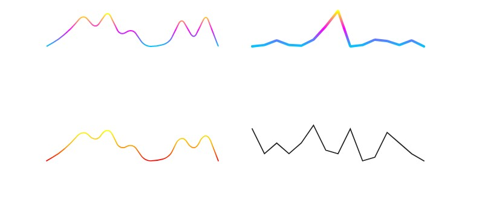

# DataTrend control

This control draw a spark line that shows a trend based on data. 
this control is a implementation of [react-trend](https://unsplash.github.io/react-trend/) component.


Here is an example of the control:




## How to use this control in your solutions

- Check that you installed the `@pnp/spfx-controls-react` dependency. Check out the [getting started](../#getting-started) page for more information about installing the dependency.
- Import the control into your component:

```TypeScript
import { DataTrend } from '@pnp/spfx-controls-react/lib/DataTrend';
```
- Use the `DataTrend` control in your code as follows:

```TypeScript
 <DataTrend  smooth
             autoDraw
             autoDrawDuration={3000}
             autoDrawEasing="ease-out"
             data={[0,2,5,9,5,10,3,5,0,0,1,8,2,9,0]}
             gradient={['#00c6ff', '#F0F', '#FF0']}
             radius={10}
             strokeWidth={2}
             strokeLinecap={'butt'}
          />
```

 

```TypeScript
 
```
## Implementation

The `DataTrend` control can be configured with the following properties:


| Property | Type | Required | Description |
| ---- | ---- | ---- | ---- |
| smooth | boolean | no | Smooth allows the peaks to be 'rounded' out so that the line has no jagged edges. |
| autoDraw | boolean | no | Allow the line to draw itself on mount. Set to true to enable, and customize using autoDrawDuration and autoDrawEasing. |
| autoDrawEasing | string | no | The easing function to use for the autoDraw animation. Accepts any transition timing function within the CSS spec (eg. linear, ease, ease-in, cubic-bezier...). |
| autoDrawDuration | number | no | The amount of time, in milliseconds, that the autoDraw animation should span. default 2000 |
| data | number[] | yes | data  |
| gradient | string[] | no | an array of 2+ colour values, and will fade evenly between them from the bottom up.  |
| radius | number | no | When using smoothing, you may wish to control the amount of curve around each point. For example, a 0 radius is equivalent to not having any smoothing at all, where an impossibly-large number like 10000 will ensure that each peak is as curved as it can possibly be.This prop has no effect if smooth isn't set to true. |
| strokeWidth | number | no | line thickness |
| strokeLinecap | string | no | control the edges of your line, values: "Butt","round", "square" |
| padding | number | no | expand the space around the line, default: 8 |


