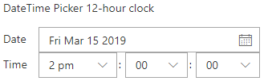
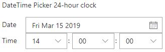
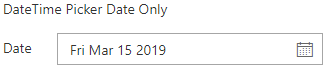

# DateTimePicker control

This control allows you to select dates from a calendar and optionally the time of day using dropdown controls. You can configure the control to use 12 or 24-hour clock.

Here are some examples of the control:

**DateTime Picker 12-hour clock**  


**DateTime Picker 24-hour clock**  


**DateTime Picker Date Only**  


**DateTime Picker No Seconds**  


**DateTime Picker Dropdowns for Time Part**  


## How to use this control in your solutions

- Check that you installed the `@pnp/spfx-controls-react` dependency. Check out the [getting started](../../#getting-started) page for more information about installing the dependency.
- Import the control into your component. The DateConvention and TimeConvention controls if the time of day controls are shown and the time format used (12 hours/24 hours).

```TypeScript
import { DateTimePicker, DateConvention, TimeConvention } from '@pnp/spfx-controls-react/lib/DateTimePicker';
```

- Use the `DateTimePicker` control in your code as follows, either as an uncontrolled or a controlled component:

```TypeScript
// Uncontrolled
<DateTimePicker label="DateTime Picker - 12h"
                dateConvention={DateConvention.DateTime}
                timeConvention={TimeConvention.Hours12} />

// Controlled
<DateTimePicker label="DateTime Picker - 24h"
                dateConvention={DateConvention.DateTime}
                timeConvention={TimeConvention.Hours24}
                value={this.state.date}
                onChange={this.handleChange} />
```

## Implementation

The `DateTimePicker` control can be configured with the following properties:

| Property | Type | Required | Description |
| ---- | ---- | ---- | ---- |
| label | string | no | Property field label displayed on top. |
| disabled | boolean | no | Specifies if the control is disabled or not. |
| formatDate | function | no | Defines a formatDate function that can override the output value in Date picker. |
| parseDateFromString | function | no | Optional method to parse the text input value to date, it is only useful when allowTextInput is set to true |
| dateConvention | DateConvention | no | Defines the date convention to use. The default is date and time.|
| timeConvention | TimeConvention | no | Defines the time convention to use. The default value is the 24-hour clock convention. |
| firstDayOfWeek | DayOfWeek | no | Specify the first day of the week for your locale. |
| firstWeekOfYear | FirstWeekOfYear | no | Defines when the first week of the year should start. |
| key | string | no | A unique key that indicates the identity of this control |
| onGetErrorMessage | function | no | The method is used to get the validation error message and determine whether the input value is valid or not. See [this documentation](https://learn.microsoft.com/en-us/sharepoint/dev/spfx/web-parts/guidance/validate-web-part-property-values) to learn how to use it. |
| showGoToToday | boolean | no | Controls whether the "Go to today" link should be shown or not |
| isMonthPickerVisible | boolean | no | Controls whether the month picker is shown beside the day picker or hidden. |
| showMonthPickerAsOverlay | boolean | no | Show month picker on top of date picker when visible. |
| showWeekNumbers | boolean | no | Controls whether the calendar should show the week number (weeks 1 to 53) before each week row |
| allowTextInput | boolean | no | Whether the user is allowed to enter a date as text instead of picking one from the date picker. |
| strings | IDatePickerStrings | no | Localized strings to use in the DateTimePicker |
| value | Date | no | Default value of the DatePicker, if any |
| onChange | function | no | Callback issued when date or time is changed |
| showSeconds | boolean | no | Specifies, if seconds dropdown should be shown, defaults to false. |
| timeDisplayControlType | TimeDisplayControlType | no | Specifies what type of control to use when rendering time part. |
| showLabels | boolean | no | Specifies if labels in front of date and time parts should be rendered. |
| placeholder | string | no | Placeholder text for the DatePicker. |
| initialPickerDate | Date | no | The initially highlighted date in the calendar picker |
| maxDate | Date | no | The maximum allowable date. |
| minDate | Date | no | The minimum allowable date. |
| minutesIncrementStep | MinutesIncrement | no | Specifies minutes' increment step for `TimeDisplayControlType.Dropdown` |
| showClearDate | boolean | no | Controls whether the clearDate iconButton must be available when date is selected, default to false |
| showClearDateIcon | string | no | Controls the icon used for clearDate iconButton. Defaults to 'RemoveEvent' |
| restrictedDates | Date[] | no | If set the Calendar will not allow selection of dates in this array. |

Enum `TimeDisplayControlType`

| Name     | Description                      |
| -------- | -------------------------------- |
| Text     | Renders Time part as Masked Edit |
| Dropdown | Renders Time part as Dropdown    |

Enum `DateConvention`

| Name     | Description                    |
| -------- | ------------------------------ |
| DateTime | Shows the date and time picker |
| Date     | Shows only the date picker     |

Enum `TimeConvention`

| Name    | Description                                              |
| ------- | -------------------------------------------------------- |
| Hours12 | Specify the hours in 12-hours (AM / PM) time convention. |
| Hours24 | Specify the hours in 24-hours time convention.           |

Interface `IDateTimePickerStrings` extends [IDatePickerStrings](https://developer.microsoft.com/en-us/fabric#/components/datepicker)

| Property         | Type   | Required | Description                                                         |
| ---------------- | ------ | -------- | ------------------------------------------------------------------- |
| dateLabel        | string | no       | Label for the date selector.                                        |
| timeLabel        | string | no       | Label for the time of day selector.                                 |
| timeSeparator    | string | no       | Separator between time of day components (hours, minutes, seconds). |
| amDesignator     | string | no       | Used as AM designator when 12-hour clock is used.                   |
| pmDesignator     | string | no       | Used as PM designator when 12-hour clock is used.                   |
| textErrorMessage | string | no       | Error message when text is entered in the date picker.              |

Type `MinutesIncrement`

```typescript
type MinutesIncrement = 1 | 5 | 10 | 15 | 30;
```


