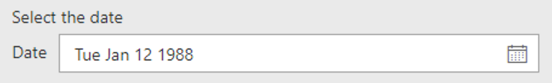
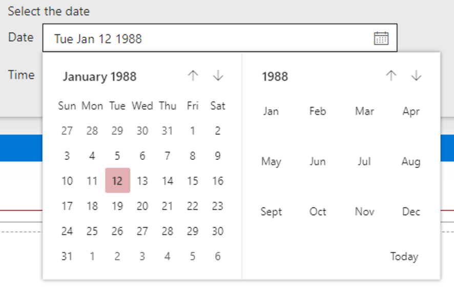
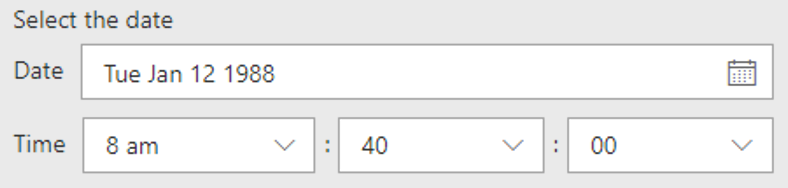

# DateTimePicker control

This control renders a Date and Time picker control.

The control can be configured to be date only or date and time.

**Date only**



**Date picker**



**Date and time**




## How to use this control in your solutions

- Check that you installed the `@pnp/spfx-controls-react` dependency. Check out the [getting started](../#getting-started) page for more information about installing the dependency.
- Import the following modules to your component:

```TypeScript
import { DateTimePicker, DateConvention, TimeConvention } from '@pnp/spfx-controls-react/lib/DateTimePicker';
```

- Use the `DateTimePicker` control in your code as follows:

```TypeScript
<DateTimePicker
    label="Select the date"
    onChange={(newValue: Date) => {
    // TODO: do something with the date
    }}
    dateConvention={DateConvention.DateTime}
    initialDate={new Date(1988, 0, 12, 8, 40)}
/>
```

## Implementation

The `DateTimePicker` control can be configured with the following properties:

| Property | Type | Required | Description |
| ---- | ---- | ---- | ---- |
| onChange | function | yes | Defines a function to raise when the date gets changed. |
| label | string | no | Property field label displayed on top. |
| disabled | boolean | no | Specify if the control needs to be disabled. |
| initialDate | Date | no | Initial date and time value of the control. |
| formatDate | function | no | Defines a formatDate function that can override the output value in Date picker. |
| dateConvention | DateConvention | no | Defines the date convention to use. By default this is set to date and time. |
| timeConvention | TimeConvention | no | Defines the time convention to use. By default this is set to 24-hour clock convention. |
| onGetErrorMessage | function | no | The method is used to get the validation error message and determine whether the input value is valid or not.. |
| deferredValidationTime | number | no | Control will start to validate after users stop typing for `deferredValidationTime` milliseconds. Default value is 200. |
| firstDayOfWeek | number | no | Specifies the first day of the week for your locale. |
| datePickerStrings | IDatePickerStrings | no | Localized strings to use in the DatePicker. |
| showSeconds | boolean | no | Specifies, if seconds dropdown should be shown. |
| maxDate | Date | no | The maximum allowable date. |
| minDate | Date | no | The minimum allowable date. |

Enum `DateConvention`

| Name | Description |
| ---- | ---- |
| DateTime | Shows the date and time picker |
| Date | Shows only the date picker |

Enum `TimeConvention`

| Name | Description |
| ---- | ---- |
| Hours12 | Specify the hours in 12-hours (AM / PM) time convention. |
| Hours24 | Specify the hours in 24-hours time convention. |