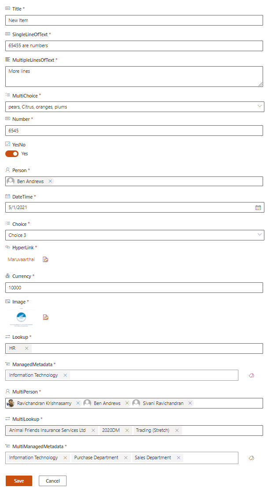
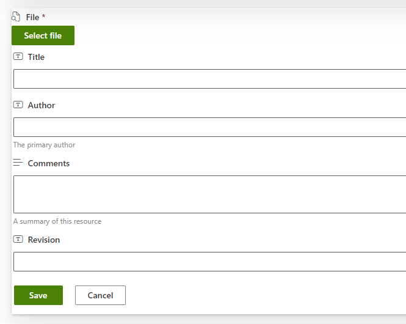

# Dynamic Form

This control can dynamically generate SharePoint list or SharePoint document library form and everything controlled through list setting.

## How to use this control in your solutions

- Check that you installed the `@pnp/spfx-controls-react` dependency. Check out the [getting started](../../#getting-started) page for more information about installing the dependency.
- Import the following modules to your component:

```TypeScript
import { DynamicForm } from "@pnp/spfx-controls-react/lib/DynamicForm";
```

- Use the DynamicForm control in your code as follows:

```jsx
<DynamicForm 
          context={this.props.context} 
          listId={"3071c058-549f-461d-9d73-8b9a52049a80"}  
          listItemId={1}
          onCancelled={() => { console.log('Cancelled') }}
          onBeforeSubmit={async (listItem) => { return false; }}
          onSubmitError={(listItem, error) => { alert(error.message); }}
          onSubmitted={async (listItemData) => { console.log(listItemData); }}>
</DynamicForm>
```



## File selection

To upload a file when creating a new document in a document library you need to specify:

- enableFileSelection: Set this parameter to true to enable file selection.
- contentTypeId: This parameter specifies the target content type ID of the document you are creating.
- supportedFileExtensions: This parameter is optional and is used to specify the supported file extensions if they are different from the default ones.

Enabling the file selection will display a new button on top of the form that allow the user to select a file from the recent files, browsing OneDrive or select and upload a file from the computer.



## Implementation

The `DynamicForm` can be configured with the following properties:

| Property | Type | Required | Description |
| ---- | ---- | ---- | ---- |
| context | BaseComponentContext | yes | The context object of the SPFx loaded webpart or customizer. |
| listId | string | yes | Guid of the list.|
| listItemId | number | no | list item ID. |
| contentTypeId | string | no | content type ID |
| disabled | boolean | no | Allows form to be disabled. Default value is `false`|
| disabledFields | string[] | no | InternalName of fields that should be disabled. Default value is `false`|
| enableFileSelection | boolean | no | Specify if the form should support the creation of a new list item in a document library attaching a file to it. This option is only available for document libraries and works only when the contentTypeId is specified and has a base type of type Document. Default value is `false`|
| fieldOrder | string[] | no | List of fields internal names. Specifies fields custom sorting. |
| hiddenFields | string[] | no | InternalName of fields that should be hidden. Default value is `false`|
| onListItemLoaded | (listItemData: any) => Promise&lt;void&gt; | no | List item loaded handler. Allows to access list item information after it's loaded.|
| onBeforeSubmit | (listItemData: any) => Promise&lt;boolean&gt; | no | Before submit handler. Allows to modify the object to be submitted or cancel the submission. To cancel, return `true`.|
| onSubmitted | (listItemData: any, listItem?: IItem) => void | no | Method that returns listItem data JSON object and PnPJS list item instance (`IItem`). |
| onSubmitError | (listItemData: any, error: Error) => void | no | Handler of submission error. |
| onCancelled | () => void | no | Handler when form has been cancelled. |
| returnListItemInstanceOnSubmit | boolean | no | Specifies if `onSubmitted` event should pass PnPJS list item (`IItem`) as a second parameter. Default - `true` |
| supportedFileExtensions | string[] | no | Specify the supported file extensions for the file picker. Only used when enableFileSelection is `true`. Default value is `["docx", "doc", "pptx", "ppt", "xlsx", "xls", "pdf"]`. |
| webAbsoluteUrl | string | no | Absolute Web Url of target site (user requires permissions). |
| fieldOverrides | {[columnInternalName: string] : {(fieldProperties: IDynamicFieldProps): React.ReactElement\<IDynamicFieldProps\>}} | no | Key value pair for fields you want to override.  Key is the internal field name, value is the function to be called for the custom element to render. |
| respectEtag | boolean | no | Specifies if the form should respect the ETag of the item. Default - `true` |
| saveDisabled | boolean | no | Specifies if save button is disabled. |
| validationErrorDialogProps | IValidationErrorDialogProps | no | Specifies validation error dialog properties |
| customIcons | { [ columnInternalName: string ]: string } | no | Specifies custom icons for the form. The key of this dictionary is the column internal name, the value is the Fluent UI icon name. |
| storeLastActiveTab | boolean | no |  When uploading files: Specifies if last active tab will be stored after the Upload panel has been closed. Note: the value of selected tab is stored in the queryString hash. Default - `true` |
| folderPath | string | no | Server relative or library relative folder to create the item in. This option is only available for document libraries and works only when the contentTypeId is specified and has a base type of type Document or Folder. Defaults to the root folder of the library. |
| useModernTaxonomyPicker | boolean | no | Specifies if the form should render [ModernTaxonomyPicker](./ModernTaxonomyPicker.md) control for Managed metadata fields. If set to `true`, Dynamic form will render ModernTaxonomyPicker control. If set to `false`, Dynamic form will render TaxonomyPicker control. Default is `false` |
| className | string | no | Set CSS Class. |
| styles | IStyleFunctionOrObject&lt;IDynamicFormStyleProps, [IDynamicFormStyles](#idynamicformstyles-interface)&gt; | no | Styles to apply on control.  See the example [here](#how-to-use-styles-property) |

## Validation Error Dialog Properties `IValidationErrorDialogProps`

| Property                    | Type    | Required | Description                                                                      |
| --------------------------- | ------- | -------- | -------------------------------------------------------------------------------- |
| showDialogOnValidationError | boolean | no       | Specifies if the dialog should be shown on validation error. Default - `false`   |
| customTitle                 | string  | no       | Specifies a custom title to be shown in the validation dialog. Default - empty   |
| customMessage               | string  | no       | Specifies a custom message to be shown in the validation dialog. Default - empty |

## IDynamicFormStyles interface

| Property | Type  | Description |
| ---- | ---- | ---- |
| root | IStyle | styles for the root element |
| sectionTitle | IStyle | styles for the **section title** when your list has enabled [list formatting on form layout](https://learn.microsoft.com/sharepoint/dev/declarative-customization/list-form-configuration#configure-custom-body-with-one-or-more-sections) |
| sectionFormFields | IStyle | styles for the **section container** when your list has enabled list formatting on form layout |
| sectionFormField | IStyle | styles for the **section field** when your list has enabled list formatting on form layout |
| sectionLine | IStyle | styles for the **section line break** when your list has enabled list formatting on form layout |
| header | IStyle | styles for the **header** when your list has enabled list formatting on [custom header](https://learn.microsoft.com/sharepoint/dev/declarative-customization/list-form-configuration#configure-custom-header) |
| footer | IStyle | styles for the **footer** when your list has enabled list formatting on [custom footer](https://learn.microsoft.com/sharepoint/dev/declarative-customization/list-form-configuration#configure-custom-footer) |
| validationErrorDialog | IStyle | styles for the **content** element in Validation Error Dialog  |
| actions | IStyle | styles for the **actions** element in Validation Error Dialog  |
| actionsRight | IStyle | styles for the **button container** of Validation Error Dialog  |
| action | IStyle | styles for the **close button** in Validation Error Dialog  |
| buttons | IStyle | styles for the buttons (save button/cancel button)  |
| subComponentStyles | {fieldStyles: [IDynamicFieldStyles](#idynamicfieldstyles-interface)} | styles of dynamic field control|

## IDynamicFieldStyles interface

| Property | Type  | Description |
| ---- | ---- | ---- |
| fieldEditor | IStyle |  styles for root element |
| fieldContainer | IStyle | styles for container element under root  |
| titleContainer | IStyle | styles for the title container element of the field |
| fieldIcon | IStyle | styles for the icon element of the field |
| fieldDisplay | IStyle | styles for sub field control.e.g. TextField,ListItemPicker  |
| fieldDisplayNoPadding | IStyle | styles for "Url" field control  |
| fieldDescription | IStyle | styles for field description element  |
| fieldRequired | IStyle | styles for required element |
| fieldLabel | IStyle | styles for field label element , it will append fieldRequired style if the field is required |
| labelContainer | IStyle | styles for field label container element |
| pickersContainer | IStyle | styles for those picker sub control,e.g. DatePicker,TaxonomyPicker |
| errormessage | IStyle | styles for errormessage element |
| richText | IStyle | styles for richText sub control |
| thumbnailFieldButtons | IStyle | styles for button when field type is 'Thumbnail' |
| selectedFileContainer | IStyle | styles for File Selection Control |

## How to use styles property

Property styles of Dynamic Form gives you a set of properties which you can use to modify styles.
In this example it shows 4 columns (by default it shows 3 columns per row) in one row if screen size is bigger than 1280px (it requires enable list formatting first)
and make the error message font size a bit large.

```TypeScript
styles={{
  sectionFormField: {
    selectors: {
      ':has(div)': {
        [`@media (min-width: 1280px)`]: {
          "min-width": '21%',
          "max-width": '21%' //force show 4 columns per row in big screen size when enabled list custom formatting
        }
      },
    },
  },

  subComponentStyles: {
    fieldStyles: {
      errormessage: {
        "font-size": "18px" //overwrite the error message font size in Dynamic Field for Lookup/Note/Date fields (The error message element is generated directly in Dynamic Field control)
      },
      fieldDisplay: {
        selectors: {
          '.ms-TextField-errorMessage': {
            "font-size": "18px !important" //overwrite the error message font size in Dynamic Field for TextField (error message element is wrapped in Fluent UI TextField control, we cannot modify it directly,we have to use 'selectors' to change it)
          }
        }
      }
    }
  }
}}
```
