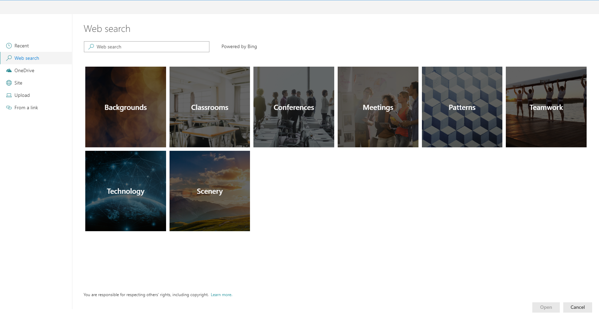
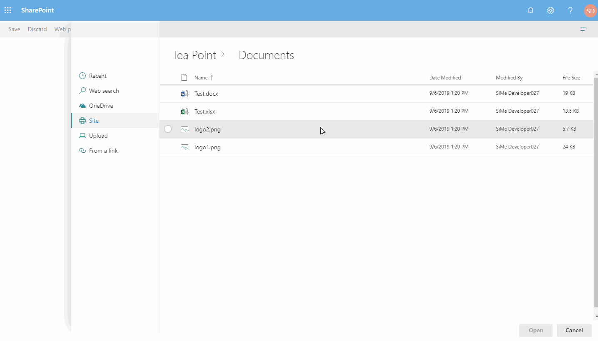

# FilePicker control

File picker control allows to browse and select a file from various places.

Currently supported locations:

- Recent files - tab allows to select a file from recently modified files based on the search results.
- Web search - tab uses Bing cognitive services to look for a file. (Only images)
- OneDrive - tab allows to select a file from the user's One Drive.
- Site document libraries - tab allows to select a file from the existing site document libraries.
- Upload - tab allows to upload a file from local drive.
- Multi-Upload - tab allows to upload multiple files from local drive.
- From a link - tab allows to paste a link to the document.

## Overview

The control supports all types of file, however it also allows to specify list of extensions for the files that are going to be looked displayed. Currently, only single file selection is supported.


## Different display types

File picker support 3 types of views : List, Compact list and Tiles. In case Tiles view is selected, the control shows the thumbnail of the file.


## Breadcrumb support

The control displays breadcrumb navigation that allows to easily switch folders or document libraries.


## Paged data load

File picker doesn't load all the files that exist in the folder. Instead, it allows to specify how many results are loaded in a batch, and executes paged requests when new data is required.


## How to use this control

- Check that you installed the `@pnp/spfx-controls-react` dependency. Check out the [getting started](../../#getting-started) page for more information about installing the dependency.
- Import the following module to your component:

```TypeScript
import { FilePicker, IFilePickerResult } from '@pnp/spfx-controls-react/lib/FilePicker';
```

- Use the `FilePicker` control in your code as follows:

```TypeScript
<FilePicker
  bingAPIKey="<BING API KEY>"
  accepts= {[".gif", ".jpg", ".jpeg", ".bmp", ".dib", ".tif", ".tiff", ".ico", ".png", ".jxr", ".svg"]}
  buttonIcon="FileImage"
  onSave={(filePickerResult: IFilePickerResult[]) => { this.setState({filePickerResult }) }}
  onChange={(filePickerResult: IFilePickerResult[]) => { this.setState({filePickerResult }) }}
  context={this.props.context}
/>
```

- Sample `onSave` handler:

```TypeScript
  private _onFilePickerSave = async (filePickerResult: IFilePickerResult[]) => {
    this.setState({ filePickerResult: filePickerResult });
    if (filePickerResult && filePickerResult.length > 0) {
      for (var i = 0; i < filePickerResult.length; i++) {
        const item = filePickerResult[i];
        const fileResultContent = await item.downloadFileContent();
        console.log(fileResultContent);
      }
    }
  }
```

## Implementation

The FilePicker component can be configured with the following properties:

| Property | Type | Required | Description |
| ---- | ---- | ---- | ---- |
| label | string | no | Specifies the text describing the file picker. |
| buttonLabel | string | no | Specifies the label of the file picker button. |
| buttonIcon | string | no | In case it is provided the file picker will be rendered as an action button. |
| buttonIconProps | IIconProps | no | In case it is provided the file picker will be rendered as an Icon the and all can define Properties for Icon  |
| defaultFolderAbsolutePath | string | no | Optional string parameter to set a default active folder/library for the SiteFilesTab. E.g. `"https://contoso.sharepoint.com/teams/siteName/documentLibrary/Folder 1/SubFolder 1"`  |
| onSave | (filePickerResult: IFilePickerResult[]) => void | yes | Handler when the file has been selected and picker has been closed. |
| onChange | (filePickerResult: IFilePickerResult[]) => void | no | Handler when the file selection has been changed. |
| onCancel | () => void | no | Handler when file picker has been cancelled. |
| context | BaseComponentContext | yes | Current context. |
| accepts | string[] | no | Array of strings containing allowed files extensions. E.g. [".gif", ".jpg", ".jpeg", ".bmp", ".dib", ".tif", ".tiff", ".ico", ".png", ".jxr", ".svg"] |
| required | boolean | no | Sets the label to inform that the value is required. |
| bingAPIKey | string | no | Used to execute WebSearch. If not provided SearchTab will not be available. The API key can be created on a Azure account ([Bing image search API](https://www.microsoft.com/en-us/bing/apis/bing-image-search-api)), a free version exist for 1000 query per month ([Pricing](https://www.microsoft.com/en-us/bing/apis/pricing)) |
| disabled | boolean | no | Specifies if the picker button is disabled |
| hidden | boolean | no | Specifies if the picker button is hidden (if hidden, panel visibility can still be controlled with isPanelOpen) |
| itemsCountQueryLimit | number | no | Number of items to obtain when executing REST queries. Default 100. |
| hideRecentTab | boolean | no | Specifies if RecentTab should be hidden. |
| hideWebSearchTab | boolean | no | Specifies if WebSearchTab should be hidden. |
| hideStockImages | boolean | no | Specifies if StockImagesTab should be hidden. |
| hideOrganisationalAssetTab | boolean | no | Specifies if `OrganisationalAssetTab` should be hidden. |
| hideOneDriveTab | boolean | no | Specifies if OneDriveTab should be hidden. |
| hideSiteFilesTab | boolean | no | Specifies if SiteFilesTab should be hidden. |
| hideLocalUploadTab | boolean | no | Specifies if LocalUploadTab should be hidden. |
| hideLocalMultipleUploadTab | boolean | no | Specifies if LocalMultipleUploadTab should be hidden. |
| hideLinkUploadTab | boolean | no | Specifies if LinkUploadTab should be hidden. |
| storeLastActiveTab | boolean | no | Specifies if last active tab will be stored after the Upload panel has been closed. Note: the value of selected tab is stored in the queryString hash. Default `true` |
| isPanelOpen | boolean | no | Specifies if the file picker panel is open by default or not |
| renderCustomUploadTabContent | (filePickerResult: IFilePickerResult) => JSX.Element \| null | no | Optional renderer to add custom user-defined fields to "Upload" tab |
| renderCustomMultipleUploadTabContent | (filePickerResult: IFilePickerResult[]) => JSX.Element \| null | no | Optional renderer to add custom user-defined fields to "Multi-Upload" tab |
| renderCustomLinkTabContent | (filePickerResult: IFilePickerResult) => JSX.Element \| null | no | Optional renderer to add custom user-defined fields to "Link" tab |
| includePageLibraries | boolean | no | Specifies if Site Pages library to be visible on Sites tab |
| allowExternalLinks | boolean | no | Specifies if external links should be allowed. |
| checkIfFileExists | boolean | no | When using file links, this property allows the user to choose if the control should check if the link point to a file that exists or not. |
| tabOrder | FilePickerTab[]| no | Defines a custom display order for the tabs. Tabs not listed will follow their default order. |
| defaultSelectedTab | FilePickerTab  | no | Sets the default selected tab. If not specified, the first visible tab is used. |

Interface `IFilePickerResult`

Provides options for carousel buttons location.

| Value | Type | Description |
| ---- | ---- | ---- |
| fileName | string | File name of the result with the extension. |
| fileNameWithoutExtension | string | File name of the result without the extension. |
| fileAbsoluteUrl | string | Absolute URL of the file. Null in case of file upload. |
| fileSize | number | Size of the result (in bytes). Set only for file upload |
| downloadFileContent | () => Promise&lt;File&gt; | Function allows to download file content. Returns File object. |

Enum `FilePickerTab`

Represents the available tabs in the File Picker component. Each tab corresponds to a different source from which users can select files.

| Name            | Description                                           |
|-----------------|-------------------------------------------------------|
| Recent          | Displays recently used files.                         |
| StockImages     | Shows stock image selection.                          |
| Web             | Allows searching files from the web.                  |
| OrgAssets       | Displays organizational assets.                       |
| OneDrive        | Allows file selection from OneDrive.                  |
| Site            | Enables browsing site files.                          |
| Upload          | Provides option to upload local files.                |
| Link            | Lets the user add a file via a URL.                   |
| MultipleUpload  | Supports uploading multiple files at once.            |


