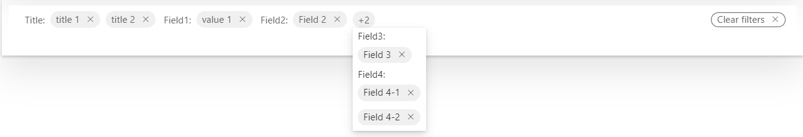

# FilterBar

This control allows you to render a bar of filters that looks exactly the same as in modern lists.

Here is an example of the control in action:



## How to use this control in your solutions

- Check that you installed the `@pnp/spfx-controls-react` dependency. Check out the [getting started](../../#getting-started) page for more information about installing the dependency.
- In your component file, import the `FilterBar` control as follows:

```TypeScript
import { FilterBar } from "@pnp/spfx-controls-react/lib/FilterBar";
```

- Use the `FilterBar` control in your code as follows:

```TypeScript
// Initial state
this.state = {
      filters: [{
            label: "Title",
            value: "title 1"
        },
        {
            label: "Field1",
            value: "value 1"
        },
        {
            label: "Title",
            value: "title 2"
        }
    ]
}
...
...
// Events 
private onClearFilters = () => {
    console.log("Cleared all filters");
    this.setState({ filters: []});
}

private onRemoveFilter = (label: string, value: string) => {
    console.log(`Cleared ${label} ${value}`);
    const itm = this.state.filters.find(i => i.label === label && i.value === value);
    if (itm) {
        const index = this.state.filters.indexOf(itm);
        this.state.filters.splice(index, 1)

        this.setState({
          filters: [...this.state.filters]
        });
    }
}

...
...

//Render the filter bar
<FilterBar
    items={this.state.items}
    inlineItemCount={3}
    onClearFilters={this.onClearFilters} 
    onRemoveFilter={this.onRemoveFilter}>
</FilterBar>
```

## Implementation

The `FilterBar` control can be configured with the following properties:

| Property | Type | Required | Description | Default |
| ---- | ---- | ---- | ---- | ---- |
| items | [IFilterBarItem[]](#ifilterbaritem) | yes | Filters to be displayed. Multiple filters with the same label are grouped together | |
| inlineItemCount | number | no | Number of filters, after which filters start showing as overflow | 5 |
| onClearFilters | () => void | no | Callback function called after the next item button is clicked. Not used when triggerPageEvent is specified. | |
| onRemoveFilter | (label: string, value: string) => void | no | Callback function called after clicking a singular filter pill | |

## IFilterBarItem

| Property | Type   | Required | Description  | Default |
| -------- | ------ | -------- | ------------ | ------- |
| label    | string | yes      | Filter label |         |
| value    | string | yes      | Filter value |         |


