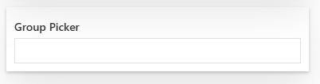
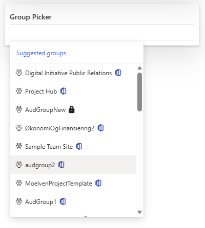
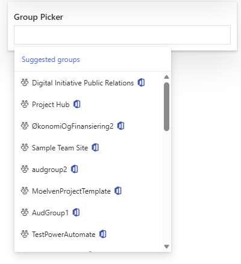
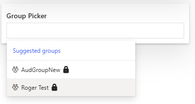
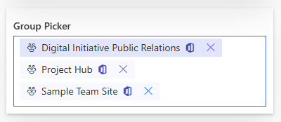

# GroupPicker control

This control allows you to select one or multiple Microsoft 365 groups and/or security groups using Microsoft Graph. Suggestions and selected items display a small icon indicating the group type.

Here is an example of the control:



`GroupPicker` single selection mode showing all groups:



`GroupPicker` single selection mode showing M365 groups:



`GroupPicker` single selection mode showing Security groups:



`GroupPicker` multi-selection mode:



## How to use this control in your solutions

- Check that you installed the `@pnp/spfx-controls-react` dependency. Check out the [getting started](../../#getting-started) page for more information about installing the dependency.
- Import the control into your component:

```TypeScript
import { GroupPicker } from "@pnp/spfx-controls-react/lib/GroupPicker";
```

- Use the `GroupPicker` control in your code as follows:

```TypeScript
  <GroupPicker
    appcontext={this.props.context}
    label="Group Picker"
    itemLimit={3}
    selectedGroups={this.state.selectedGroups}
    multiSelect={true}
    onSelectedGroups={(tagList: ITag[]) => {
      this.setState({ selectedGroups: tagList });
    }}
    groupType="M365" //All, Security
    themeVariant={this.props.themeVariant}
  />
```

## Implementation

The `GroupPicker` control can be configured with the following properties:

| Property | Type | Required | Description |
| ---- | ---- | ---- | ---- |
| appcontext | BaseComponentContext | yes | The context object of the SPFx loaded webpart or customizer. |
| selectedGroups | ITag[] | yes | Array with selected groups. |
| itemLimit | number | no | Number of allowed selected items. |
| multiSelect | boolean | no | Optional mode indicates if multi-choice selections is allowed. Default is `true`. |
| label | string | no | Label of the picker. |
| styles | IBasePickerStyles | no | Custom styles of the picker. |
| themeVariant | IReadonlyTheme | no | Theme variant used for SharePoint/Teams theming. |
| groupType | GroupTypeFilter | no | Filter groups by type. Allowed values: `"All"`, `"M365"`, `"Security"`. Default is `"All"`. |
| onSelectedGroups | (tagsList: ITag[]) => void | yes | Callback with groups selected. |

## MSGraph Permissions required

This control requires Microsoft Graph permissions for reading groups. Grant at least one of the following:

- `Group.Read.All`
- `Directory.Read.All`


