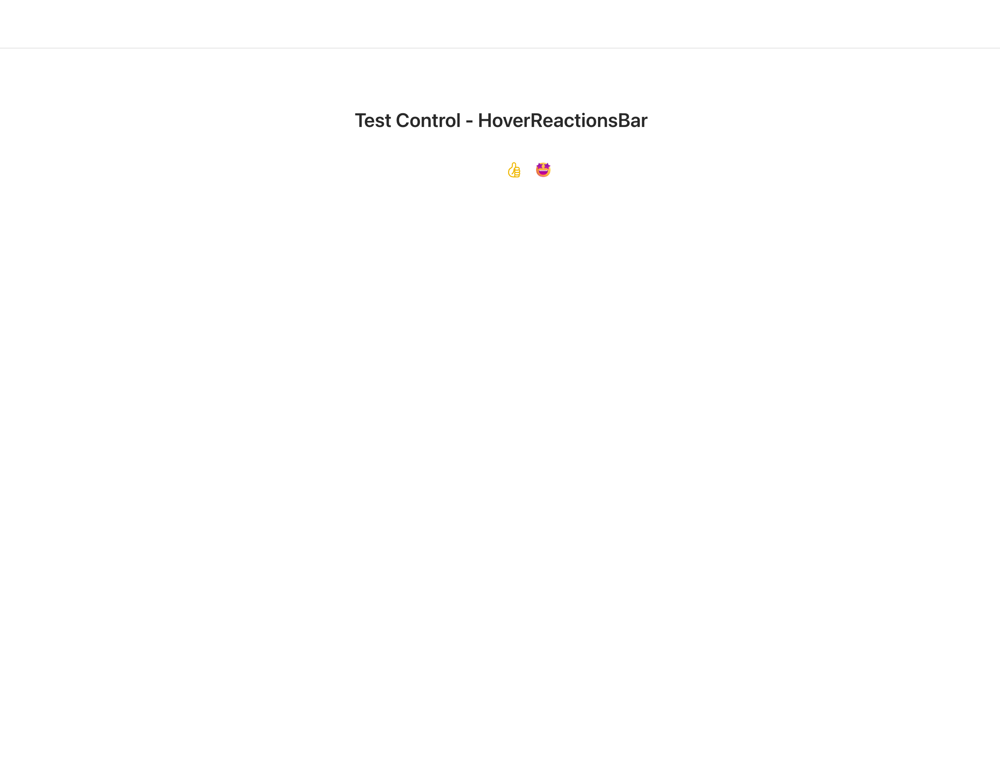
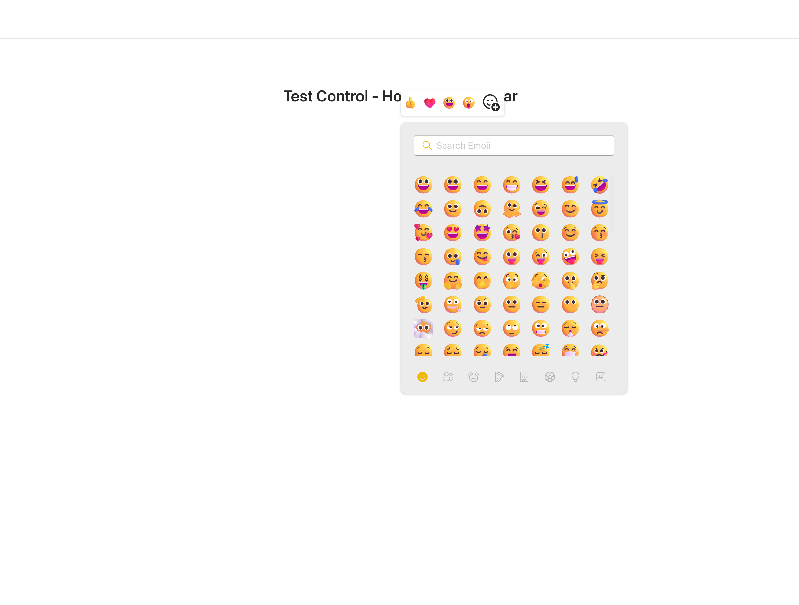
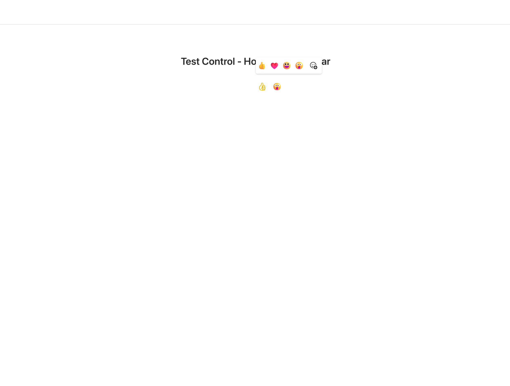

# HoverReactionsBar

This control allows you to select an emoji from emoji bar or select from picker.


**HoverReactionsBar**








## How to use this control in your solutions

- Check that you installed the `@pnp/spfx-controls-react` dependency. Check out the [getting started](../../#getting-started) page for more information about installing the dependency.
- Import the following modules to your component:

```TypeScript
import { HoverReactionsBar } from '@pnp/spfx-controls-react/lib/HoverReactionsBar';
```

- Use the `HoverReactionsBar` control in your code as follows:

```TypeScript
<HoverReactionsBar
            isOpen={isOpenHoverReactionBar}
            onSelect={onSelectEmoji}
            onDismiss={(): void => {
              setIsOpenHoverReactionBar(false);
            }}
            target={divRefAddReaction.current as HTMLDivElement}
          />
```

- With the `onSelected` property you can get the selcted term:

```typescript
   const onSelectEmoji = React.useCallback(async (emoji: string, emojiInfo: IEmojiInfo) => {
    console.log('emoji', emoji);
    console.log('emojiInfo object',emojiInfo);
    setIsOpenHoverReactionBar(false);
  }, []);

```
onSelect: (emoji: string | undefined, emojiInfo?: IEmojiInfo) => void;
  isOpen: boolean;
  onDismiss: () => void;
  top4Reactions?: string[];
  target: HTMLDivElement;
  themeV8?: Theme ;

## Implementation

The HoverReactionsBar control can be configured with the following properties:

| Property | Type | Required | Description |
| ---- | ---- | ---- | ---- |
| isOpen | boolean | yes | show hoverReactionsVar |
| onSelected |onSelect: (emoji: string, emojiInfo?: IEmojiInfo) => void;| yes | selected Emoji |
| top4Reactions |  string[] | no |  name of emojis to show on the bar  |
| target | HTMLDivElement | yes | container of controls who fire the HoverReactionsBar |
| onDismis | onDismiss: () => void; | yes | function to call to dismiss HoverReactionsBar|


