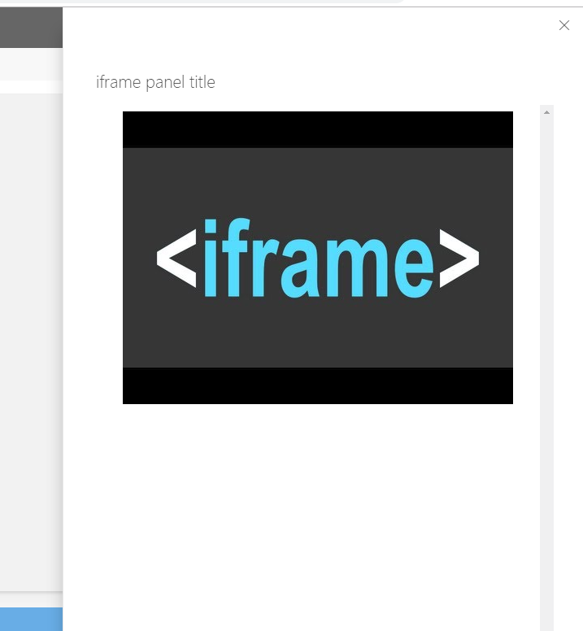

# IFramePanel control

This control renders a Panel with an iframe as content.

Here is an example of the control in action:



## How to use this control in your solutions

- Check that you installed the `@pnp/spfx-controls-react` dependency. Check out the [getting started](../../#getting-started) page for more information about installing the dependency.
- Import the following modules to your component:

```TypeScript
import { IFramePanel } from "@pnp/spfx-controls-react/lib/IFramePanel";
```

- The `IFramePanel` uses the [Office Fabric UI implemenation of the panel](https://developer.microsoft.com/en-us/fabric#/components/panel). The properties of this control inherit the panel properties.

- Use the `IFramePanel` control in your code as follows (`this._onIframeLoaded` and `this._onDismiss` are methods that should be implemented if you want to execute some actions when the iframe content is loaded and dialog should be closed respectively.)

```TypeScript
<IFramePanel url={this.state.iFrameUrl}
             type={PanelType.medium}
             headerText="Panel Title"
             closeButtonAriaLabel="Close"
             isOpen={this.state.iFramePanelOpened}
             onDismiss={this._onDismiss.bind(this)}
             iframeOnLoad={this._onIframeLoaded.bind(this)} />
```

## Implementation

The IFramePanel component extends the properties from the [Fabric UI IPanelProps](https://developer.microsoft.com/en-us/fabric#/components/panel)
 along with the additional following properties:

| Property | Type | Required | Description |
| ---- | ---- | ---- | ---- |
| url | string | yes | iframe Url |
| heigth | string | yes | iframe's height, if empty it will be dynamically set to the full height available in the panel's content area |
| iframeOnload | iframeOnLoad?: (iframe: any) => {} | no | iframe's onload event handler |
| name | string | no | Specifies the name of an iframe |
| allowFullScreen | boolean | no | Specifies if iframe content can be displayed in a full screen |
| allowTransparency | boolean | no | Specifies if transparency is allowed in iframe |
| sandbox | string | no | Enables an extra set of restrictions for the content in an iframe |
| scrolling | string | no | Specifies whether or not to display scrollbars in an iframe |
| seamless | string | no | When present, it specifies that the iframe should look like it is a part of the containing document (no borders or scrollbars) |


