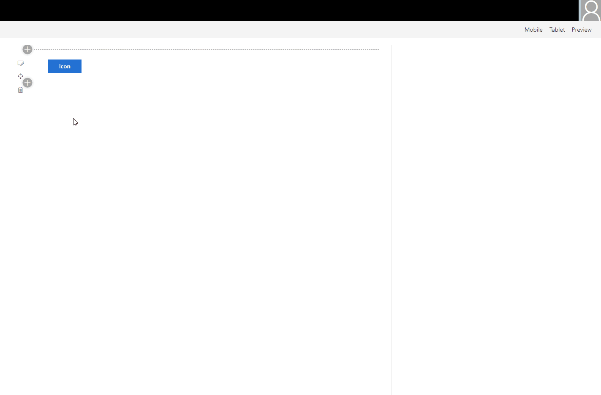

# IconPicker control

Control that allows to search and select an icon from office-ui-fabric-react icons.

## Overview
The control allows selecting an icon from the list of icons available in the office-ui-fabric-react library. Icon list is a static copy of available icons. Currently, only one icon selection is supported.


## Displayed in the panel
Icon picker always opens a new panel where you can pick an icon. The panel displays all the icons and maintains readability. Picker does not displays selected icon outside the panel.



## How to use this control

- Check that you installed the `@pnp/spfx-controls-react` dependency. Check out the [getting started](../../#getting-started) page for more information about installing the dependency.
- Import the following module to your component:

```TypeScript
import { IconPicker } from '@pnp/spfx-controls-react/lib/IconPicker';
```

- Use the `IconPicker` control in your code as follows:

```TypeScript
<IconPicker
    buttonLabel={'Icon'}
    onChange={(iconName: string) => { this.setState({icon: iconName}); }}
    onSave={(iconName: string) => { this.setState({icon: iconName}); }}       
/>
```

## Implementation

The IconPicker component can be configured with the following properties:

| Property | Type | Required | Description |
| ---- | ---- | ---- | ---- |
| buttonLabel | string | no | Specifies the label of the icon picker button. |
| onSave | (iconName: string) => void | yes | Handler when the icon has been selected and picker has been closed. |
| onChange | (iconName: string) => void | no | Handler when the icon selection has been changed. |
| disabled | boolean | no | Specifies if the picker button is disabled |
| buttonClassName | boolean | no | If provided, additional class name will be added to the picker button |
| panelClassName | boolean | no | If provided, additional class name will be added to the picker panel |
| currentIcon | boolean | no | Specifies default selected icon |


