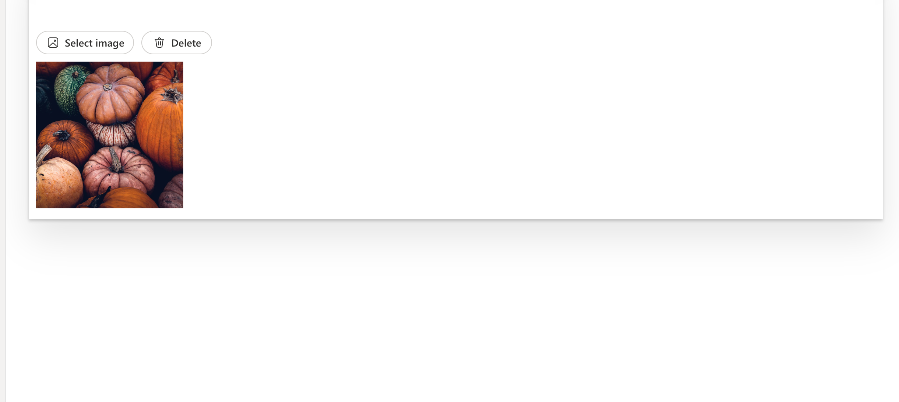

# ImagePicker

This control allows you to select or upload image from SharePoint, OneDrive or Stock Images.

Here is an example of the control in action:




## How to use this control in your solutions

- Check that you installed the `@pnp/spfx-controls-react` dependency. Check out the [getting started](../../#getting-started) page for more information about installing the dependency.
- Import the following modules to your component:

```TypeScript
import { ImagePicker } from '@pnp/spfx-controls-react/lib/ImagePicker';
```

- Use the `ImagePicker` control in your code as follows:

```Typescript

  <ImagePicker
  onFileSelected={handleFileSelected}
  onDeleteFile={handleDeleteFile}
  selectedFileUrl={selectedImageUrl}
  context={appContext} />
```

- With the `onFileSelect` property you can get the selected image:

```typescript
const handleFileSelected = React.useCallback(async (file: IFilePickerResult) => {
  console.log("file", file);
}, []);
```

- With the `onDelete` property you can execute a callback after delete the image:

```typescript
const onDeleteFile = React.useCallback(async () => {
  console.log("onDeleteFile");
}, []);
```

## Implementation

The HoverReactionsBar control can be configured with the following properties:

| Property        | Type                                              | Required | Description             |
| --------------- | ------------------------------------------------- | -------- | ----------------------- |
| onFileSelected  | onFileSelect: (file: IFilePickerResult ) => void; | yes      | OnSelectedFile Callback |
| onDeleteFile    | onDeleteFile: () => void                          | yes      | onDeleteFile CallBack   |
| selectedFileUrl | string                                            | yes      | Default Selected Image  |
| context         | BaseComponentContext                              | yes      | Context                 |


