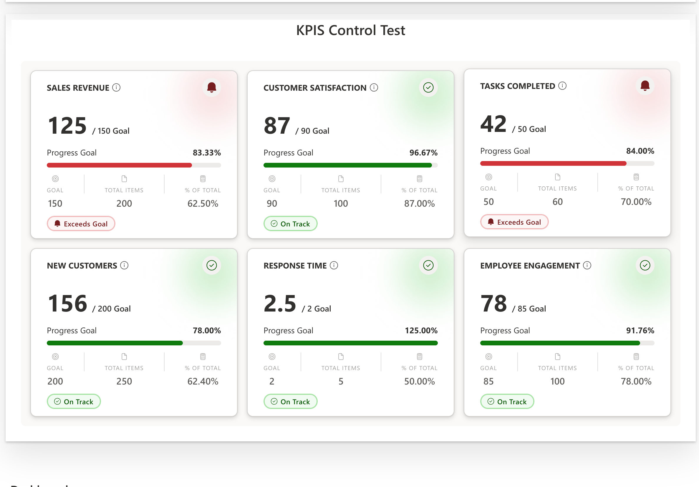

# KPIControl

A React component for displaying Key Performance Indicator (KPI) cards in a responsive grid layout. Each card visualizes progress toward a goal with visual indicators, progress bars, and status badges. Two card variants are available: a full-featured card and a compact version.

## Table of Contents

- [Installation](#installation)
- [Basic Usage](#basic-usage)
- [Card Variants](#card-variants)
- [Properties](#properties)
- [Data Structure](#data-structure)
- [Goal Metrics](#goal-metrics)
- [Features](#features)
- [Examples](#examples)

## Installation

```bash
npm install @pnp/spfx-controls-react
```

## Example of KPIControl



## Basic Usage

```tsx
import * as React from 'react';
import { Kpis } from '@pnp/spfx-controls-react/lib/KPIControl';

const MyKPIComponent: React.FC = () => {
  return (
    <Kpis skeletonCount={3} />
  );
};
```

## Card Variants

The KPIControl offers two card variants to suit different use cases:

### KPICard (Full Version)

The full KPICard displays comprehensive information including footer metrics (Goal, Total Items, % of Total) and a status badge.

```tsx
import * as React from 'react';
import { KPICard } from '@pnp/spfx-controls-react/lib/KPIControl';
import { IKpiCardData, EGoalMetric } from '@pnp/spfx-controls-react/lib/KPIControl';

const MyKPICard: React.FC = () => {
  const kpiData: IKpiCardData = {
    identifier: 'sales-kpi',
    title: 'Sales Revenue',
    currentValue: 125000,
    goal: 150000,
    totalItems: 200000,
    description: 'Total sales revenue for Q1',
    goalMetric: EGoalMetric.HIGHER_IS_BETTER,
  };

  return (
    <KPICard dataCard={kpiData} />
  );
};
```

### KPICardCompact (Compact Version)

The compact version displays only essential information: title, goal metric indicator, current value, goal, and progress bar. Ideal for dashboards with limited space or when displaying many KPIs.

```tsx
import * as React from 'react';
import { KPICardCompact } from '@pnp/spfx-controls-react/lib/KPIControl';
import { IKpiCardData, EGoalMetric } from '@pnp/spfx-controls-react/lib/KPIControl';

const MyCompactKPICard: React.FC = () => {
  const kpiData: IKpiCardData = {
    identifier: 'sales-kpi',
    title: 'Sales Revenue',
    currentValue: 125000,
    goal: 150000,
    totalItems: 200000,
    description: 'Total sales revenue for Q1',
    goalMetric: EGoalMetric.HIGHER_IS_BETTER,
  };

  return (
    <KPICardCompact dataCard={kpiData} />
  );
};
```

### Comparison

| Feature | KPICard | KPICardCompact |
|---------|---------|----------------|
| Title | ✅ | ✅ |
| Goal Metric Indicator | ✅ | ✅ |
| Current Value / Goal | ✅ | ✅ |
| Progress Bar | ✅ | ✅ |
| Progress Percentage | ✅ | ✅ |
| Footer Metrics (Goal, Total Items, % of Total) | ✅ | ❌ |
| Status Badge (On Track / Off Track) | ✅ | ❌ |
| Glow Effect | ✅ | ✅ |
| Info Tooltip | ✅ | ✅ |

## Properties

### Kpis Component Properties

| Property | Type | Required | Default | Description |
|----------|------|----------|---------|-------------|
| `skeletonCount` | `number` | No | `3` | Number of skeleton cards to display while loading |
| `compact` | `boolean` | No | `false` | When `true`, renders compact KPI cards instead of full cards |

#### Using the compact prop

```tsx
import * as React from 'react';
import { Kpis } from '@pnp/spfx-controls-react/lib/KPIControl';

// Full cards (default)
const FullKpis: React.FC = () => <Kpis />;

// Compact cards
const CompactKpis: React.FC = () => <Kpis compact />;
```

### KPICard & KPICardCompact Component Properties

Both card variants share the same props interface:

| Property | Type | Required | Default | Description |
|----------|------|----------|---------|-------------|
| `dataCard` | `IKpiCardData` | Yes | - | The KPI data to display |

## Data Structure

### IKpiCardData Interface

```typescript
interface IKpiCardData {
  /** Unique identifier for the KPI */
  identifier: string;
  /** Current numeric value of the KPI */
  currentValue: number;
  /** Goal / target threshold */
  goal: number;
  /** Total number of items used to compute the KPI */
  totalItems: number;
  /** Description of the KPI */
  description: string;
  /** Card title */
  title?: string;
  /** Goal metric type - determines if lower or higher is better */
  goalMetric?: EGoalMetric;
}
```

## Goal Metrics

The `EGoalMetric` enum defines how the KPI progress is evaluated:

```typescript
enum EGoalMetric {
  /** Lower values are better (e.g., response time, error rate) */
  LOWER_IS_BETTER = 1,
  /** Higher values are better (e.g., sales, customer satisfaction) */
  HIGHER_IS_BETTER = 2
}
```

### Goal Metric Examples

| Metric Type | Use Case | On Track When |
|-------------|----------|---------------|
| `LOWER_IS_BETTER` | Response Time | Current ≤ Goal |
| `LOWER_IS_BETTER` | Error Rate | Current ≤ Goal |
| `HIGHER_IS_BETTER` | Sales Revenue | Current ≥ Goal |
| `HIGHER_IS_BETTER` | Customer Satisfaction | Current ≥ Goal |

## Features

### Visual Indicators

- **Progress Bar**: Shows progress toward the goal with color coding (green for on track, red for off track)
- **Status Badge**: Checkmark icon when on track, alert icon when off track
- **Glow Effect**: Subtle background glow that changes color based on status
- **Hover Animation**: Cards lift slightly on hover for better interactivity

### Card Information

Each KPI card displays:

- **Title**: The KPI name (uppercase)
- **Current Value**: The current metric value
- **Goal**: The target value
- **Progress Percentage**: How close to the goal
- **Footer Metrics**: Goal, Total Items, and Percentage of Total
- **Description**: Available via info tooltip on the title

### Responsive Layout

The KPI container uses a responsive CSS grid:

- Auto-fills columns with minimum 280px width
- Adapts to tablet screens (≤768px) with 240px minimum
- Single column layout on mobile (≤480px)

### Loading State

When loading, skeleton cards are displayed to provide visual feedback. The number of skeleton cards can be configured via the `skeletonCount` prop.

### Empty State

When no KPIs are configured, a `NoKpisCard` component is displayed with a call-to-action to configure KPIs.

### Error Handling

Errors are displayed using a `ShowError` component with the error message.

## Examples

### Multiple KPIs

```tsx
import * as React from 'react';
import { KPICard } from '@pnp/spfx-controls-react/lib/KPIControl';
import { IKpiCardData, EGoalMetric } from '@pnp/spfx-controls-react/lib/KPIControl';

const kpis: IKpiCardData[] = [
  {
    identifier: 'kpi-1',
    title: 'Sales Revenue',
    currentValue: 125000,
    goal: 150000,
    totalItems: 200000,
    description: 'Total sales revenue for Q1',
    goalMetric: EGoalMetric.HIGHER_IS_BETTER,
  },
  {
    identifier: 'kpi-2',
    title: 'Customer Satisfaction',
    currentValue: 87,
    goal: 90,
    totalItems: 100,
    description: 'Customer satisfaction score',
    goalMetric: EGoalMetric.HIGHER_IS_BETTER,
  },
  {
    identifier: 'kpi-3',
    title: 'Response Time',
    currentValue: 2.5,
    goal: 2,
    totalItems: 5,
    description: 'Average response time in hours',
    goalMetric: EGoalMetric.LOWER_IS_BETTER,
  },
];

const MyKPIs: React.FC = () => {
  return (
    <div style={{ display: 'grid', gridTemplateColumns: 'repeat(auto-fill, minmax(280px, 1fr))', gap: '16px' }}>
      {kpis.map((kpi) => (
        <KPICard key={kpi.identifier} dataCard={kpi} />
      ))}
    </div>
  );
};
```

### KPI with Lower is Better Metric

```tsx
const responseTimeKpi: IKpiCardData = {
  identifier: 'response-time',
  title: 'Response Time',
  currentValue: 1.5,  // 1.5 hours - below goal, so ON TRACK
  goal: 2,            // 2 hours target
  totalItems: 5,
  description: 'Average response time in hours - lower is better',
  goalMetric: EGoalMetric.LOWER_IS_BETTER,
};
```

### KPI with Higher is Better Metric

```tsx
const salesKpi: IKpiCardData = {
  identifier: 'sales',
  title: 'Monthly Sales',
  currentValue: 85000,  // $85k - below goal, so OFF TRACK
  goal: 100000,         // $100k target
  totalItems: 150000,
  description: 'Monthly sales target - higher is better',
  goalMetric: EGoalMetric.HIGHER_IS_BETTER,
};
```

### Using Compact Cards in a Dashboard

```tsx
import * as React from 'react';
import { KPICardCompact } from '@pnp/spfx-controls-react/lib/KPIControl';
import { IKpiCardData, EGoalMetric } from '@pnp/spfx-controls-react/lib/KPIControl';

const kpis: IKpiCardData[] = [
  {
    identifier: 'kpi-1',
    title: 'Sales Revenue',
    currentValue: 125000,
    goal: 150000,
    totalItems: 200000,
    description: 'Total sales revenue for Q1',
    goalMetric: EGoalMetric.HIGHER_IS_BETTER,
  },
  {
    identifier: 'kpi-2',
    title: 'Customer Satisfaction',
    currentValue: 87,
    goal: 90,
    totalItems: 100,
    description: 'Customer satisfaction score',
    goalMetric: EGoalMetric.HIGHER_IS_BETTER,
  },
  {
    identifier: 'kpi-3',
    title: 'Response Time',
    currentValue: 1.5,
    goal: 2,
    totalItems: 5,
    description: 'Average response time in hours',
    goalMetric: EGoalMetric.LOWER_IS_BETTER,
  },
];

const MyCompactKPIs: React.FC = () => {
  return (
    <div style={{ display: 'grid', gridTemplateColumns: 'repeat(auto-fill, minmax(280px, 1fr))', gap: '16px' }}>
      {kpis.map((kpi) => (
        <KPICardCompact key={kpi.identifier} dataCard={kpi} />
      ))}
    </div>
  );
};
```

### Mixing Full and Compact Cards

You can use both card types in the same dashboard for different purposes:

```tsx
import * as React from 'react';
import { KPICard, KPICardCompact } from '@pnp/spfx-controls-react/lib/KPIControl';
import { IKpiCardData, EGoalMetric } from '@pnp/spfx-controls-react/lib/KPIControl';

const primaryKpi: IKpiCardData = {
  identifier: 'primary-kpi',
  title: 'Revenue',
  currentValue: 125000,
  goal: 150000,
  totalItems: 200000,
  description: 'Primary KPI with full details',
  goalMetric: EGoalMetric.HIGHER_IS_BETTER,
};

const secondaryKpis: IKpiCardData[] = [
  // ... secondary KPIs
];

const MixedDashboard: React.FC = () => {
  return (
    <div>
      {/* Primary KPI with full details */}
      <KPICard dataCard={primaryKpi} />
      
      {/* Secondary KPIs in compact format */}
      <div style={{ display: 'grid', gridTemplateColumns: 'repeat(3, 1fr)', gap: '16px', marginTop: '16px' }}>
        {secondaryKpis.map((kpi) => (
          <KPICardCompact key={kpi.identifier} dataCard={kpi} />
        ))}
      </div>
    </div>
  );
};
```
