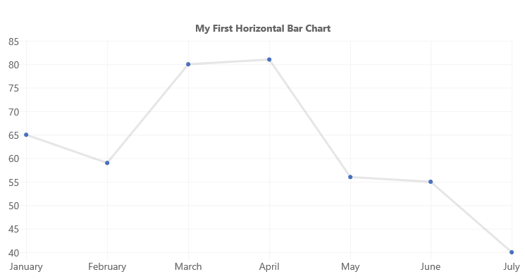
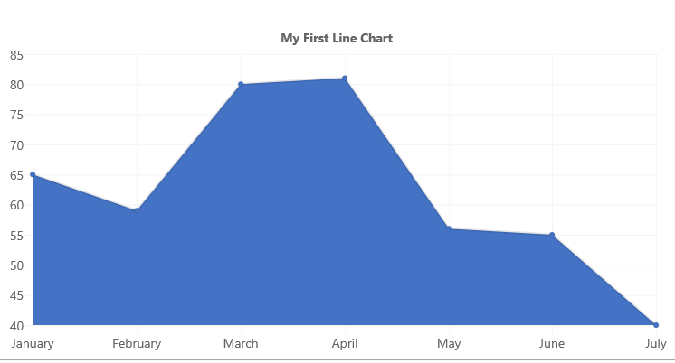
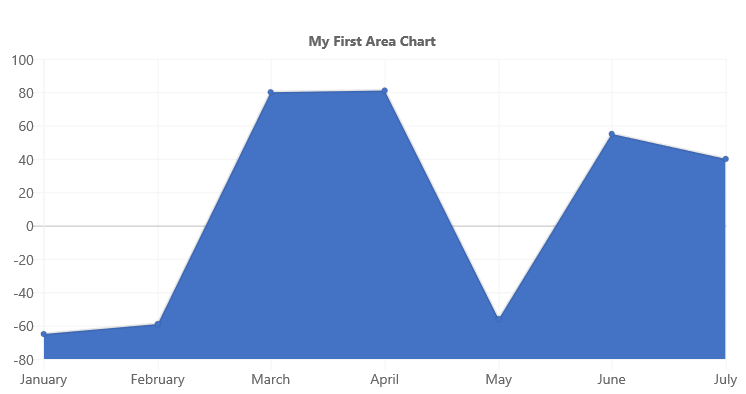
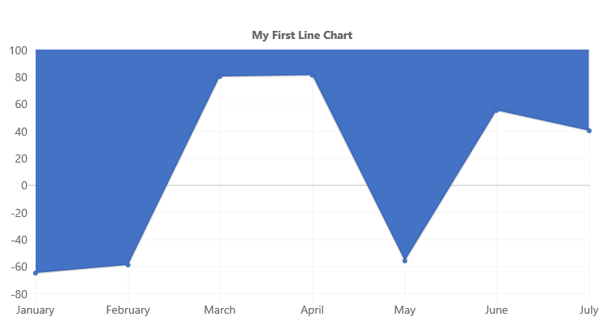
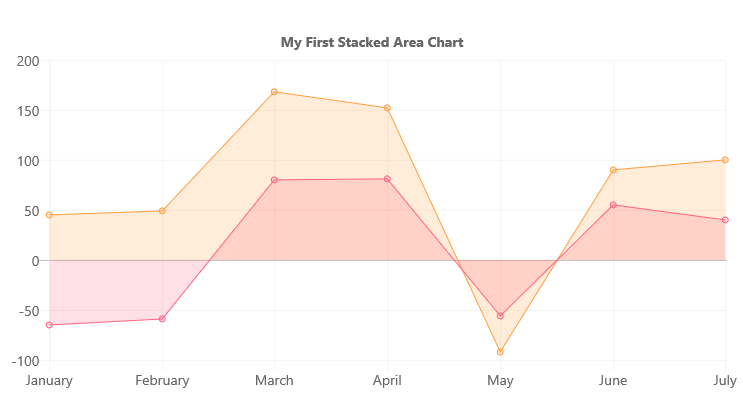
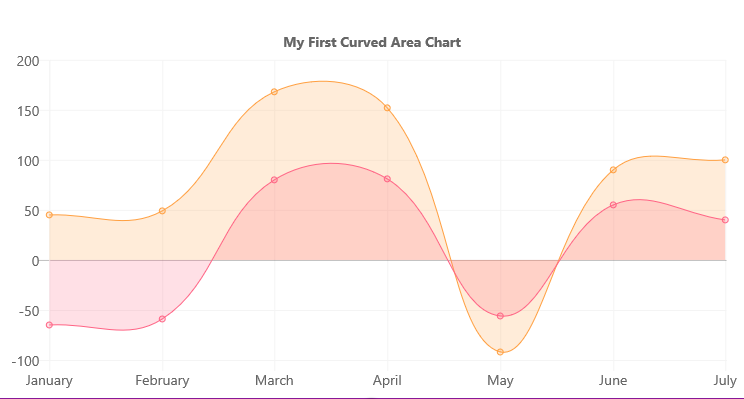

# ChartControl - Line Chart

Line charts represent data values as plotted points on a line.



## Example Usage

To create a line chart, add the ChartControl import:

```TypeScript
import { ChartControl } from "@pnp/spfx-controls-react/lib/ChartControl";
```

Then render the ChartControl:

```TypeScript
<ChartControl
    type='line'
    data={data}
    options={options}
  />
```

Alternatively, you can use the following import:

```TypeScript
import { ChartControl, ChartType } from '@pnp/spfx-controls-react/lib/ChartControl';
```

Followed by:

```TypeScript
 <ChartControl
    type={ChartType.Line}
    data={data}
    options={options}
  />
```

For example, to render the chart above, use the following code:

```TypeScript
// set the data
const data = {
  labels:
    [
      'January', 'February', 'March', 'April', 'May', 'June', 'July'
    ],
  datasets: [
    {
      label: 'My First Dataset',
      fill: false,
      lineTension: 0,
      data:
        [
          65, 59, 80, 81, 56, 55, 40
        ]
    }
  ]
};

// set the options
const options = {
  legend: {
    display: false,
  },
  title: {
    display: true,
    text: "My First Line Chart"
  }
};

return (
  <ChartControl
    type={ChartType.Line}
    data={data}
    options={options}
  />);
```

## Variations

### Curved lines


You can render curved lines instead of straight lines by removing the `lineTension` setting from each dataset, or by setting it to a value other than `0`.

For example, to render the above chart, use the following code:


```TypeScript
// set the data
const data = {
  labels:
    [
      'January', 'February', 'March', 'April', 'May', 'June', 'July'
    ],
  datasets: [
    {
        label: 'My First Dataset',
        fill: false,
        //lineTension: 0, -- removed
        data:
          [
            -65, -59, 80, 81, -56, 55, 40
          ],
        backgroundColor: "rgba(255, 99, 132, 0.2)",
        borderColor: "rgb(255, 99, 132)",
        borderWidth: 1
      },
  ]
};

// set the options
const options = {
  legend: {
    display: false,
  },
  title: {
    display: true,
    text: "My First Curved Line Chart"
  }
};

return (
  <ChartControl
    type={ChartType.Line}
    data={data}
    options={options}
  />);
```

### Area Chart



To render an area chart, change the `fill` setting of the dataset to `true`.

```TypeScript
// set the data
const data = {
  labels:
    [
      'January', 'February', 'March', 'April', 'May', 'June', 'July'
    ],
  datasets: [
    {
      label: 'My First Dataset',
      fill: true,
      lineTension: 0,
      data:
        [
          65, 59, 80, 81, 56, 55, 40
        ]
    }
  ]
};

// set the options
const options = {
  legend: {
    display: false,
  },
  title: {
    display: true,
    text: "My First Area Chart"
  }
};

return (
  <ChartControl
    type={ChartType.Line}
    data={data}
    options={options}
  />);
```

If your chart has negative and positive values, you can control where the filled area by setting the `fill` setting to one of the following value:

| `fill` Value | Description | Sample |
| ----        | ----    | ---- |
| `'start'`   | Fill from the bottom of the chart  |  |
| `'end'`     | Fill from the top of the chart  |  |
| `'origin'`  | Fill from the 'zero' line Same as `true`  |   |

For example, the code below will set the `fill` value to `start`:

```TypeScript
// set the data
const data = {
  labels:
    [
      'January', 'February', 'March', 'April', 'May', 'June', 'July'
    ],
  datasets: [
    {
      label: 'My First Dataset',
      fill: 'start',
      lineTension: 0,
      data:
        [
          -65, -59, 80, 81, -56, 55, 40
        ]
    }
  ]
};

// set the options
const options = {
  legend: {
    display: false,
  },
  title: {
    display: true,
    text: "My First Area Chart"
  }
};

return (
  <ChartControl
    type={ChartType.Line}
    data={data}
    options={options}
  />);
```

Which renders the following chart:


### Stacked Area Chart



If your bar chart has multiple datasets, you can render it as a stacked area chart by changing the settings on the Y axis to enable stacking, as follows:

```TypeScript
const options = {
  scales: {
      yAxes: [{
          stacked: true
      }]
  }
};
```

In order to render each dataset with a different color, make sure to specify the `backgroundColor` and `borderColor` settings for each dataset. 

For example, to render the above chart, use the following code:

```TypeScript
const data = {
  labels:
    [
      'January', 'February', 'March', 'April', 'May', 'June', 'July'
    ],
  datasets: [
    {
      label: 'My First Dataset',
      fill: true,
      lineTension: 0,
      data:
        [
          -65, -59, 80, 81, -56, 55, 40
        ],
      backgroundColor: "rgba(255, 99, 132, 0.2)",
      borderColor: "rgb(255, 99, 132)",
      borderWidth: 1
    },
    {
      label: 'My Second Dataset',
      fill: true,
      lineTension: 0,
      data:
        [
          45, 49, 88, 71, -36, 35, 60
        ],
      backgroundColor: 'rgba(255, 159, 64, 0.2)',
      borderColor: 'rgb(255, 159, 64)',
      borderWidth: 1
    }

  ]
};

const options =  {
  legend: {
    display: false,
  },
  title: {
    display: true,
    text: "My First Stacked Area Chart"
  },
  scales: {
    yAxes: [{
      stacked: true
    }]
  }
};

return (
  <ChartControl
    type={ChartType.Line}
    data={data}
    options={options}
  />);
```

As with lines, you can set the `lineTension` value to render curved lines instead of straight lines:



In addition to the `fill` values listed above, you can specify how each dataset fill:

| `fill` Value Type | Description | Sample Values |
| ----        | ----    | ---- |
| number   | Fill to dataset by its absolute index  | `1`, `2`, `3`, ... |
| string     | Fill to dataset by its relative index  | `'-3'`, `'-2'`, `'-1'`, `'+1'`, `'+2'`, `'+3'`, ... |

For example, if you use declare your datasets with the following fill values:

```TypeScript
const data = {
      labels:
        [
          'January', 'February', 'March', 'April', 'May', 'June', 'July'
        ],
      datasets: [
        {
          label: 'My First Dataset',
          fill: "start",
          lineTension: 0,
          data:
            [
              -65, -59, 80, 81, -56, 55, 40
            ],
          backgroundColor: "rgba(255, 99, 132, 0.2)",
          borderColor: "rgb(255, 99, 132)",
          borderWidth: 1
        },
        {
          label: 'My Second Dataset',
          fill: '-1',
          lineTension: 0,
          data:
            [
              45, 49, 88, 71, -36, 35, 60
            ],
          backgroundColor: 'rgba(255, 159, 64, 0.2)',
          borderColor: 'rgb(255, 159, 64)',
          borderWidth: 1
        }

      ]
    };
```

Will cause the first dataset to fill from the bottom of the chart, while the second dataset will fill to the previous dataset (by it's relative index of `-1`)


## Data Structure

### number[]
The `data` property of each dataset item consists of an array of numbers. Each point in the array corresponds to the matching label on the x axis:

```TypeScript
data: [20, -10, 33, -47]
```

The chart elements will be rendered in the same order as found in the array.

### Point[]

You can also provide data elements with `x` and `y` coordinates:

```TypeScript
data: [{
    x: 10,
    y: 20
}, {
    x: 15,
    y: 10
}]
```

## Configuration

The following configuration options are specific to line charts:

| Name                      | Type              | Default | Description |
| ----                      | ----              | ----    | ---- |
| showLines             | boolean            | true     | Indicates whether a line will be drawn between each data point. A value of `false` will not render lines. |
| spanGaps        | boolean            | false     | Indicates whether invalid number values (`NaN`) will cause a break in the line . A value of `false` will not span data gaps and cause a break in the line. |


## For More Information

For more information on what options are available with Line charts, refer to the [Line Chart documentation](https://www.chartjs.org/docs/latest/charts/line.html) on [Chart.js](https://www.chartjs.org).
